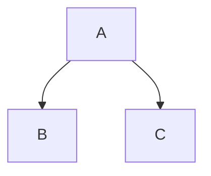

# Hextra Theme Components

This site uses the [Hextra](https://imfing.github.io/hextra/) Hugo theme. Always prefer Hextra shortcodes over custom HTML/CSS for components in blog posts.

## Code Blocks

Use standard fenced code blocks with attributes:

```markdown
```python {filename="hello.py" linenos=table hl_lines=[2] linenostart=1}
def say_hello():
    print("Hello!")
```

```

- `filename` shows a title bar
- `linenos=table` for line numbers (use `linenostart=N` to offset)
- `hl_lines=[1,3]` to highlight specific lines
- `base_url="..."` with `filename` creates a link to the file
- Copy button is on by default; configure in `hugo.yaml` under `params.highlight.copy`

## Diagrams

Mermaid is supported natively:

````markdown


````

## Callouts

Use the `callout` shortcode for notes/warnings. Supports types: `default`, `info`, `warning`, `error`, `important`.

```markdown

Be careful here.

```

Alternative: GitHub-style alerts (v0.9.0+), which are more portable:

```markdown
> [!WARNING]
> Be careful here.
```

Supported alert types: `NOTE`, `TIP`, `IMPORTANT`, `WARNING`, `CAUTION`.

## Collapsible Details

```markdown

Hidden content (Markdown supported).

```

Add `closed="true"` to start collapsed.

## Cards

Card grid with optional icons, images, tags:

```markdown

  
  

```

Parameters per card: `link`, `title`, `subtitle`, `icon`, `tag`, `tagColor`, `tagIcon`, `tagBorder`.
Container parameter: `cols` (max columns, e.g. `cols="2"`).

Image cards:
```markdown

  
  

```

Image processing (from `assets/` dir): add `method="Resize" options="600x q80 webp"`.

## Tabs

```markdown

  Content
  Content
  Content

```

Add `selected=true` to pre-select. Add `icon` to tab name. Tabs sync when `params.page.tabs.sync: true` in config.

## Steps (Numbered Process)

Wrap `###` headings in `{}` (note: percent delimiters, not angle brackets):

```markdown
{}

### Step 1

Do this first.

### Step 2

Then do this.

{}
```

Use `{class="no-step-marker"}` on subheadings to exclude from numbering. Only works with Markdown content, not nested shortcodes.

## FileTree

```markdown

  
    
    
      
    
  

```

Folder states: `open` (default) or `closed`.

## Icon

Inline icons (requires `enableInlineShortcodes: true` in hugo.yaml):

```markdown

```

Uses Heroicons v1 outline. Full list: https://imfing.github.io/hextra/docs/guide/shortcodes/icon/

Add custom icons: create `data/icons.yaml` in project root with SVG content.

## Badge

```markdown




```

Colors: `gray` (default), `purple`, `indigo`, `blue`, `green`, `yellow`, `amber`, `orange`, `red`.

## YouTube / PDF Embed

```markdown


```

Both Hugo built-in. PDF can be relative path from project root.

## Term (Glossary)

```markdown

```

Requires glossary data files in `data/glossary/` (one per language: `en.yaml`, etc.). Terms render as clickable definition tooltips.
