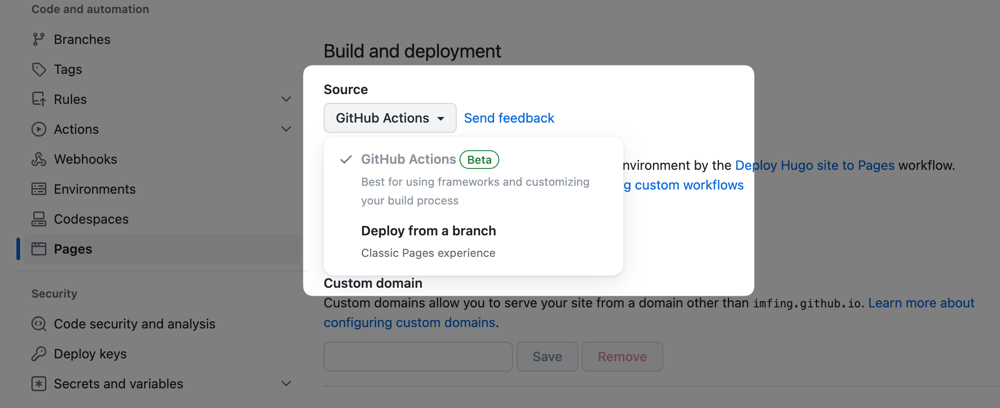

# Crushing C.O.D.E

[](https://github.com/crushingcode/crushingcode-source/actions/workflows/pages.yaml)

- Personal Blog by Nishant Srivastava
- Uses [Hugo Static Site Generator](https://gohugo.io/).
- [🌐 Link ↗](https://crushingcode.github.io)
- [Github ↗](https://github.com/crushingcode/crushingcode.github.io)

## Deployment

### GitHub Pages

A GitHub Actions workflow is provided in [`.github/workflows/pages.yaml`](./.github/workflows/pages.yaml) to [publish to GitHub Pages](https://github.blog/changelog/2022-07-27-github-pages-custom-github-actions-workflows-beta/) for free.

For details, see [Publishing with a custom GitHub Actions workflow](https://docs.github.com/en/pages/getting-started-with-github-pages/configuring-a-publishing-source-for-your-github-pages-site#publishing-with-a-custom-github-actions-workflow).

Note: in the settings, make sure to set the Pages deployment source to **GitHub Actions**:



[Run the workflow manually](https://docs.github.com/en/actions/using-workflows/manually-running-a-workflow) if it's not triggered automatically.

## Local Development

Pre-requisites: [Hugo](https://gohugo.io/getting-started/installing/), [Go](https://golang.org/doc/install) and [Git](https://git-scm.com)

```sh
# Clone the repo
git clone git@github.com:crushingcode/crushingcode.github.io.git

# Change directory
cd crushingcode.github.io

# Start the server
./serve_local.sh
```

### Update theme

```sh
./update_theme.sh
```

See [Update modules](https://gohugo.io/hugo-modules/use-modules/#update-modules) for more details.

## [License](/LICENSE.md)

© [Nishant Srivastava](https://www.nisrulz.com) | [CC BY-SA 4.0](https://creativecommons.org/licenses/by-sa/4.0/)
