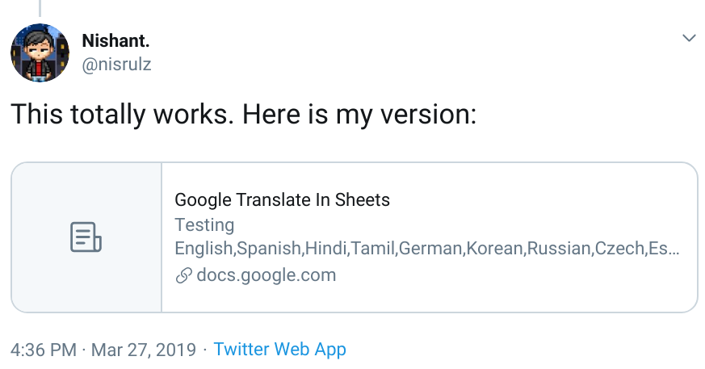
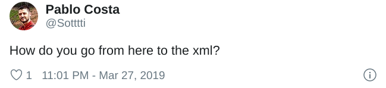
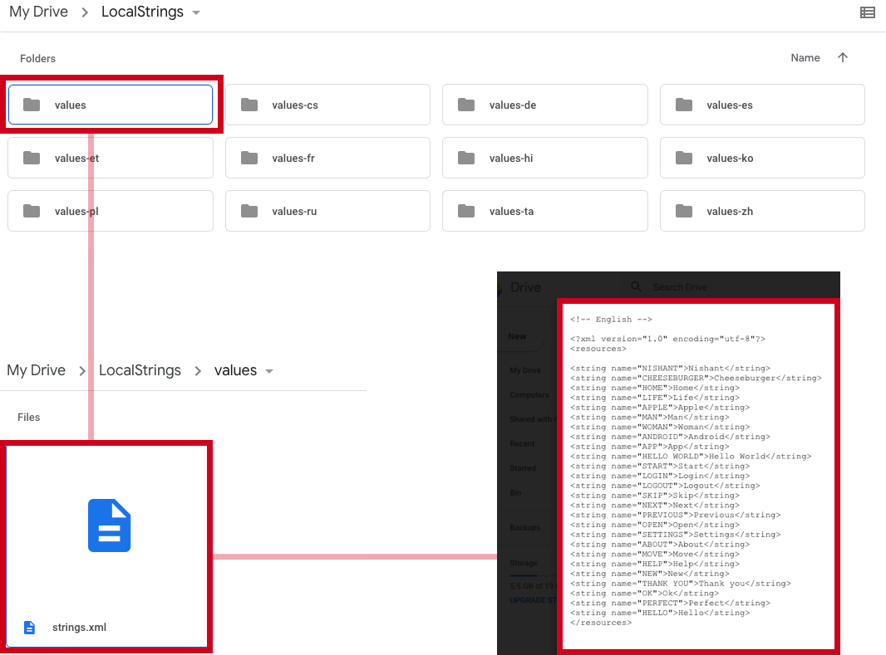
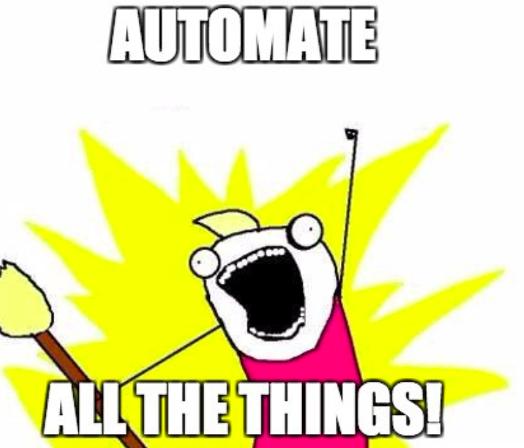

> ##### TL;DR: I used Google Sheets + Translate + AppScript to build a completely free and robust Automated Android Localization Tool! 🐼

<!--more-->

So this started when I found the below tweet:



Basically what it is doing is that using Google Sheets you can specify a cell text to be translated to another language using the very simple formula as below:

`GOOGLETRANSLATE(text, [source_language, target_language])`

[Read more here.](https://support.google.com/docs/answer/3093331?hl=en)

I was curious so I just tried it out on my own Google Sheet:

 

Direct link to the google sheet file:
[**Google Translate In Sheets**](https://docs.google.com/spreadsheets/d/14XH2Cu9kJQoebyMpzVKL6WrPsEkKYwctB6Cou4RvGQI/edit)

> Testing English, Spanish, Hindi, Tamil, German, Korean, Russian, Czech, Estonian, French, Polish, Chinese

...and it totally worked!! 🎉

I only have to duplicate a row (each column has the formula already set up to translate the text in the first column to respective columns language) and then update the text in the first column in English with my own string value. That English string is translated to all the other languages in their respective columns.

This was super cool and I was mostly done here. This was a cool feature. However, if you remember my first tweet, I mentioned:

> Seems super handy for indie Android devs when considering simple localization!

One guy reached out to me about that end result and how to do that:

Interestingly that is what most people would like. The first thing that pops up in the head that one can use the Google App Script to parse the data in Google Sheets and then it is just a matter of formatting the data to be the right format of how strings.xml is.

So I went on to fiddle with some Google AppScript and was able to generate the below:
[**strings.xml @Pastebin.com**](https://pastebin.com/e35uhz3j)

Hmm, pretty close now 🤔

What is missing, is that each of these needs to be in its own value-lang folder inside a strings.xml file.

Should be easy. So after fiddling a bit more I was able to end up generating the full folder structure inside my own Google Drive folder.

##### Finally! 🎈

Everything was so quick to bootstrap and get running 🛴

I plan on open sourcing this sheet and the app script by this weekend. It is not doing anything complex, pretty simple. I would also release the script as an addon so it is easier to set up for people.

For now, I think it works for most Indie devs who cannot afford to pay for translation services and hopefully it will be as helpful as I think it is.

Stay tuned for more updates here (about open-sourcing the script, addon release and explanation about how the script )🙃

For now, I am too sleepy to write anything 😴

Until next time, keep crushing code 😎

> Special Credit to [Jake Millar](https://twitter.com/JakeMillerTech) who tweeted the Google Translate trick inside Google Sheets!

I do a lot of such tinkering with scripts and Android development over at [Github](https://github.com/nisrulz), or you can see me rambling about tech in [twitter](https://twitter.com/nisrulz) :]
