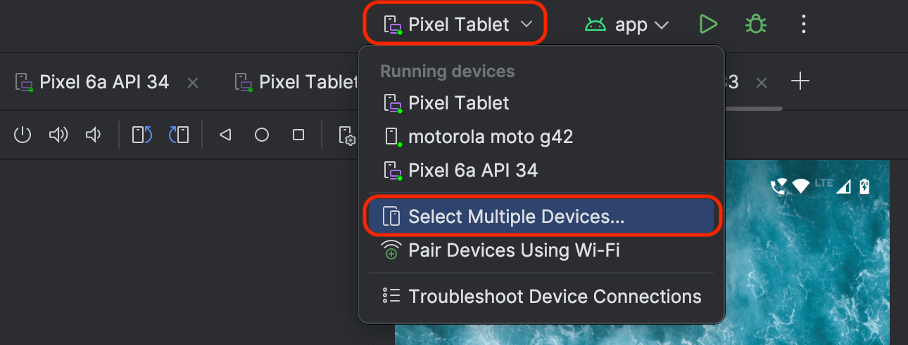
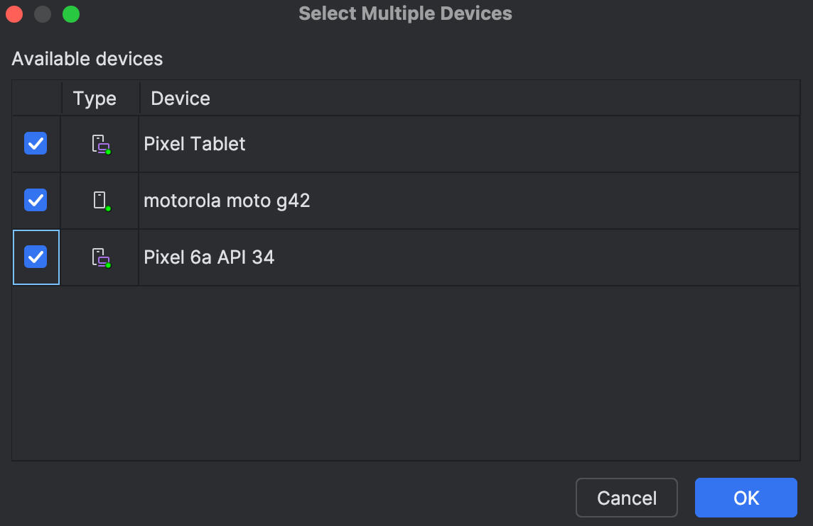
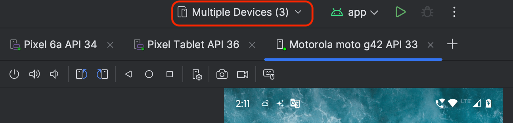

<!--Short abstract goes here-->

Automate the tedious task of uninstalling Android apps from multiple devices using adb. This guide provides shell functions to list connected devices, search for packages, and uninstall them efficiently, saving Android devs time and frustration.

<!--more-->

When developing for Android platform you usually would need to deploy your app on multiple devices. This works fine when you use Android Studio as it supports deploying to Multiple devices.

You do that by selecting "Select Multiple Devices..." option from the device selection drop-down menu:







You can then just the click on the "Run" icon to install the app on all the selected devices in one go 👨🏻‍💻

However, when you are working on a project and you have already deployed your app to multiple devices, then uninstalling the app from each device is a manual and tedious task. You have to manually go through each device and uninstall the app. This can be time-consuming if you are testing on more than 2 devices. As a result the feedback loop suffers.

This is where `adb` comes to the rescue. [`adb`(Android Debug Bridge)](https://developer.android.com/tools/adb) is a command-line tool that allows you to communicate with an Android device over a communication channel such as over USB or Wifi. It provides a way to list all connected devices, install and uninstall apps, and more.

> [!NOTE]
> You need to have `adb`, `awk` and `sed` in your PATH for this to work.
>
> Also this blog post assumes you already know how bash programming works. If not, refer to learn more [here](https://learnxinyminutes.com/bash/).

To avoid doing it manually, I have created some shell functions that can be used to automate the process of uninstalling apps that contain a matching string in the app's package name from multiple devices.

### Step 1: Finding the Device IDs of connected devices

First step would be to get the list of devices connected to your computer. This can be emulators and physical devices connected via USB/Wifi connections.

Place the below bash function inside your `.bashrc`/`.zshrc` file or any other shell configuration file:

```sh
# Function: getDeviceIds
# Description: Retrieves all connected Android device IDs using adb
# Returns: Space-separated list of device IDs
# Usage: getDeviceIds
# ---------------------------------------------------------------------
function getDeviceIds() {
    # Get all connected devices and extract only the device IDs
    # Skips the "List of devices attached" header line and takes only the first column
    local devices=($(adb devices | grep -v "List" | awk '{if(length($1) > 0) print $1}'))

    # Check if any devices were found
    if [ ${#devices[@]} -eq 0 ]; then
        echo "No devices connected."
        return 1
    fi

    # Return the array of device IDs
    echo "${devices[@]}"
}
```

When you execute this in a new terminal window, the output should look similar to this (with id of your connected devices):

```sh
❯ getDeviceIds
ZZ12EXRG14 emulator-5554 emulator-5556
```

### Step 2: Uninstalling all matching packages from a specific device

You can uninstall android packages matching a pattern for a specific package name by calling the `uninstallPackageForDevice` function with an argument of the part of the package name you want to uninstall.

Place the below bash function inside your `.bashrc`/`.zshrc` file or any other shell configuration file:

```sh
# Function: uninstallPackageForDevice
# Description: Uninstalls packages matching a pattern for a specific device and user
# Parameters:
#   $1 - device_id: The specific device ID to target
#   $2 - search_term: Package name pattern to search for
#   $3 - user_id: User profile ID (defaults to 0 for primary user, use 10 for work profile)
# Usage: uninstallPackageForDevice <device_id> <search_term> [user_id]
# ---------------------------------------------------------------------
function uninstallPackageForDevice() {
    local device_id=$1
    local search_term=$2
    local user_id=${3:-0}

    # Validate required parameters
    if [ -z "$device_id" ] || [ -z "$search_term" ]; then
        echo "Usage: uninstallPackageForDevice <device_id> <search_term> [user_id]"
        return 1
    fi

    echo "Device: $device_id - Searching for packages matching '$search_term' for user $user_id..."

    # Find all packages matching search term and uninstall them one by one
    for pkg in $(adb -s $device_id shell pm list packages --user $user_id | grep $search_term | sed 's/package://g'); do
        echo "Uninstalling $pkg from $device_id"
        # Use the pm uninstall command to remove the package for the specified user
        adb -s $device_id shell pm uninstall --user $user_id $pkg
    done
}
```

Here:

- The `pm list packages` command lists all packages
- `grep` filters for our search term
- `sed` removes the "package:" prefix from each line

> [!NOTE]
> The third argument to this bash function `user_id` is actually optional.
> `user_id` is the user profile ID (defaults to 0 for primary user, use 10 for work profile)

When you execute this in a new terminal window:

```sh
❯ uninstallPackageForDevice emulator-5554 com.github.nisrulz.
Device: emulator-5554 - Searching for packages matching 'com.github.nisrulz.' for user 0...
Uninstalling com.github.nisrulz.exampleapp from emulator-5554
Success
```

This will uninstall all packages that contain `com.github.nisrulz.` in their package name from the emulator-5554 device.

### Step 3: Uninstalling all matching packages from all connected devices

Now that you have the list of devices connected to your system and the ability to uninstall android apps from those devices, you can run a bash function that iterates over these connected devices to uninstall all packages matching a pattern.

Place the below bash function inside your `.bashrc`/`.zshrc` file or any other shell configuration file:

```sh
# Function: uninstallPackages
# Description: Main function that uninstalls packages matching a pattern on all connected devices
# Parameters:
#   $1 - search_term: Package name pattern to search for
#   $2 - user_id: User profile ID (defaults to 0 for primary user, use 10 for work profile)
# Usage: uninstallPackages <search_term> [user_id]
# ---------------------------------------------------------------------
function uninstallPackages() {
    local search_term=$1
    local user_id=${2:-0}

    # Validate required parameters
    if [ -z "$search_term" ]; then
        echo "Usage: uninstallPackages <search_term> [user_id]"
        return 1
    fi

    # Get list of all connected devices
    local devices=($(getDeviceIds))

    # Exit if no devices were found
    if [ $? -ne 0 ]; then
        return 1
    fi

    # Process each device one by one
    for device in "${devices[@]}"; do
        uninstallPackageForDevice "$device" "$search_term" "$user_id"
        echo "------------------------"
    done
}
```

When you execute this in a new terminal window:

```sh
❯ uninstallPackages com.github.nisrulz.
Device: ZZ12EXRG14 - Searching for packages matching 'com.github.nisrulz.' for user 0...
Uninstalling com.github.nisrulz.exampleapp from ZZ12EXRG14
Success
------------------------
Device: emulator-5554 - Searching for packages matching 'com.github.nisrulz.' for user 0...
Uninstalling com.github.nisrulz.exampleapp from emulator-5554
Success
------------------------
Device: emulator-5556 - Searching for packages matching 'com.github.nisrulz.' for user 0...
Uninstalling com.github.nisrulz.exampleapp from emulator-5556
Success
------------------------
```

This will uninstall all packages that contain `com.github.nisrulz.` in their package name from all connected devices (physical and emulator both) 🚀

Some more example of usage:

- Uninstall all packages containing "com.example." for default user (0)

  ```sh
  uninstallPackages com.example.
  ```

- Uninstall all packages containing "com.example." for work profile (user 10)

  ```sh
  uninstallPackages com.example. 10
  ```

Thats it.

As always, we follow the mantra of

