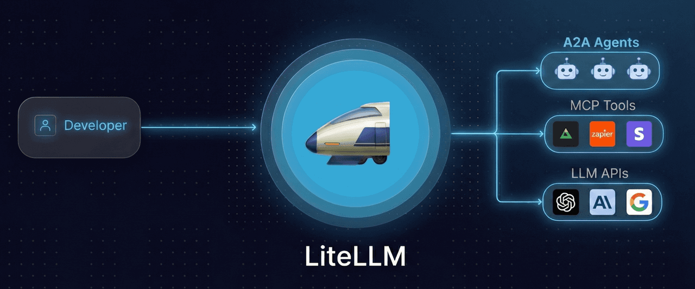
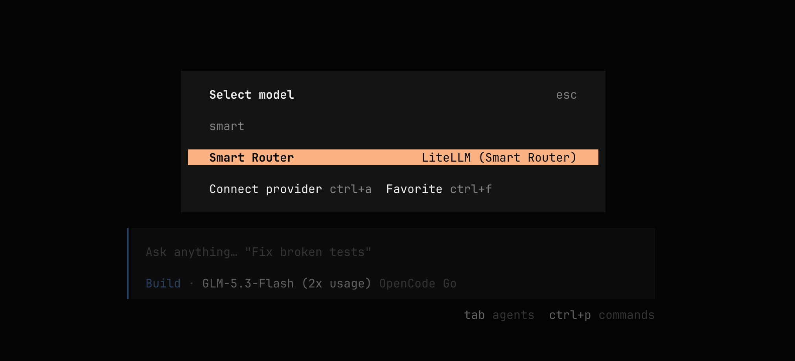
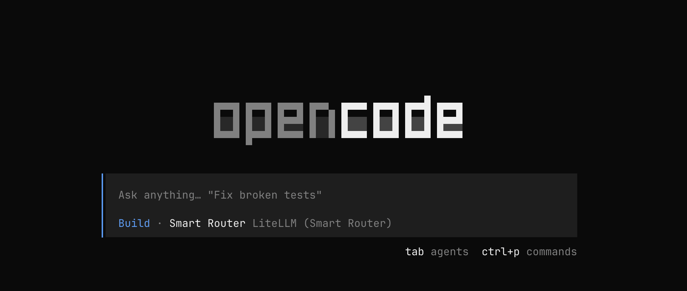

<!--Short abstract goes here-->

I caught my coding agent paying flagship prices for a typo fix. LiteLLM's Auto Router v2 routes cheap prompts to cheap models and keeps the hard ones on the big guns. Here is how I set it up with OpenCode.

<!--more-->

## The Problem

Your coding agent sends every request to the same model. "Rename this variable" and "debug this race condition" cost the same. They shouldn't.

[LiteLLM's Auto Router v2](https://docs.litellm.ai/docs/proxy/auto_routing) classifies each prompt by complexity and routes it to a matching tier. Cheap requests go to cheap models. Hard requests go to the flagship.




Auto Router v2 is in beta. It ships in LiteLLM v1.94.x, and config keys can still change between releases.


LiteLLM shared [numbers from a live production deployment](https://docs.litellm.ai/blog/auto-router-production-savings): 450+ users, 272,876 requests, 7B tokens over four months.

- 51% saved. $12,249 on $23,985 of would-be flagship spend
- 95% of requests never needed the flagship tier

And on [8,619 graded benchmark prompts](https://docs.litellm.ai/blog/auto-router-cost-quality-benchmark):

- 97% of flagship quality at 40% lower cost
- 87% quality at 75% lower cost on general queries

That is more like it 🤘🏼

## The Router Config

Four tiers and one router entry, all served by [OpenCode Go](https://opencode.ai/docs/go). LiteLLM has no dedicated `opencode-go` provider yet, so each model uses the generic `openai/` prefix pointed at the Go endpoint. Prices come from the [OpenCode Go pricing table](https://opencode.ai/docs/go#usage-limits):

```yaml
model_list:
  - model_name: cheap/mimo-v2.5
    litellm_params:
      model: openai/mimo-v2.5                          # Go serves it on /chat/completions
      api_base: https://opencode.ai/zen/go/v1
      api_key: os.environ/OPENCODE_GO_API_KEY          # $0.14/$0.28 per 1M tokens

  - model_name: mid/longcat-2.0
    litellm_params:
      model: openai/longcat-2.0
      api_base: https://opencode.ai/zen/go/v1
      api_key: os.environ/OPENCODE_GO_API_KEY          # $0.30/$1.20 per 1M tokens

  - model_name: strong/kimi-k2.7-code
    litellm_params:
      model: openai/kimi-k2.7-code
      api_base: https://opencode.ai/zen/go/v1
      api_key: os.environ/OPENCODE_GO_API_KEY          # $0.95/$4.00 per 1M tokens

  - model_name: smart-router
    litellm_params:
      model: auto_router/complexity_router
      drop_params: true          # strip params the target model does not support
      complexity_router_config:
        tiers:
          SIMPLE:    cheap/mimo-v2.5
          MEDIUM:    mid/longcat-2.0
          COMPLEX:   strong/kimi-k2.7-code
          REASONING: strong/kimi-k2.7-code
        classifier_type: heuristic_first
        heuristic_first_max_tier: SIMPLE
        classifier_llm_config:
          model: cheap/mimo-v2.5          # fast first token, smallest bill; the classifier prompt is tiny
          timeout_ms: 5000
        classifier_fallback: heuristic    # if the LLM classifier fails, fall back to the free scorer
        complexity_router_default_model: mid/longcat-2.0
        keyword_tier_rules:
          - keywords: ["rename", "format", "comment", "typo", "whitespace", "lint"]
            tier: SIMPLE
          - keywords: ["refactor", "architecture", "race condition", "deadlock", "memory leak", "concurrency", "thread safety", "migration"]
            tier: REASONING
        session_affinity: false          # set true to pin a session to its first-turn model (preserves prompt cache)
        return_raw_model_name: true      # return the actual model name in the response body, not the alias

general_settings:
  master_key: os.environ/LITELLM_MASTER_KEY
  # Forward client x-* headers to the provider. OpenCode Go demands
  # x-opencode-session on every request:
  # https://opencode.ai/docs/go/#where-can-i-use-it
  forward_client_headers_to_llm_api: true
```

Save this as `~/.config/litellm/config.yaml`. The LiteLLM Proxy picks it up in the next step.

## Run the Proxy

One command installs the [`lite` CLI](https://docs.litellm.ai/docs/proxy/management_cli) and the proxy runtime, proxy extras included:

```bash
uv tool install 'litellm[proxy]'
```

Export two keys:

```bash
export OPENCODE_GO_API_KEY=sk-your-opencode-go-key   # from opencode.ai/go
export LITELLM_MASTER_KEY=sk-your-master-key          # the key your clients use
```

The master key is a shared secret you invent. Any non-empty string works, the `sk-` prefix is just convention. This command prints a ready-to-paste export line:

```bash
# Output: 
#   export LITELLM_MASTER_KEY="sk-c14e1940069c5e689173ff5b2a7148d6edc83e338f3cbf85"

echo "export LITELLM_MASTER_KEY=\"sk-$(openssl rand -hex 24)\""
```

The command generates a new key every run, so pick one output and save it. The config reads it from the env var at startup, so the proxy refuses to start without it.

Start the proxy with the saved config:

```bash
litellm --config ~/.config/litellm/config.yaml
```



```sh
INFO:     Started server process [46797]
INFO:     Waiting for application startup.

   ██╗     ██╗████████╗███████╗██╗     ██╗     ███╗   ███╗
   ██║     ██║╚══██╔══╝██╔════╝██║     ██║     ████╗ ████║
   ██║     ██║   ██║   █████╗  ██║     ██║     ██╔████╔██║
   ██║     ██║   ██║   ██╔══╝  ██║     ██║     ██║╚██╔╝██║
   ███████╗██║   ██║   ███████╗███████╗███████╗██║ ╚═╝ ██║
   ╚══════╝╚═╝   ╚═╝   ╚══════╝╚══════╝╚══════╝╚═╝     ╚═╝


#------------------------------------------------------------#
#                                                            #
#            'This product would be better if...'            #
#        https://github.com/BerriAI/litellm/issues/new       #
#                                                            #
#------------------------------------------------------------#

 Thank you for using LiteLLM! - Krrish & Ishaan


Give Feedback / Get Help: https://github.com/BerriAI/litellm/issues/new


LiteLLM: Proxy initialized with Config, Set models:
    cheap/mimo-v2.5
    mid/longcat-2.0
    strong/kimi-k2.7-code
    smart-router
INFO:     Application startup complete.
INFO:     Uvicorn running on http://0.0.0.0:4000 (Press CTRL+C to quit)
```



The proxy listens on `http://localhost:4000`.

Quick check that the router works, piped through [jq](https://jqlang.github.io/jq/) so the response reads well in the terminal. Install jq first if you do not have it:

```bash
brew install jq
```

```bash
BODY='{
  "model": "smart-router",
  "messages": [
    {"role": "user", "content": "What does the -v flag do in grep?"}
  ]
}'

curl -s http://localhost:4000/v1/chat/completions \
  -H "Authorization: Bearer $LITELLM_MASTER_KEY" \
  -H "Content-Type: application/json" \
  -d "$BODY" \
  | jq '{model, answer: .choices[0].message.content}'
```

On my run the router picked `mimo-v2.5`, the SIMPLE tier. Exactly what a grep question deserves. Every response also carries the `x-litellm-model-name` header, so you can see which tier served the request.



```text
{
  "model": "mimo-v2.5",
  "answer": "In `grep`, the `-v` flag stands for \"invert match\" — it
             reverses the normal behavior of the command.

             Normally, `grep` prints lines that match the given
             pattern. With `-v`, `grep` prints lines that do NOT match
             the pattern.

             Example: suppose file.txt contains apple, banana, cherry,
             apricot. Running `grep -v \"apple\" file.txt` would output
             banana, cherry, apricot, because it skips any line
             containing \"apple\".

             Note: the longer option `--invert-match` does the same
             thing as `-v`."
}
```



## Connect OpenCode

The `lite` CLI wraps coding agents and routes their traffic through your proxy. Point it at your key and launch OpenCode:

```bash
export LITELLM_PROXY_API_KEY="$LITELLM_MASTER_KEY"
lite opencode
```

The wrapper exports `OPENAI_BASE_URL` and `OPENAI_API_KEY` for you, checks the key against the proxy, then launches OpenCode.


The defaults above assume your proxy runs at `http://localhost:4000`.

To change that:

```sh
export LITELLM_PROXY_URL="http://your-proxy:4000"
```




One catch: OpenCode reads its model list from config, not from the proxy. Add the router to `~/.config/opencode/opencode.json` so it shows up in `/models`:

```json opencode.json
{
  "$schema": "https://opencode.ai/config.json",
  "provider": {
    "litellm": {
      "npm": "@ai-sdk/openai-compatible",
      "name": "LiteLLM",
      "options": {
        "baseURL": "http://localhost:4000/v1",
        "apiKey": "{env:OPENAI_API_KEY}"
      },
      "models": {
        "smart-router": { "name": "Smart Router" }
      }
    }
  }
}
```



Launch `lite opencode`. Inside OpenCode, run `/models` and select Smart Router under the LiteLLM provider. That is the `smart-router` alias, and every request now routes by tier. Done 🚀






OpenCode sends a `reasoningSummary` parameter that plain chat completions reject. The router entry handles it with `drop_params: true`. If you point OpenCode at a tier model directly, add `additional_drop_params: ["reasoningSummary"]` to that model's entry:

```yaml {hl_lines=[6]}
- model_name: cheap/mimo-v2.5
  litellm_params:
    model: openai/mimo-v2.5
    api_base: https://opencode.ai/zen/go/v1
    api_key: os.environ/OPENCODE_GO_API_KEY
    additional_drop_params: ["reasoningSummary"]
```

The [OpenCode integration guide](https://docs.litellm.ai/docs/tutorials/opencode_integration#dropping-opencode-specific-parameters) covers this and more.


### The Session Header

OpenCode Go wants `x-opencode-session` on every request, one stable id per conversation. It uses the id for provider routing and prompt caching. LiteLLM strips client headers by default, so the id never reaches the OpenCode Go backend and the router fails with this error:

```text
litellm.BadRequestError: OpenAIException - Error from provider (Console Go): Request is missing 
x-opencode-session and cannot be routed efficiently.
```

Two changes are needed to fix it.

1. Add a line in the proxy config under `general_settings`:

   ```yaml {hl_lines=[2]}
   general_settings:
     forward_client_headers_to_llm_api: true
   ```

   OpenCode already sends the session id on every request. With this line, the proxy passes it through to the OpenCode Go backend.

2. Add a tiny plugin that puts the id on the wire. Save it as `~/.config/opencode/plugins/opencode-session-header.ts`:

```ts {filename="~/.config/opencode/plugins/opencode-session-header.ts"}
import type { Plugin } from "@opencode-ai/plugin"

// Injects x-opencode-session on every LLM request so OpenCode Go
// gets a stable session id per conversation.
const OpencodeSessionHeader: Plugin = async () => {
  return {
    "chat.headers": async (input, output) => {
      output.headers["x-opencode-session"] = input.sessionID
    },
  }
}

export default OpencodeSessionHeader
export { OpencodeSessionHeader }
```

The plugin sets the header through OpenCode's `chat.headers` hook, which runs on every request and merges the returned headers into the HTTP call to the provider. OpenCode loads global plugins at startup.


The proxy reads its config at startup, not per request. An edit to `config.yaml` while the proxy runs changes nothing. I burned time on this: the config had the right line, the proxy had been up for 3 days, and OpenCode Go kept rejecting the header. **Restart the proxy after any config change.**


## Picking a Classifier

The router needs to decide which tier a prompt belongs to. [Four classifiers in v2](https://docs.litellm.ai/docs/proxy/auto_routing#classification):

| Classifier | Cost | Latency | Notes |
| ----------- | ------ | --------- | ------- |
| `heuristic` | free | sub-ms | Weighted scorer, the default |
| [`trained_heuristic`](https://docs.litellm.ai/blog/heuristic-v2) | free | sub-ms | Calibrated model, better out of the box |
| `heuristic_first` | free for most traffic | sub-ms, LLM only when unsure | Recommended |
| `llm` | one small model call | 1-2s | Most accurate |

`heuristic_first` is the sweet spot. It runs the free local scorer first. Prompts that clearly land at or below `heuristic_first_max_tier` route with no LLM call. Ambiguous prompts escalate to the LLM classifier:

```yaml
classifier_type: heuristic_first
heuristic_first_max_tier: SIMPLE
classifier_llm_config:
  model: cheap/mimo-v2.5        # the classifier prompt is tiny, use the fast cheap tier
  timeout_ms: 5000
classifier_fallback: heuristic  # if the LLM classifier fails, fall back to the free scorer
```

`classifier_fallback` decides what happens when the LLM classifier fails or times out. The default falls back to the heuristic scorer. Set it to `default_model` to route to `complexity_router_default_model` instead. A classifier timeout is not fatal: the request routes anyway, so a slow classifier costs a little latency, not the request.

The LLM classifier call is tracked as `classifier_cost` and deducted from reported savings (v1.100+).

## Why It Saves Tokens

**Tier selection**: Input tokens cost the same on any model. Output tokens on the cheap tier cost 5-10x less than the flagship. Most coding work does not need flagship reasoning.

**Heuristic-first classification**: The free scorer handles most traffic with no LLM call. The LLM classifier only runs on ambiguous prompts, and its cost comes off the reported savings.

**Context escalation** (on by default): If a simple question arrives deep into a long session and the chosen tier cannot hold the prompt, the router bumps it to a tier that fits. No failed calls. No retry tokens.

**Session pinning** (`session_affinity: true`): A multi-turn session stays on one model. No prompt-cache invalidation from tier switching mid-conversation. The trade: the whole session inherits the first turn's tier.

**Keyword rules**: Hard overrides for known patterns. Multiple matches escalate to the highest matched tier, so rule order does not matter:

```yaml
keyword_tier_rules:
  - keywords: ["rename", "format", "comment", "typo", "whitespace", "lint"]
    tier: SIMPLE
  - keywords: ["refactor", "architecture", "race condition", "deadlock", "memory leak", "concurrency", "thread safety", "migration"]
    tier: REASONING
semantic_keyword_matching: true   # match paraphrases via embeddings, not just literal keywords
embedding_model: voyage-3-5
match_threshold: 0.5
```

## Stuck-Task Escalation

A cheap model can get stuck mid-task. It calls the same tool with the same arguments three times, or the same call keeps erroring, while the newest message reads like a harmless follow-up: "can you try a different approach?" Read alone, that turn classifies SIMPLE every time, so the router sends it right back to the model that was already failing.

[Stall escalation](https://docs.litellm.ai/blog/auto-router-stall-escalation) gives the router that judgment:

- It reads the assistant's own tool calls, not your messages. A task counts as stalled once the newest call repeats or errors at least `stall_escalation_repeat_threshold` times across the last `stall_escalation_window` calls
- Anchored on the newest call, so a task that already recovered does not keep escalating
- Reads both Anthropic `tool_use`/`tool_result` blocks (including `is_error`) and chat-completions `tool_calls`/`tool` messages
- Stateless. Detection reruns on every classified turn, so the bump lifts the moment the task looks unstuck

```yaml
stall_escalation_enabled: true
stall_escalation_window: 6
stall_escalation_repeat_threshold: 3
```

It cannot combine with `session_affinity` or `classification_mode: user_turn`. Both replay a held routing decision, so detection would never see the tool calls it needs.

## Tune Your Tiers

The production case study points both SIMPLE and MEDIUM at the cheapest model, and that is where most of the savings come from. A rough shape to aim for:

| Tier | Traffic share | Spend share |
| ------ | -------------- | ------------- |
| SIMPLE + MEDIUM | ~80% | ~20% |
| COMPLEX | ~15% | ~30% |
| REASONING | ~5% | ~50% |

Watch your proxy logs for a day, then adjust `tier_boundaries` if requests overshoot their tier. The default logs already show what matters: tier fallbacks, classifier failures, and errors. For the full picture, including classifier decisions and full error tracebacks, start the proxy with `--detailed_debug`.

### Watch the Router Live

Here is a slice from my proxy. The LLM classifier timed out once, the proxy fell back to the free heuristic scorer, and traffic kept flowing. Watch the `selected model` lines: one request routes to `longcat-2.0`, the next to `mimo-v2.5`.



```sh
❯ litellm --config ~/.config/litellm/config.yaml --detailed_debug | grep "selected model"
INFO:     Started server process [54773]
INFO:     Waiting for application startup.
INFO:     Application startup complete.
INFO:     Uvicorn running on http://0.0.0.0:4000 (Press CTRL+C to quit)
14:00:18 - LiteLLM Router:WARNING: complexity_router.py:1354 - ComplexityRouter: LLM classifier failed (litellm.Timeout: APITimeoutError - Request timed out. Error_str: Request timed out. - timeout value=5.0, time taken=5.38 seconds

Deployment Info: request_timeout: None
timeout: None. Received Model Group=cheap/mimo-v2.5
Available Model Group Fallbacks=None LiteLLM Retried: 2 times, LiteLLM Max Retries: 2), falling back to heuristic
14:00:25 - LiteLLM:DEBUG: cost_calculator.py:1286 - selected model name for cost calculation: openai/longcat-2.0
14:00:46 - LiteLLM:DEBUG: cost_calculator.py:1286 - selected model name for cost calculation: openai/mimo-v2.5
```



The raw `detailed_debug` output is mostly noise. The line you want, the picked model, sits between startup banner and stack trace noise, so scanning it is far from obvious. I pipe the proxy output through `awk` to keep the useful lines only: timestamp and picked model for routing lines, matching error lines for failures:

```zsh {filename="~/.zshrc"}
litellm-autorouter-watch() {
  litellm --config ~/.config/litellm/config.yaml --detailed_debug 2>&1 \
    | awk '
      /selected model name/ {print $1, "→", $NF; fflush(); next}
      /Uvicorn running on/ {sub(/.*Uvicorn running on /, "Proxy URL: "); print; fflush(); next}
      /BadRequestError|RateLimitError|APIError|Error from provider|Received Model Group/ {print; fflush()}'
}
```

- `2>&1` merges stderr into the pipe, so the debug lines reach `awk`
- `awk` slices the router lines to two fields and flushes each line immediately
- the Uvicorn startup line reprints as `Proxy URL: http://0.0.0.0:4000 (Press CTRL+C to quit)`
- matching error lines print unchanged, so the message and the model group stay visible

Run `litellm-autorouter-watch` in one terminal, OpenCode in another.

Here is the `detailed_debug` sample from above through `litellm-autorouter-watch`. The model lines collapse, and the matching classifier error line stays visible:

```text
Proxy URL: http://0.0.0.0:4000 (Press CTRL+C to quit)
timeout: None. Received Model Group=cheap/mimo-v2.5
14:00:25 → openai/longcat-2.0
14:00:46 → openai/mimo-v2.5
```

## Find Models and Generate the Config

The config above pins three models by hand. [OpenCode Go](https://opencode.ai/docs/go) serves more than two dozen models, so I wrote a script to do the picking. It scrapes live pricing from the [OpenCode Go docs](https://opencode.ai/docs/go#usage-limits), cross-references the live models API, and groups the chat-completions models by output cost:



Save as `group_models.py` and run with `uv run` or plain `python3`:

```bash
uv run group_models.py                  # tier table
uv run group_models.py --format yaml    # generate the proxy config
uv run group_models.py --cheap-max 0.6 --mid-max 2.0 --strong-max 5.0
```

- `--cheap-max`, `--mid-max`, `--strong-max`: output cost ceilings per 1M tokens for the cheap, mid, and strong tiers (defaults 1.0 / 3.0 / 6.0)
- `--format table` prints grouped models with pricing, `--format yaml` prints a full proxy `model_list`

The script filters out models that do not offer [Zero Data Retention](https://opencode.ai/docs/go#privacy). `grok-4.6` and `gpt-5.6-luna` keep data for 30 days, and the Muse Spark Contributor tiers use traffic for model training. It also skips models served on the [Anthropic-style `/messages` endpoint](https://opencode.ai/docs/go#endpoints), since the `openai/` prefix cannot drive those. Everything the script emits is 0 days retention.

```python {filename="group_models.py"}
#!/usr/bin/env python3
import argparse
import json
import urllib.request
from html.parser import HTMLParser

MODELS_URL = "https://opencode.ai/zen/go/v1/models"
PRICING_URL = "https://opencode.ai/docs/go"


def fetch_models():
    req = urllib.request.Request(MODELS_URL, headers={"User-Agent": "Mozilla/5.0"})
    with urllib.request.urlopen(req, timeout=10) as resp:
        data = json.loads(resp.read())
    return {m["id"] for m in data["data"]}


class TableParser(HTMLParser):
    """Parse all tables from HTML. Returns list of tables, each a list of rows."""

    def __init__(self):
        super().__init__()
        self._table_depth = 0
        self._in_row = False
        self._in_cell = False
        self._cell_text = ""
        self._current_row = []
        self._current_table = []
        self.tables = []

    def handle_starttag(self, tag, attrs):
        if tag == "table":
            self._table_depth += 1
            self._current_table = []
        elif tag == "tr" and self._table_depth > 0:
            self._in_row = True
            self._current_row = []
        elif tag in ("td", "th") and self._in_row:
            self._in_cell = True
            self._cell_text = ""

    def handle_endtag(self, tag):
        if tag in ("td", "th") and self._in_cell:
            self._in_cell = False
            self._current_row.append(self._cell_text.strip())
        elif tag == "tr" and self._in_row:
            self._in_row = False
            if self._current_row:
                self._current_table.append(self._current_row)
        elif tag == "table":
            self._table_depth -= 1
            if self._current_table:
                self.tables.append(self._current_table)
                self._current_table = []

    def handle_data(self, data):
        if self._in_cell:
            self._cell_text += data


def parse_price(value):
    if not value or value == "-":
        return 0.0
    cleaned = value.replace("$", "").replace(",", "").strip()
    try:
        return float(cleaned)
    except ValueError:
        return 0.0


def display_to_model_id(name):
    """Convert display name to model ID. Handles '(Off-Peak)', '(≤ 200K tokens)' variants."""
    clean = name.split("(")[0].strip()
    return clean.lower().replace(" ", "-")


def fetch_pricing():
    """Scrape pricing from the docs page. Returns dict: model_id -> (input, output, cached_read)."""
    req = urllib.request.Request(PRICING_URL, headers={"User-Agent": "Mozilla/5.0"})
    with urllib.request.urlopen(req, timeout=10) as resp:
        html = resp.read().decode("utf-8")

    parser = TableParser()
    parser.feed(html)

    # Table 0 = request counts, table 1 = pricing
    if len(parser.tables) < 2:
        print("ERROR: Could not find pricing table")
        return {}

    pricing = {}
    for row in parser.tables[1]:
        if len(row) < 4 or row[0] == "Model":
            continue
        model_id = display_to_model_id(row[0])
        input_cost = parse_price(row[1])
        output_cost = parse_price(row[2])
        cached_read = parse_price(row[3]) if len(row) > 3 else 0.0
        # Keep the lowest price across variants (Off-Peak vs Peak, etc.)
        if model_id in pricing:
            if output_cost < pricing[model_id][1]:
                pricing[model_id] = (input_cost, output_cost, cached_read)
        else:
            pricing[model_id] = (input_cost, output_cost, cached_read)

    return pricing


# Models served on the Anthropic-style /messages endpoint.
# LiteLLM's openai/ prefix cannot drive these.
# https://opencode.ai/docs/go#endpoints
NON_OPENAI_SHAPE_MODELS = {
    "minimax-m2.5", "minimax-m2.7", "minimax-m3",
    "qwen3.6-plus", "qwen3.7-plus", "qwen3.7-max", "qwen3.8-max", "qwen3.8-flash",
}

# Models that do NOT offer Zero Data Retention (ZDR).
# Data is retained 30 days or used for model training.
# https://opencode.ai/docs/go#privacy
NON_ZDR_MODELS = {
    "grok-4.6",                    # 30 days retention
    "gpt-5.6-luna",                # 30 days retention
    "muse-spark-1.2-contributor",  # used for training
    "muse-spark-1.3-contributor",  # used for training
}


def group_models(pricing, thresholds=(1.0, 3.0, 6.0)):
    cheap, mid, strong, ultra = [], [], [], []
    available = fetch_models()
    for model_id in available:
        if model_id not in pricing:
            continue
        if model_id in NON_ZDR_MODELS or model_id in NON_OPENAI_SHAPE_MODELS:
            continue
        _, output_cost, _ = pricing[model_id]
        if output_cost < thresholds[0]:
            cheap.append((model_id, output_cost))
        elif output_cost < thresholds[1]:
            mid.append((model_id, output_cost))
        elif output_cost < thresholds[2]:
            strong.append((model_id, output_cost))
        else:
            ultra.append((model_id, output_cost))
    return {
        "cheap": sorted(cheap, key=lambda x: (x[1], x[0])),
        "mid": sorted(mid, key=lambda x: (x[1], x[0])),
        "strong": sorted(strong, key=lambda x: (x[1], x[0])),
        "ultra": sorted(ultra, key=lambda x: (x[1], x[0])),
    }


def print_table(pricing, groups):
    for tier, models in groups.items():
        print(f"\n{tier.upper()} (output cost per 1M tokens)")
        print("-" * 55)
        for model_id, cost in models:
            input_c, _, cache_c = pricing[model_id]
            print(f"  {model_id:<42} in=${input_c:.2f}  out=${cost:.2f}  cache=${cache_c:.3f}")


def print_yaml(pricing, groups):
    print("model_list:")
    for tier, models in groups.items():
        for model_id, _ in models:
            print(f"  - model_name: {tier}/{model_id}")
            print(f"    litellm_params:")
            print(f"      model: openai/{model_id}")
            print(f"      api_base: https://opencode.ai/zen/go/v1")
            print(f"      api_key: os.environ/OPENCODE_GO_API_KEY")
    # Pick default and classifier models from mid tier (or cheap if no mid)
    default_model = f"mid/{groups['mid'][0][0]}" if groups["mid"] else f"cheap/{groups['cheap'][0][0]}"
    classifier_model = default_model
    print("")
    print("  - model_name: smart-router")
    print("    litellm_params:")
    print("      model: auto_router/complexity_router")
    print("      drop_params: true")
    print("      complexity_router_config:")
    print("        tiers:")
    labels = {"cheap": "SIMPLE", "mid": "MEDIUM", "strong": "COMPLEX"}
    for tier, label in labels.items():
        if groups[tier]:
            print(f"          {label}: {tier}/{groups[tier][0][0]}")
    reasoning = groups["strong"][0][0] if groups["strong"] else groups["mid"][0][0]
    print(f"          REASONING: strong/{reasoning}")
    print("        classifier_type: heuristic_first")
    print("        heuristic_first_max_tier: SIMPLE")
    print("        classifier_llm_config:")
    print(f"          model: {classifier_model}")
    print("          timeout_ms: 2000")
    print("        classifier_fallback: heuristic")
    print(f"        complexity_router_default_model: {default_model}")
    print("        keyword_tier_rules:")
    print("          - keywords: [\"hi\", \"hello\", \"thanks\"]")
    print("            tier: SIMPLE")
    print("          - keywords: [\"kubernetes\", \"race condition\"]")
    print("            tier: REASONING")
    print("        session_affinity: false")
    print("        return_raw_model_name: true")


def main():
    parser = argparse.ArgumentParser(description="Group opencode-go models by cost tier")
    parser.add_argument("--format", choices=["table", "yaml"], default="table")
    parser.add_argument("--cheap-max", type=float, default=1.0)
    parser.add_argument("--mid-max", type=float, default=3.0)
    parser.add_argument("--strong-max", type=float, default=6.0)
    args = parser.parse_args()

    pricing = fetch_pricing()
    groups = group_models(pricing, (args.cheap_max, args.mid_max, args.strong_max))

    if args.format == "yaml":
        print_yaml(pricing, groups)
    else:
        print_table(pricing, groups)


if __name__ == "__main__":
    main()
```

**Live output** (2026-09-06, chat-completions and ZDR only):

```sh

CHEAP (output cost per 1M tokens)
-------------------------------------------------------
  mimo-v2.5                                  in=$0.14  out=$0.28  cache=$0.003
  glm-5.3-flash                              in=$0.15  out=$0.50  cache=$0.030
  hy3                                        in=$0.14  out=$0.58  cache=$0.035
  deepseek-v4-flash                          in=$0.22  out=$0.66  cache=$0.007
  deepseek-v4-flash-vision-exp               in=$0.22  out=$0.66  cache=$0.007
  omen-alpha                                 in=$0.20  out=$0.66  cache=$0.040
  mimo-v2.5-pro                              in=$0.43  out=$0.87  cache=$0.004

MID (output cost per 1M tokens)
-------------------------------------------------------
  longcat-2.0                                in=$0.30  out=$1.20  cache=$0.006
  deepseek-v4-pro                            in=$0.66  out=$1.98  cache=$0.022
  hy4-preview                                in=$0.83  out=$2.50  cache=$0.042

STRONG (output cost per 1M tokens)
-------------------------------------------------------
  kimi-k2.6                                  in=$0.95  out=$4.00  cache=$0.160
  kimi-k2.7-code                             in=$0.95  out=$4.00  cache=$0.190
  glm-5.1                                    in=$1.40  out=$4.40  cache=$0.260
  glm-5.2                                    in=$1.40  out=$4.40  cache=$0.260
  glm-5.3                                    in=$1.40  out=$4.40  cache=$0.260

ULTRA (output cost per 1M tokens)
-------------------------------------------------------
  kimi-k3                                    in=$3.00  out=$15.00  cache=$0.300
```



## Bottom Line

Most agent requests are not hard. Do not pay flagship pricing for easy work. A four-tier router with a free classifier cut a real bill in half in production. Point your agent at one name.

Done! Let the router decide and watch the bill shrink. Share the blog post if you like it! 😎
