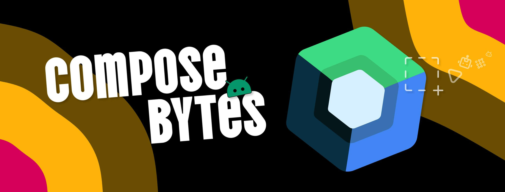

<!--Short abstract goes here-->

I wanted to have the ripple effect gone from a composable clickable component. As it turns out the API has changed and often times the first solution that popups when you search for it, is deprecated 🤡

<!--more-->

When you create a clickable compose component i.e Button, you will notice that it comes with its own on-click Ripple Effect.

For example, say there is a `CustomButton` compose component defined like below:

```kt
@Composable
fun CustomButton(modifier: Modifier = Modifier, text: String) {
    var counter by remember { mutableIntStateOf(0) }
    Button(
        modifier = modifier.height(150.dp), // Increased height to visualize the Ripple effect
        colors = ButtonDefaults.buttonColors().copy(containerColor = Color.Gray),
        onClick = { counter++ }) {
        Text("$text, Clicked: $counter")
    }
}
```

This is how it looks like when you click on it, with the Ripple Effect:

<video controls autoplay muted width=600 src="with_ripple_effect.webm"></video>

Now, what if you don't want to have this Ripple Effect when you click on it?

As of today the other solutions mentioned online seem to be deprecated. [The official docs suggest to switch to using the newer (but experimental) Ripple APIs.](https://developer.android.com/develop/ui/compose/touch-input/user-interactions/migrate-indication-ripple#disable-ripple)

Let's see how you can make use of the new APIs in a reusable way, to disable the Ripple Effect when you click on the component.

### Create a Compose Extension function

Create a new file `ComposeExt.kt` and add the following extension function:

```kt {filename="ComposeExt.kt"}
import androidx.compose.material3.ExperimentalMaterial3Api
import androidx.compose.material3.LocalRippleConfiguration
import androidx.compose.runtime.Composable
import androidx.compose.runtime.CompositionLocalProvider

@OptIn(ExperimentalMaterial3Api::class)
@Composable
fun DisableRippleEffect(content: @Composable () -> Unit) {
    CompositionLocalProvider(LocalRippleConfiguration provides null) {
        content()
    }
}
```

### Wrap your Compose clickable component with `DisableRippleEffect`

Use the extension function to wrap the clickable component `CustomButton` so as to have no ripple effect on-click:

```kt {filename="MainScreen.kt", hl_lines=[1,3]}
DisableRippleEffect {
    CustomButton(text = "Button without Ripple Effect")
}
```

Run your app and click on the compose component. You will notice the Ripple effect is no longer visible.

<video controls autoplay muted width=600 src="with_no_ripple_effect.webm"></video>

Done ✅


Note: When you wrap your component with `DisableRippleEffect`, the component's childeren will also inherit the behaviour of no ripple effect. So the wrapping should be done on the root compose component with no child compose components.


### Working with clickable Parent-Child relationships

In order to deal with situations where you do have child compose components and you deliberately want to disable the ripple effect on the parent component, there is another way to do it.

Take for example the following setup:

```kt {filename="MainScreen.kt"}
Box(  // Parent Composable
    modifier = Modifier
        .fillMaxWidth()
        .height(300.dp) // Increased height to visualize the Ripple effect
        .clickable {
            // do something
        },
    contentAlignment = Alignment.Center
) {
    CustomButton(text = "Button with Ripple Effect")   // Child Composable
}
```

This is how it looks when you run the app:

> Notice how you can click outside the button and still see the Ripple effect.

<video controls autoplay muted width=600 src="parent_with_ripple_effect.webm"></video>

Now in order for removing the ripple effect on the parent composable, you need to set the `indication` property to `null` in your `clickable` modifier for the parent component. This makes sure only the specific compose component on which the modifier is applied has no ripple effect.

The code change looks like below:

```kt {filename="MainScreen.kt", hl_lines=[5,6,7,8,9,10,11]}
Box(  // Parent Composable
    modifier = Modifier
        .fillMaxWidth()
        .height(300.dp) // Increased height to visualize the Ripple effect
        .clickable (
            onClick = {
                // do something
            },
            interactionSource = remember { MutableInteractionSource() }, // This is mandatory
            indication = null
        ),
    contentAlignment = Alignment.Center
) {
    CustomButton(text = "Button with Ripple Effect")   // Child Composable
}
```

This is how it looks when you run the app:

<video controls autoplay muted width=600 src="parent_with_no_ripple_effect.webm"></video>

Thats all there is!
