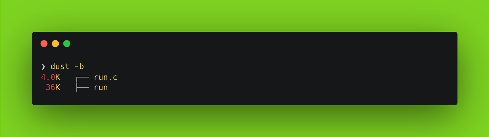
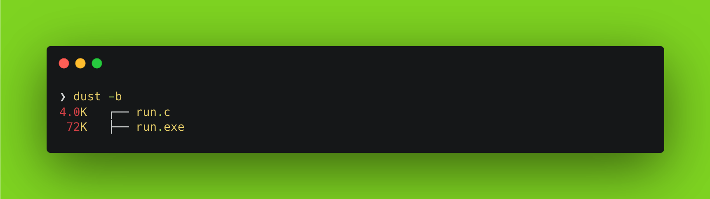

<!--more-->


This post is part of a series.


{}

1. [Nim Adventures](/blog/cross-compilation-adventures/cross-compilation-adventures-nim/)
2. [Kotlin Native Adventures](/blog/cross-compilation-adventures/cross-compilation-adventures-kotlin-native/)
3. [Dart Adventures](/blog/cross-compilation-adventures/cross-compilation-adventures-with-dart/)
4. [Go Adventures](/blog/cross-compilation-adventures/cross-compilation-adventures-go/)
5. [Rust Adventures](/blog/cross-compilation-adventures/cross-compilation-adventures-rust/)
6. **C Lang Adventures**  `This post`
7. [Python Adventures](/blog/cross-compilation-adventures/cross-compilation-adventures-python/)

> TLDR: I want to build cross-platform CLI utility tools that can be compiled on my laptop and run seamlessly on other platforms.

{}

It is well known that C is an excellent programming language for systems programming, particularly when working with low-level hardware interactions. Its efficiency and flexibility make it a popular choice for developing operating systems, embedded systems, and other system software. The language's close relationship with the machine makes it easy to optimize code for performance, which is crucial in these applications. More importantly it has stood the test of time. Because C code can be compiled for a wide range of platforms, you can write your CLI app once and run it on multiple operating systems without modification. Many legacy systems still run on older operating systems like DOS or Unix. C's low-level nature and compatibility with these older systems make it an ideal choice for developing CLI apps that can run on a wide range of hardware and software environments.

But let's face it – writing a CLI app in C is just plain cool! 😎 It's like creating a masterpiece using the building blocks of computer science – you get to tap into that raw, elemental power that drives the very fabric of computing itself!

Generally speaking about [C](https://www.cprogramming.com/tutorial/c-tutorial.html):

> C is a general-purpose programming language that was developed in the 1970s by Dennis Ritchie at Bell Labs. It was designed to be a portable and efficient language for systems programming, with a focus on simplicity and flexibility. Over time, C has become one of the most widely used programming languages in the world.
> C is versatile and allows for cross-compilation, which means that you can compile C code on one platform and run it on another. This is achieved through the use of an intermediate representation (IR) called assembly code. When you compile C code using a compiler like GCC, the output is not machine code specific to a particular platform. Instead, it's in the form of assembly code, which can be compiled into machine code for a different platform using a process called linkage. This allows developers to write C code that can run on multiple platforms without having to modify the code itself.

Sounds good! Let's dive into building a very basic CLI tool.

> You will build the same example as in the last post.

**_A good example to showcase would be to build a CLI tool that can convert from °C to F and vice versa. Our tool will take an input for value and the unit to be converted to, then output would be converted temprature value._**

> **NOTE**: I am using macOS (M2 Pro, Apple Silicon), so the instructions follow through using that only. However the steps should work on all platform with little tweaks.

First we need to install [**gcc**](https://formulae.brew.sh/formula/gcc). Open your Terminal app and execute the command

```sh
brew install gcc
```

Once installed, you should have access to `gcc`(GNU C Compiler) in your Terminal. If not restart your session or open a new Terminal window so it is loaded in the PATH. Follow through next steps

- Create a file named `run.c`.

  ```sh
  touch run.c
  ```

- Add the below code to the `run.c` file and save the file.

  ```c
  #include <stdio.h>
  #include <stdlib.h>
  #include <string.h>
  #include <ctype.h>

  double celsiusToFahrenheit(double celsius)
  {
      return celsius * 9 / 5 + 32;
  }

  double fahrenheitToCelsius(double fahrenheit)
  {
      return (fahrenheit - 32) * 5 / 9;
  }

  int main(int argumentCount, char *arguments[])
  {
      if (argumentCount != 3)
      {
          printf("Usage: ./run <value> <unit_to_convert_to>\n");
          return 1;
      }

      double value = atof(arguments[1]);
      char unit[2];
      strcpy(unit, arguments[2]);
      unit[0] = toupper(unit[0]);

      if (value == 0 && strcmp(arguments[1], "0") != 0)
      {
          printf("Invalid temperature value.\n");
          return 1;
      }

      double convertedTemperature;
      if (unit[0] == 'C')
      {
          convertedTemperature = celsiusToFahrenheit(value);
      }
      else if (unit[0] == 'F')
      {
          convertedTemperature = fahrenheitToCelsius(value);
      }
      else
      {
          printf("Invalid unit. Please use C or F.\n");
          return 1;
      }

      printf("Converted temperature: %.2f%s\n", convertedTemperature, (unit[0] == 'C') ? " °F" : " °C");

      return 0;
  }
  ```

  > I am not going to explain this code as it is simple and self explanatory.
  >
  > To understand and learn the language you can use [Learn X in Y minutes: C](https://learnxinyminutes.com/docs/c/) 🚀

- Now to compile, execute the `gcc` compiler with `-o`argument with the name of output file and the `run.c` source file:

  ```sh
  gcc run.c -o run
  ```

  You should now have a binary generated in the same directory with the same name as the c file i.e run

  

  > **NOTE**: I use [`dust`](https://github.com/bootandy/dust) CLI tool to list files in directory with their sizes.
  > **TIP**: You can generate an optimized binary by passing `-O3` flags at the time of compilation. i.e `gcc run.c -o run -O3`. Result is usually a smaller binary.

- Time to execute our generated `run` binary file:

  ```sh
  ❯ ./run
  Usage: ./run <value> <unit_to_convert_to>
  ```

  Didn't work 🙄, but we have a helpful message stating how to use the CLI tool 😊

  ```sh
  ❯ ./run 49 C
  Converted temperature: 120.2°C
  ```

Done! That was a super quick intro to working with GNU C Compiler (GCC) and C Language in less than 5 mins 😅

But we aren't done yet. This generated binary would work on \*nix systems. I mentioned earlier that I would like to have **_cross-(platform + compilation)_**.

**C** has the ability to cross compile. Since we already have \*nix compatible binary i.e Linux and macOS are sorted for us. We need to cross compile to a format that Windows understands i.e `exe`/`executable`. Let's do that next.

- First install the `mingw-w64` toolchain using **homebrew** for macOS:

  ```sh
  brew install mingw-w64
  ```

- Compile the `run.c` file with `x86_64-w64-mingw32-gcc` compiler for 64 bit Windows:

  ```sh
  x86_64-w64-mingw32-gcc -o run run.c
  ```

  > Likewise when building for 32 bit windows os use `i686-w64-mingw32-gcc` compiler.

  You should now have a `.exe` binary generated in the same directory with the same name as the c file i.e run.exe

  

  > **NOTE**: In order to run this .exe file, you need to either execute this on Windows directly or if on a \*nix system then make use of [Wine](https://www.winehq.org/).

Thats it. I think **C Language** comes quite close to do what I wanted to get out of it, however it works for smaller CLI apps only. Anything serious would not be maintainable in the long run. To summarize:

| Generate cross-platform binaries | Can cross-compile to platforms | Easy syntax, so maintainable code |
| -------------------------------- | ------------------------------ | --------------------------------- |
| ✅                               | ✅                             | ❌                                |

While C is a versatile programming language, it is considerably low level when it comes to writing algorithms and logic using it. A lot of stuff needs to be handled by writing manual code for memory management, complex algorithms and data structures. For this reason it is not quite maintainable code over a period of time and as the code becomes complex/big. The syntax is too verbose and it is quite easy to shoot one self in the foot if one is not careful. For such cases, usually a more high-level language like Python or Kotlin might be a better choice. These languages offer easier memory management, built-in support for object-oriented programming, and a wider range of libraries and frameworks for various tasks.

Something good out of this exploration, C lang beats all programming languages I have tried in this series in terms of how small binary it generates. It is even smaller than `nim-lang` which was producing smaller binaries. An OG programming language for a reason 😎

> **BONUS**: [The GNU C Reference Manual](https://www.gnu.org/software/gnu-c-manual/gnu-c-manual.html) is a very good resource to learn C language.

I'll be trying this approach of evaluating more languages in the future. You can find the code for this post [here](https://github.com/nisrulz/cross-compilation-adventures/tree/master/c-lang).
