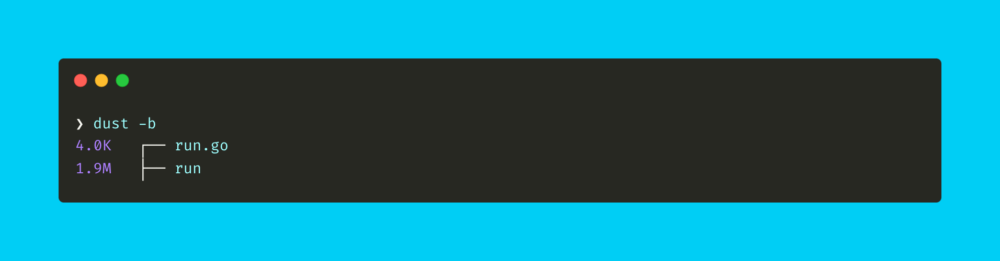
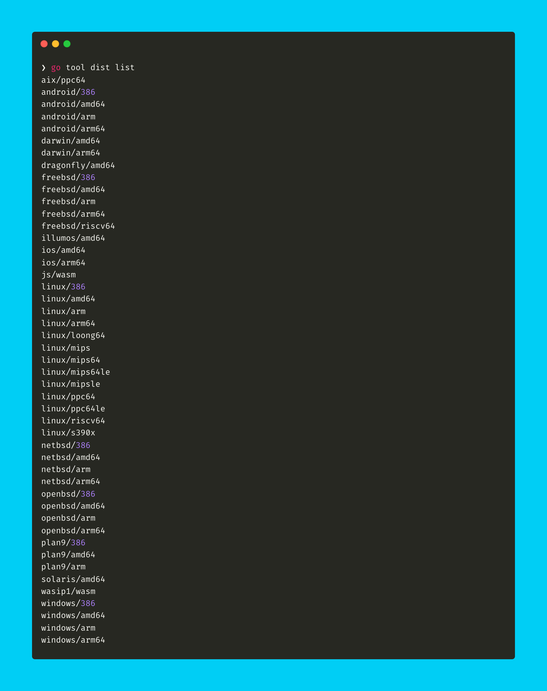
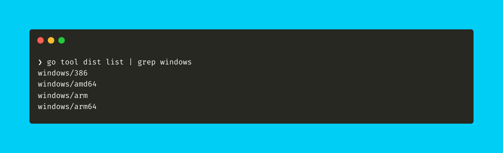
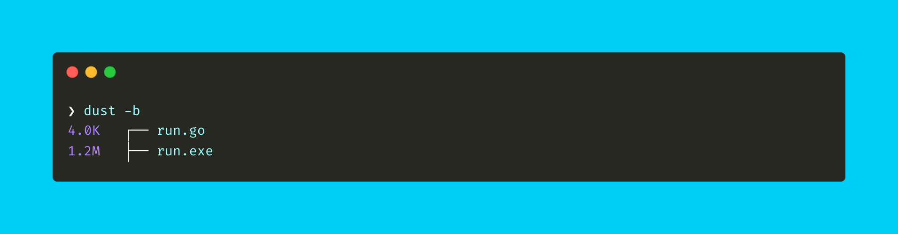

<!--more-->


[This post is part of a series.](/blog/cross-compilation-adventures/)

_TLDR; I want to build cross-platform CLI utility tools that can be compiled on my laptop and run seamlessly on other platforms._


It is quite obvious for someone reading the blog posts in this series, that the author (me) loves using a lot of CLI tools. Afterall I am going to extents of exploring programming languages that fit my usecase in the best possible manner. Many of them actually simplify my day to day dev-life in many ways.
Interestingly, [many of them are built using Go lang](https://github.com/mantcz/awesome-go-cli?tab=readme-ov-file). Notable mention of [gh-cli](https://github.com/cli/cli), GitHub’s official command line tool. It is something I use quite often. It is natural that I wanted to explore Go lang for building CLI utility tool for myself.

Generally speaking about [Go lang](https://go.dev/):

> - Go is a statically typed, compiled language developed by Google in 2009. It's efficient and easy to write, making it popular for scalable apps. Go's concise syntax allows developers to write code quickly with fewer lines than other languages, reducing binary size and improving performance.
> - Go's strong type system and built-in support for concurrent programming make it well-suited for tasks that require heavy computational resources. Additionally, Go allows developers to cross-compile their code to run on other platforms without needing to recompile, making it ideal for building applications that can be deployed across multiple environments.

Sounds good! Let's dive into building a very basic CLI tool.

> You will build the same example as in the last post.

**_A good example to showcase would be to build a CLI tool that can convert from °C to F and vice versa. Our tool will take an input for value and the unit to be converted to, then output would be converted temprature value._**

> **NOTE**: I am using macOS (M2 Pro, Apple Silicon), so the instructions follow through using that only. However the steps should work on all platform with little tweaks.

First we need to install [**go-lang**](https://formulae.brew.sh/formula/go#default). Open your Terminal app and execute the command

```sh
brew install go
```

Once installed, you should have access to `go` compiler in your Terminal. If not restart your session or open a new Terminal window so it is loaded in the PATH. Follow through next steps

- Create a file named `run.go`.

  ```sh
  touch run.go
  ```

- Add the below code to the `run.go` file and save the file.

  ```go
  package main

  import (
    "fmt"
    "os"
    "strconv"
    "strings"
  )

  func celsiusToFahrenheit(celsius float64) float64 {
    return celsius*9/5 + 32
  }

  func fahrenheitToCelsius(fahrenheit float64) float64 {
    return (fahrenheit - 32) * 5 / 9
  }

  func main() {
    if len(os.Args) != 3 {
      fmt.Println("Usage: ./run <value> <unit_to_convert_to>")
      return
    }

    value, err := strconv.ParseFloat(os.Args[1], 64)
    if err != nil {
      fmt.Println("Invalid temperature value.")
      return
    }

    unit := strings.ToUpper(os.Args[2])

    var convertedTemperature float64

    switch unit {
    case "C":
      convertedTemperature = celsiusToFahrenheit(value)
    case "F":
      convertedTemperature = fahrenheitToCelsius(value)
    default:
      fmt.Println("Invalid unit. Please use C or F.")
      return
    }

    unitSymbol := "°F"
    if unit == "C" {
      unitSymbol = "°C"
    }

    fmt.Printf("Converted temperature: %v%s\n", convertedTemperature, unitSymbol)
  }
  ```

  > I am not going to explain this code as it is simple and self explanatory.
  >
  > To understand and learn the language you can use [Learn X in Y minutes: Go](https://learnxinyminutes.com/docs/go/) 🚀

- Now to compile, execute the `go` compiler with `build` argument and the `run.go` source file:

  ```sh
  go build run.go
  ```

  You should now have a binary generated in the same directory with the same name as the go file i.e run

  

  > **NOTE**: I use [`dust`](https://github.com/bootandy/dust) CLI tool to list files in directory with their sizes.
  > **TIP**: You can generate an optimized binary by passing `-ldflags "-s -w"` flags at the time of compilation. i.e `go build -ldflags "-s -w" run.go`. Result is just a smaller binary.

  

- Time to execute our generated `run` binary file:

  ```sh
  ❯ ./run
  Usage: ./run <value> <unit_to_convert_to>
  ```

  Didn't work 🙄, but we have a helpful message stating how to use the CLI tool 😊

  ```sh
  ❯ ./run 49 C
  Converted temperature: 120.2°C
  ```

Done! That was a super quick intro to working with Go Compiler and Go Language in less than 5 mins 😅

But we aren't done yet. This generated binary would work on \*nix systems. I mentioned earlier that I would like to have **_cross-(platform + compilation)_**.

**Go** allows to do that easily. Since we already have \*nix compatible binary i.e Linux and macOS are sorted for us. We need to cross compile to a format that Windows understands i.e `exe`/`executable`. Let's do that next.

Since v1.5, Go comes with support for all architectures built in. That means cross compiling is as simple as setting the right `$GOOS` and `$GOARCH` environment variables before building.

> **NOTE**: GOOS (pronounced "goose") stands for Go Operating System, while GOARCH (pronounced "gore-ch") stands for Go Architecture. GOOS and GOARCH are both pronounced "gore".

To find the list of possible platforms (the values you can use for these env variables), run the below command:

```sh
go tool dist list
```

Your output might be different, but this is how it looks like on my machine:



> **TIP**: To find all the Go supported architectures for a specific platform, use `grep`. For example to find for `windows`, run `go tool dist list | grep windows`:
>
> 

- This output `windows/amd64` is a set of key-value pairs separated by a `/`
- It is structured as `operating_system/architecture` which corresponds to `GOOS/GOARCH` i.e `$GOOS=operating_system` and `$GOARCH=architecture`
- Based on which platform and which architecture you want to compile to, you just need to pass the correct value to `GOOS` and `GOARCH` before calling `go build`.

For our usecase (and an example) compiling to Windows platform, build the `run.go` file with `GOOS=windows` flag before the `go build` command:

```sh
GOOS=windows go build run.go
```

> **NOTE**: You can also pass GOARCH with the architecture value, if you are compiling for a specific architecture for the platform.
> For example, for `windows` platform and `arm` architecture you should run the command:
> `GOOS=windows GOARCH=arm go build run.go`

Something to note, when building for windows os, the values of GOOS and GOARCH:

- For 64 bit: `GOOS=windows GOARCH=amd64`
- For 32 bit: `GOOS=windows GOARCH=386`

  You should now have a `.exe` binary generated in the same directory with the same name as the go file i.e run.exe

  

  > **TIP**: ou can generate an optimized binary by passing `-ldflags "-s -w"` flags at the time of compilation. i.e `GOOS=windows go build -ldflags "-s -w" run.go`. Result is just a smaller binary.

  

  > **NOTE**: In order to run this .exe file, you need to either execute this on Windows directly or if on a \*nix system then make use of [Wine](https://www.winehq.org/).

Thats it. I think **Go Language** pretty much does what I wanted to get out of it:

| Generate cross-platform binaries | Can cross-compile to platforms | Easy syntax, so maintainable code |
| -------------------------------- | ------------------------------ | --------------------------------- |
| ✅                               | ✅                             | ✅                                |

All check boxes ticked is good 😊

Something to note though, the generated binary's size isn't small. Compared to what `nim-lang` can generate (in KBs), the size of binary seems to be quite large (in MBs). It is comparable to what `kotlin-native` was able to generate.

However, Go has a very [thriving ecosystem of libraries and frameworks](https://github.com/avelino/awesome-go). This is an added advantage as most of the funtionality can be leveraged from using one of the libraries. This can be helpful to quickly build the CLI tool, rather than having to build everything from sratch.

> **BONUS**: While my requirement isn't about compiling to other platforms, but Go lang is quite capable to compile for many platforms such as compiling for Android, iOS, JavaScript, FreeBSD, etc. You can just pass a different value to GOOS and GOARCH before the `go build` command.

I'll be trying this approach of evaluating more languages in the future. You can find the code for this post [here](https://github.com/nisrulz/cross-compilation-adventures/tree/master/go-lang).
