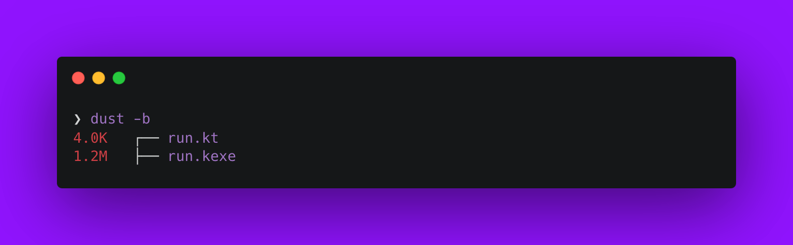
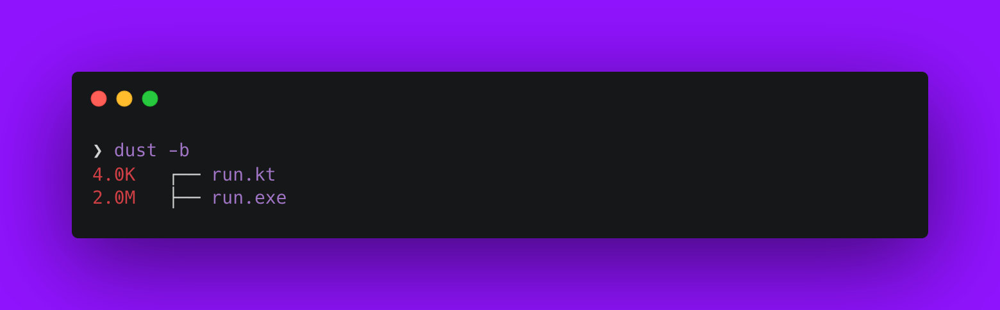

<!--more-->


This post is part of a series.


{}

1. [Nim Adventures](/blog/cross-compilation-adventures/cross-compilation-adventures-nim/)
2. **Kotlin Native Adventures**  `This post`
3. [Dart Adventures](/blog/cross-compilation-adventures/cross-compilation-adventures-with-dart/)
4. [Go Adventures](/blog/cross-compilation-adventures/cross-compilation-adventures-go/)
5. [Rust Adventures](/blog/cross-compilation-adventures/cross-compilation-adventures-rust/)
6. [C Lang Adventures](/blog/cross-compilation-adventures/cross-compilation-adventures-c/)
7. [Python Adventures](/blog/cross-compilation-adventures/cross-compilation-adventures-python/)

> TLDR: I want to build cross-platform CLI utility tools that can be compiled on my laptop and run seamlessly on other platforms.

{}

I am an Android Engineer by profession, so my goto language is [Kotlin](https://kotlinlang.org/). While looking at other programming languages, I also wanted to take a look at building a CLI tool using Kotlin. Thankfully, there exists [Kotlin/Native](https://kotlinlang.org/docs/native-command-line-compiler.html) that does exactly the same.

From the official website:

> - Kotlin is a modern but already mature programming language designed to make developers happier. It's concise, safe, interoperable with Java and other languages, and provides many ways to reuse code between multiple platforms for productive programming.
> - The Kotlin/Native compiler is available for three operating systems: macOS, Linux, and Windows. It can be accessed through the command line or as part of the standard Kotlin distribution, which can be downloaded from GitHub Releases. The compiler supports various targets, including Linux, macOS, iOS, and others. Additionally, it allows cross-platform compilation, enabling developers to compile code for a different platform than the one they are using.

Sounds good! Let's dive into building a very basic CLI tool.

> You will build the same example as in the last post.

**_A good example to showcase would be to build a CLI tool that can convert from °C to F and vice versa. Our tool will take an input for value and the unit to be converted to, then output would be converted temprature value._**

> **NOTE**: I am using macOS (M2 Pro, Apple Silicon), so the instructions follow through using that only. However the steps should work on all platform with little tweaks.

First we need to install [**kotlin**](https://formulae.brew.sh/formula/kotlin#default) and [**kotlin-native**](https://formulae.brew.sh/cask/kotlin-native#default). Open your Terminal app and execute the command

```sh
brew install kotlin
brew install --cask kotlin-native
```

Once installed, you should have access to `kotlinc-native` compiler in your Terminal. If not restart your session or open a new Terminal window so it is loaded in the PATH. Follow through next steps

- Create a file named `run.kt`.

  ```sh
  touch run.kt
  ```

- Add the below code to the `run.kt` file and save the file.

  ```kotlin
  fun celsiusToFahrenheit(celsius: Double): Double {
      return celsius * 9 / 5 + 32
  }

  fun fahrenheitToCelsius(fahrenheit: Double): Double {
      return (fahrenheit - 32) * 5 / 9
  }

  fun main(args: Array<String>) {
      if (args.size != 2) {
          println("Usage: ./run.kexe <value> <unit_to_convert_to>")
          return
      }

      val value = args[0].toDoubleOrNull()
      val unit = args[1].uppercase()

      if (value == null) {
          println("Invalid temperature value.")
          return
      }

      val convertedTemperature = when (unit) {
          "C" -> celsiusToFahrenheit(value)
          "F" -> fahrenheitToCelsius(value)
          else -> {
              println("Invalid unit. Please use C or F.")
              return
          }
      }

      println("Converted temperature: $convertedTemperature${if (unit == "C") " °F" else " °C"}")
  }

  ```

  > I am not going to explain this code as it is simple and self explanatory.
  >
  > To understand and learn the language you can use [Learn X in Y minutes: Kotlin](https://learnxinyminutes.com/docs/kotlin/) 🚀

- Now to compile, execute the `kotlinc-native` compiler with `-o`argument with the name of output file and the `run.kt` source file:

  ```sh
  kotlinc-native run.kt -o run
  ```

  You should now have a binary generated in the same directory with the same name as the kt file i.e run.kexe

  

  > **NOTE**: I use [`dust`](https://github.com/bootandy/dust) CLI tool to list files in directory with their sizes.
  > **TIP**: You can generate an optimized binary by passing `-opt` flags at the time of compilation. i.e `kotlinc-native run.kt -o run -opt`. Result is just a smaller binary.

  

- Time to execute our generated `run.kexe` binary file:

  ```sh
  ❯ ./run.kexe
  Usage: ./run.kexe <value> <unit_to_convert_to>
  ```

  Didn't work 🙄, but we have a helpful message stating how to use the CLI tool 😊

  ```sh
  ❯ ./run.kexe 49 C
  Converted temperature: 120.2°C
  ```

Done! That was a super quick intro to working with Kotlin/Native Compiler and Kotlin Language in less than 5 mins 😅

But we aren't done yet. This generated binary would work on \*nix systems. I mentioned earlier that I would like to have **_cross-(platform + compilation)_**.

**Kotin/Native** allows to do that easily. Since we already have \*nix compatible binary i.e Linux and macOS are sorted for us. We need to cross compile to a format that Windows understands i.e `exe`/`executable`. Let's do that next.

- First install the `mingw-w64` toolchain using **homebrew** for macOS:

  ```sh
  brew install mingw-w64
  ```

- Compile the `run.kt` file with `-target mingw` flag:

  ```sh
  kotlinc-native run.kt -o run.exe -target mingw
  ```

  You should now have a `.exe` binary generated in the same directory with the same name as the kt file i.e run.exe

  

  > **TIP**: You can generate an optimized binary by passing `-opt` flags at the time of compilation. i.e `kotlinc-native run.kt -o run.exe -target mingw -opt`. Result is just a smaller binary.

  

  > **NOTE**: In order to run this .exe file, you need to either execute this on Windows directly or if on a \*nix system then make use of [Wine](https://www.winehq.org/).

Thats it. I think **Kotlin/Native and Kotlin Language** pretty much does what I wanted to get out of it:

| Generate cross-platform binaries | Can cross-compile to platforms | Easy syntax, so maintainable code |
| -------------------------------- | ------------------------------ | --------------------------------- |
| ✅                               | ✅                             | ✅                                |

All check boxes ticked is good 😊

The only drawback that I saw was that the binary size (even after using the `-opt` flag) was considerably bigger than when [I generated the same using Nim Lang](/en/blog/cross-compilation-adventures-nim/). But this is not a big concern for my usecase. Being able to use a programming language that I am highly familiar with overshadows the size drawback for my usecase atleast.

> **BONUS**: While my requirement isn't about compiling to other platforms, but Kotlin/Native is quite capable such as compiling for Android, iOS, watchOS, tvOS, etc.

I'll be trying this approach of evaluating more languages in the future. You can find the code for this post [here](https://github.com/nisrulz/cross-compilation-adventures/tree/master/kotlin-native).
