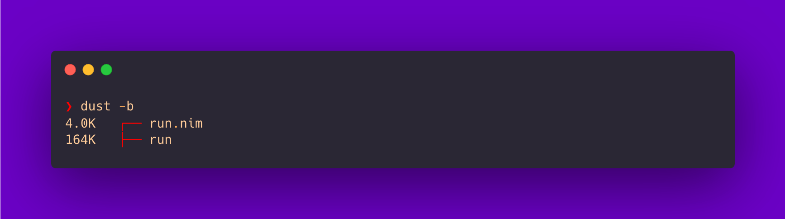
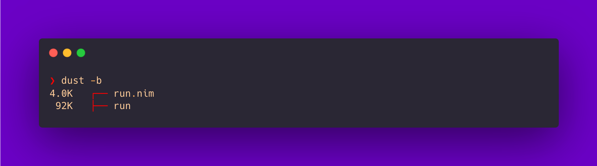
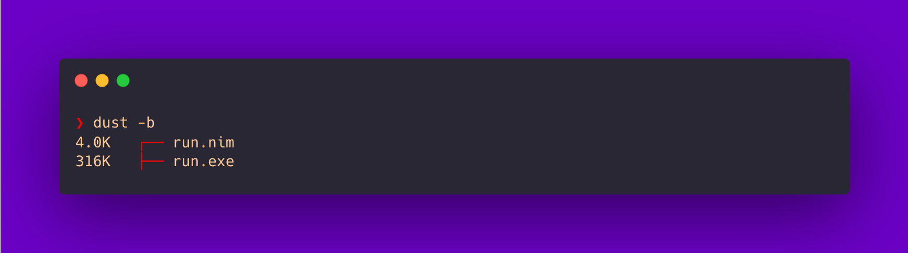
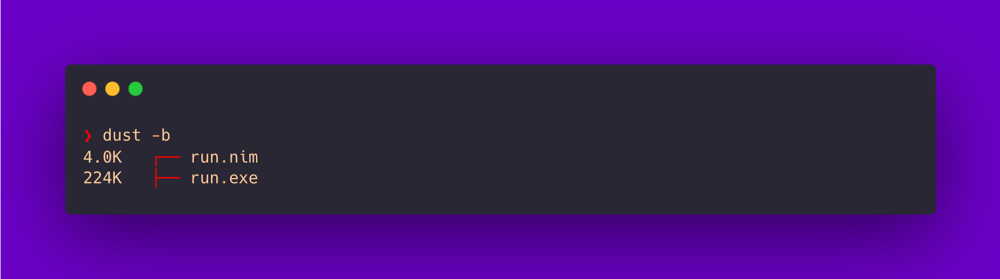

<!--more-->


  This post is part of a series.


{}

  1. **Nim Adventures**   `This post`
  2. [Kotlin Native Adventures](/posts/cross-compilation-adventures/cross-compilation-adventures-kotlin-native/)
  3. [Dart Adventures](/posts/cross-compilation-adventures/cross-compilation-adventures-with-dart/)
  4. [Go Adventures](/posts/cross-compilation-adventures/cross-compilation-adventures-go/)
  5. [Rust Adventures](/posts/cross-compilation-adventures/cross-compilation-adventures-rust/)
  6. [C Lang Adventures](/posts/cross-compilation-adventures/cross-compilation-adventures-c/)
  7. [Python Adventures](/posts/cross-compilation-adventures/cross-compilation-adventures-python/)

{}

I like working inside the Terminal app. So obviously I am using a lot of Terminal CLI (Command Line Interface) tools 🧰. To work with these CLI tools, for every usecase there is a small set of shell (bash/zsh) aliases/functions that I have created to work with for specific use cases and to simplify my life. These do differ based on the operating system I am working with (I mostly work with *nix systems i.e macOS and Linux). Remembering these aliases is, let's just say, not a good developer user experience or DevUX.

For that matter, I have wanted to build my own CLI tools that I could use instead of my shell dependent aliases. Many CLI tools themselves are cross-platform, so my idea is to build cross platform CLI tools for myself.

In order to build such CLI tools, I have been in search of suitable languages to help me build them. For my use case, an ideal language of choice must-have:

- Ability to generate binaries that are
  - cross-platform: Works on Linux, macOS, Windows (and more if possible).
  - small footprint in size
  - performant (No one wants slow tools 👀. Terminal is all about speed 🚀)
- Can cross-compile
  - Binaries for multiple target platform can be built from one platform itself (i.e from macOS compile binaries that run on macOS as well as Linux and Windows platform).
- Easy to maintain
  - The language is easy and simple enough to pick up. Thus enabling maintaining my project in the long run.

The first langauage that I stumbled upon is [Nim Lang](https://nim-lang.org/).

From the official website:

> - Nim is a statically typed compiled systems programming language. It combines successful concepts from mature languages like Python, Ada and Modula.
> - Nim generates native dependency-free executables, not dependent on a virtual machine, which are small and allow easy redistribution.
> - The Nim compiler and the generated executables support all major platforms like Windows, Linux, BSD and macOS.

Sounds good! Let's dive into building a very basic CLI tool.

**_A good example to showcase would be to build a CLI tool that can convert from °C to F and vice versa. Our tool will take an input for value and the unit to be converted to, then output would be converted temprature value._**

> **NOTE**: I am using macOS (M2 Pro, Apple Silicon), so the instructions follow through using that only. However the steps should work on all platform with little tweaks.

First we need to [install **nim-lang**](https://nim-lang.org/install_unix.html). Open your Terminal app and execute the command

```sh
curl https://nim-lang.org/choosenim/init.sh -sSf | sh
```

  > [Read here](https://nim-lang.org/install.html) to learn how to install on other platforms

Once installed, you should have access to `nim` compiler in your Terminal. If not restart your session or open a new Terminal window so it is loaded in the PATH. Follow through next steps

- Create a file named `run.nim`.

    ```sh
    touch run.nim
    ```

- Add the below code to the `run.nim` file and save the file.

    ```nim
    import strutils, std/os

    proc celsiusToFahrenheit(c: float): float =
      result = c * 9 / 5 + 32

    proc fahrenheitToCelsius(f: float): float =
      result = (f - 32) * 5 / 9

    when isMainModule:
      var value: string
      var unit: string
      if paramCount() == 2:
        value = $(paramStr(1).parseFloat())
        unit = paramStr(2).toUpper()
      else:
        echo "Usage: ./run <value> <unit_to_convert_to>"
        quit(1)

      var convertedTemperature: float
      if unit == "C":
        convertedTemperature = celsiusToFahrenheit(value.parseFloat())
      elif unit == "F":
        convertedTemperature = fahrenheitToCelsius(value.parseFloat())
      else:
        echo "Invalid unit. Please use C or F."
        quit(1)

      echo "Converted temperature: ", convertedTemperature, "°", unit

    ```

    > I am not going to explain this code as it is simple and self explanatory.
    >
    > To understand and learn the language I used [Learn X in Y minutes: Nim Lang](https://learnxinyminutes.com/docs/nim/) 🚀

- Now to compile, execute the `nim` compiler with `compile`argument and the `run.nim` file:

    ```sh
    nim compile run.nim
    ```

    > **NOTE**: You can also replace `compile` with its shorthand version `c` in above command.
    > i.e `nim c run.nim`.

    You should now have a binary generated in the same directory with the same name as the nim file i.e run.

    

    > **NOTE**: I use [`dust`](https://github.com/bootandy/dust) CLI tool to list files in directory with their sizes.
    > **TIP**: You can generate an optimized binary by passing `-d:release --opt:size` flags at the time of compilation. i.e `nim -d:release --opt:size c run.nim`. Result is just a smaller binary.

    

- Time to execute our generated `run` binary file:

    ```sh
    ❯ ./run 
    Usage: ./run <value> <unit_to_convert_to>
    ```

    Didn't work 🙄, but we have a helpful message stating how to use the CLI tool 😊

    ```sh
    ❯ ./run 49 C                         
    Converted temperature: 120.2°C
    ```

Done! That was a super quick intro to working with Nim Language in less than 5 mins 😅

> **TIP**: You can also compile and run the `.nim` file in one command by using the `-r` flag along with `c` flag. i.e `nim c -r run.nim`

But we aren't done yet. This generated binary would work on *nix systems. I mentioned earlier that I would like to have **_cross-(platform + compilation)_**.

**nim lang** allows to do that easily about which you can read [here](https://nim-lang.github.io/Nim/nimc.html#crossminuscompilation). Since we already have *nix compatible binary i.e Linux and macOS are sorted for us. We need to cross compile to a format that Windows understands i.e `exe`/`executable`. Let's do that next.

You can read about Windows cross compilation using nim lang [here](https://nim-lang.github.io/Nim/nimc.html#crossminuscompilation-for-windows).

- First install the `mingw-w64` toolchain using **homebrew** for macOS:

    ```sh
    brew install mingw-w64
    ```

- Install [MacPorts](https://www.macports.org/install.php)
- Start a new Terminal session and install `x86_64-w64-mingw32-gcc`

  ```sh
  sudo port install x86_64-w64-mingw32-gcc
  ```

  > **NOTE**: Due to a [path issue](https://github.com/nim-lang/Nim/issues/10717#issuecomment-480867457), you will have to tell nim where this `x86_64-w64-mingw32-gcc` is, by editing the `nim.cfg` file.

  To know the path where `x86_64-w64-mingw32-gcc` was installed by Macports, run `port content x86_64-w64-mingw32-gcc | grep bin/x86_64-w64-mingw32-gcc`

  ```sh
  ❯ port content x86_64-w64-mingw32-gcc | grep bin/x86_64-w64-mingw32-gcc
  /opt/local/bin/x86_64-w64-mingw32-gcc
  ```

  from above `x86_64-w64-mingw32-gcc` is installed at path `/opt/local/bin`. You need to let nim know about this path.
  
  Open `nim.cfg` at path `~/.choosenim/toolchains/nim-2.0.0/config/nim.cfg` using a code editor i.e VSCode.

  ```sh
  code ~/.choosenim/toolchains/nim-2.0.0/config/nim.cfg
  ```

  Find and edit the path value for key `amd64.windows.gcc.path` under `macosx`, from `/user/bin`

  ```nim
  @if macosx:
    amd64.windows.gcc.path = "/user/bin"
    ..
  ```

  to `/opt/local/bin`

  ```nim
  @if macosx:
    amd64.windows.gcc.path = "/opt/local/bin"
    ...
  ```

  Save the file and open a new Terminal session.

- Compile the `run.nim` file with `-d:mingw` flag:

    ```sh
    nim c -d:mingw run.nim
    ```

    You should now have a `.exe` binary generated in the same directory with the same name as the nim file i.e run.exe

    

    > **TIP**: You can generate an optimized binary by passing `-d:release --opt:size` flags at the time of compilation. i.e `nim -d:release --opt:size c -d:mingw run.nim`. Result is just a smaller binary.

    

    > **NOTE**: In order to run this .exe file, you need to either execute this on Windows directly or if on a *nix system then make use of [Wine](https://www.winehq.org/).

> **TIP**: Further reading about reduceing the binary size, read [here](https://hookrace.net/blog/nim-binary-size/)

Thats it. I think **Nim Language** pretty much does what I wanted to get out of it:

✅ Generate cross-platform binaries
✅ Can cross-compile to platforms
✅ Easy syntax, so maintainable code

| Generate cross-platform binaries | Can cross-compile to platforms | Easy syntax, so maintainable code |
| -------------------------------- | ------------------------------ | --------------------------------- |
| ✅                               | ✅                             | ✅                                |

All check boxes ticked is good 😊

> **BONUS**: While my requirement isn't about compiling to other platforms, but Nim is quite capable such as compiling for [Android](https://nim-lang.github.io/Nim/nimc.html#crossminuscompilation-for-android), [iOS](https://nim-lang.github.io/Nim/nimc.html#crossminuscompilation-for-ios) and [Nintendo-Switch](https://nim-lang.github.io/Nim/nimc.html#crossminuscompilation-for-nintendo-switch)

I'll be trying this approach of evaluating more languages in the future. You can find the code for this post [here](https://github.com/nisrulz/cross-compilation-adventures/tree/master/nim-lang).
