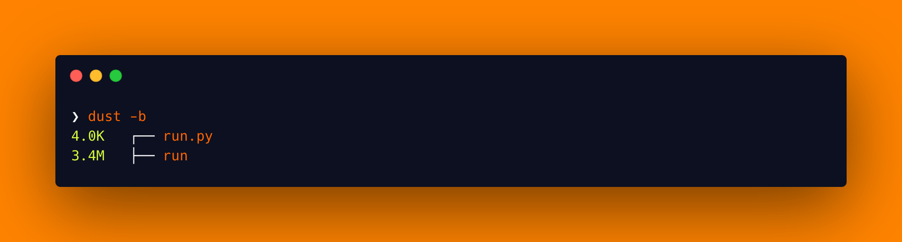

<!--more-->


This post is part of a series.


{}

1. [Nim Adventures](/blog/cross-compilation-adventures/cross-compilation-adventures-nim/)
2. [Kotlin Native Adventures](/blog/cross-compilation-adventures/cross-compilation-adventures-kotlin-native/)
3. [Dart Adventures](/blog/cross-compilation-adventures/cross-compilation-adventures-with-dart/)
4. [Go Adventures](/blog/cross-compilation-adventures/cross-compilation-adventures-go/)
5. [Rust Adventures](/blog/cross-compilation-adventures/cross-compilation-adventures-rust/)
6. [C Lang Adventures](/blog/cross-compilation-adventures/cross-compilation-adventures-c/)
7. **Python Adventures**  `This post`

> TLDR: I want to build cross-platform CLI utility tools that can be compiled on my laptop and run seamlessly on other platforms.

{}

Ask anyone what progamming language should a beginner start with and the answer would almost certainly include [Python](https://www.python.org/). Python is a very popular programming language with a very mature ecosystem. It is also very easy to learn and to use. It has all the features that you would expect from a programming language. I dabble in Python often, whenever I want to build a quick processing tool. Considering it to a build a CLI app, is but natural step forward. Python can run on multiple platforms, including Windows, macOS, and Linux, without the need for any additional dependencies or libraries. However note that Python itself cannot build executables for other platforms.
It works the same way Java does, where the installed Python executable on each platform can execute the same python file, so in that sense it is cross platform, but still it cannot cross-compile to other platforms. There are ways to create an executable binary using a Python file, which you will learn in this post and more.

Sounds good! Let's dive into building a very basic CLI tool.

> You will build the same example as in the last post.

**_A good example to showcase would be to build a CLI tool that can convert from °C to F and vice versa. Our tool will take an input for value and the unit to be converted to, then output would be converted temprature value._**

> **NOTE**: I am using macOS (M2 Pro, Apple Silicon), so the instructions follow through using that only. However the steps should work on all platform with little tweaks.

First we need to make sure we have access to **python3**. If you don't have access then go ahead and [install it](https://www.python.org/downloads/).

Once installed, you should have access to `python3` in your Terminal. If not restart your session or open a new Terminal window so it is loaded in the PATH. Follow through next steps

- Create a file named `run.py`.

  ```sh
  touch run.py
  ```

- Add the below code to the `run.py` file and save the file.

  ```py
  import sys

  def celsius_to_fahrenheit(celsius):
      return (celsius * 9 / 5) + 32

  def fahrenheit_to_celsius(fahrenheit):
      return ((fahrenheit - 32) * 5 / 9)

  def main():
      if len(sys.argv) != 3:
          print("Usage: ./run <value> <unit_to_convert_to>")
          return

      value = float(sys.argv[1])
      unit = sys.argv[2].upper()

      if not value:
          print("Invalid temperature value.")
          return

      converted_temperature = None

      if unit == "C":
          converted_temperature = celsius_to_fahrenheit(value)
      elif unit == "F":
          converted_temperature = fahrenheit_to_celsius(value)
      else:
          print("Invalid unit. Please use C or F.")
          return

      if converted_temperature is not None:
          print(f"Converted temperature: {converted_temperature}°{unit}")

  if __name__ == "__main__":
      main()
  ```

  > I am not going to explain this code as it is simple and self explanatory.
  >
  > To understand and learn the language you can use [Learn X in Y minutes: Python](https://learnxinyminutes.com/docs/python/) 🚀

- Now to compile, you could execute the `python3` compiler with the `run.py` source file:

  ```sh
  python3 run.py
  ```

  This will compile and run your code. This itself is a cross platform approach. i.e you usually would have python come pre-installed in the common OS you use. This means you can effectively run your python code on all the OS that have python installed, by simply running `python3 run.py`.

  To make it **look** like that you have an executable, you can use a trick to wrap your command inside a bash (\*nix)/bat(windows) script and make it executable, as shown below

  ```sh
  # Create the bash script
  ❯ touch run
  echo '#!/usr/bin/env bash' > run
  echo 'python3 run.py $1 $2' >> run

  # Make the script executable
  ❯ chmod +x run

  # Execute the bash script
  ❯ ./run
  Usage: ./run <value> <unit_to_convert_to>

  # Pass args to your bash script
  ❯ ./run 49 C
  Converted temperature: 120.2°C
  ```

  From the outside it looks like we have achieved what we wanted, but that is not true. This is not the same as an executable binary. It has a dependency on the `python3` compiler to be available in the PATH. Also in order for this to work, the `run.py` file needs to be in the same directory as the `run` bash script.
  So while this solution is a straight forward solution when using Python, it isn't a true cross compiled binary.

  That is not what I want. I would like to have an executable binary file that I can share around. I don't want to have a dependency on Python either. Once compiled it should require no dependencies.
  Python doesn't directly compile to an executable, instead its code needs to be bundled into an executable binary. There are 2 commonly known bundlers to do this job.

  1. [Nuitika](https://nuitka.net/index.html#what-is-nuitka)
     > Nuitka is the optimizing Python compiler written in Python that creates executables that run without an need for a separate installer.
  1. [PyInstaller](https://pyinstaller.org/en/stable/)
     > PyInstaller bundles a Python application and all its dependencies into a single package. The user can run the packaged app without installing a Python interpreter or any modules

- Compile into executable binary using Nuitika

  - First step is to install [nuitika Standard](https://nuitka.net/doc/download.html#pypi)

    ```sh
    python3 -m pip install -U nuitka
    ```

    > There is also [Nuitka Commercial](https://nuitka.net/index.html#nuitka-commercial). It additionally protects your code, data and outputs, so that users of the executable cannot access these. This a private repository of plugins that you pay to get access to. Additionally, you can purchase priority support.

  - To build an executable binary, execute the below command for your `run.py` file

    ```sh
    python3 -m nuitka run.py \
      --output-filename=run --onefile \
      --remove-output --quiet
    ```

    > **NOTE**: This will prompt you to download a C caching tool (to speed up repeated compilation of generated C code). Say yes to the question, when prompted.

  - To build an Optimized executable binary, execute the same build command above for your `run.py` file with `--lto=yes`:

    ```sh
    python3 -m nuitka run.py \
      --output-filename=run --onefile \
      --remove-output --quiet \
      --lto=yes
    ```

  You should now have a binary generated in the same directory with the same name as the py file i.e run

  

  > **NOTE**: I use [`dust`](https://github.com/bootandy/dust) CLI tool to list files in directory with their sizes.

- Compile into executable binary using PyInstaller

  - First step is to install [PyInstaller](https://pyinstaller.org/en/stable/#quickstart)

    ```sh
    python3 -m pip install -U pyinstaller
    ```

  - To build an executable binary, execute the below command for your `run.py` file

    ```sh
    pyinstaller run.py \
      --onefile --distpath . \
      --log-level ERROR --clean --noconfirm
    ```

  - To build an Optimized executable binary, execute the same build command above for your `run.py` file with `--strip`:

    ```sh
    pyinstaller run.py \
      --onefile --distpath . \
      --log-level ERROR --clean --noconfirm \
      --strip
    ```

    You should now have a binary generated in the same directory with the same name as the py file i.e run

    

- Time to execute our generated `run` binary file:

  ```sh
  ❯ ./run
  Usage: ./run <value> <unit_to_convert_to>
  ```

  Didn't work 🙄, but we have a helpful message stating how to use the CLI tool 😊

  ```sh
  ❯ ./run 49 C
  Converted temperature: 120.2°C
  ```

Done! That was a super quick intro to working with Python Compiler and Python Language in less than 5 mins 😅

**However, this generated binary would work on only macOS system.**

... the reason for that comes from known limitations in these bundlers, as none of them can cross compile to other OS platforms:

- [PyInstaller](https://pyinstaller.org/en/stable/usage.html#supporting-multiple-operating-systems): To run your generated Python executable binary on multiple operating systems like Windows and macOS, you'll need to create separate bundles for each platform using PyInstaller. Unfortunately, this means installing and running PyInstaller on each OS separately.

  > There is a [Github Action](https://github.com/sayyid5416/pyinstaller), that can help overcome this by building run.py for each OS by setting up the required python and pyinstaller environment.

- Nuitika: Same as Pyinstaller, it is required to install and run Nuitika on each OS separtely to compile an executable binary for that OS.

  > There is a [Github Action](https://github.com/Nuitka/Nuitka-Action), that can help overcome this by building run.py for each OS by setting up the required python and pyinstaller environment.

Thats it. I think **Python Language** even though being one of the more maintainable and simpler language has a big issue when it comes to building CLI apps as it is not straightforward to cross compile the binaries. The work around make everything look clunky and more like duct-tapped to work together. For a mature langauge such as Pythin cross compilation should be a must have feature. Although I do agree Python does away with that drawback by being cross platform via the Python Compiler which can execute the same python code on any platform. For building CLI apps though, having dependencies makes it unattractive as a language to use.

To summarize:

| Generate cross-platform binaries | Can cross-compile to platforms | Easy syntax, so maintainable code |
| -------------------------------- | ------------------------------ | --------------------------------- |
| ❌                               | ❌                             | ✅                                |

> **BONUS**: [PEP-0720](https://peps.python.org/pep-0720/) is a proposal made in the Python Enhancement Proposals, that aims to talk about Cross-compiling Python packages. Give it a read, as it is interesting to understand the current landscape of cross compiling Python.
> Also there is a way to [compile an executable binary for Windows platform using Wine](https://andreafortuna.org/2017/12/27/how-to-cross-compile-a-python-script-into-a-windows-executable-on-linux/)

I'll be trying this approach of evaluating more languages in the future. You can find the code for this post [here](https://github.com/nisrulz/cross-compilation-adventures/tree/master/python).
