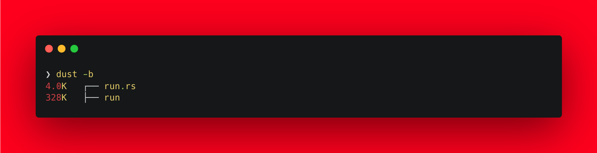
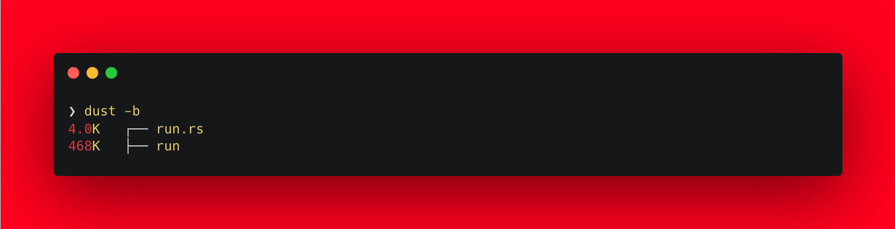
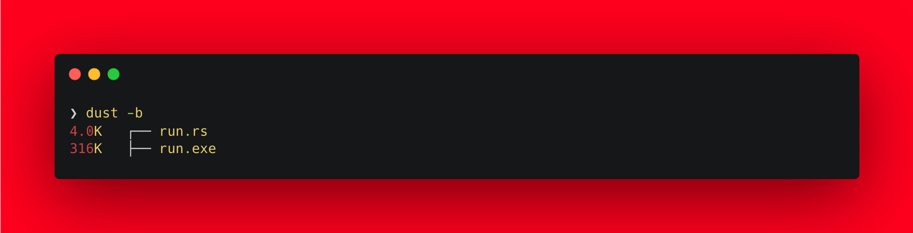

<!--more-->


This post is part of a series.


{}

1. [Nim Adventures](/blog/cross-compilation-adventures/cross-compilation-adventures-nim/)
2. [Kotlin Native Adventures](/blog/cross-compilation-adventures/cross-compilation-adventures-kotlin-native/)
3. [Dart Adventures](/blog/cross-compilation-adventures/cross-compilation-adventures-with-dart/)
4. [Go Adventures](/blog/cross-compilation-adventures/cross-compilation-adventures-go/)
5. **Rust Adventures**  `This post`
6. [C Lang Adventures](/blog/cross-compilation-adventures/cross-compilation-adventures-c/)
7. [Python Adventures](/blog/cross-compilation-adventures/cross-compilation-adventures-python/)

> TLDR: I want to build cross-platform CLI utility tools that can be compiled on my laptop and run seamlessly on other platforms.

{}

Rust has been on my radar for picking up as a new programming language to learn for some time now. It is said to be comparable to C/C++ in memory footprint and performance while providing robust memory safety. Rust was initially written for a personal project and later to power the browser engine for Mozilla, named [Servo](https://servo.org/), but quickly became clearly that as a programming language it can be used to solve problems and build robust software outside of the original goal it was built for. This is why it looks quite promising to build a CLI utility tool.

Generally speaking about [Rust](https://www.rust-lang.org/):

> Rust is a language that emphasizes memory safety without sacrificing performance. Developed by Mozilla Research, it provides fine-grained control over system resources and supports cross-compilation, resulting in efficient, safe executables. Rust's ownership and borrowing system manages memory safely without explicit operations, reducing errors like null pointer dereferences and data races. Additionally, Rust's just-in-time (JIT) compilation feature enables optimization at compile time, further improving performance. With a growing ecosystem of libraries, frameworks, and tools, Rust is becoming a popular choice for developers seeking reliable and efficient software development.

Sounds good! Let's dive into building a very basic CLI tool.

> You will build the same example as in the last post.

**_A good example to showcase would be to build a CLI tool that can convert from °C to F and vice versa. Our tool will take an input for value and the unit to be converted to, then output would be converted temprature value._**

> **NOTE**: I am using macOS (M2 Pro, Apple Silicon), so the instructions follow through using that only. However the steps should work on all platform with little tweaks.

First we need to install [**rust**](https://www.rust-lang.org/tools/install). Open your Terminal app and execute the command

```sh
curl --proto '=https' --tlsv1.2 -sSf https://sh.rustup.rs | sh
```

Once installed, you should have access to `rustc` compiler in your Terminal. If not restart your session or open a new Terminal window so it is loaded in the PATH. Follow through next steps

- Create a file named `run.rs`.

  ```sh
  touch run.rs
  ```

- Add the below code to the `run.rs` file and save the file.

  ```rs
  use std::env;

  fn celsius_to_fahrenheit(celsius: f64) -> f64 {
      celsius * 9.0 / 5.0 + 32.0
  }

  fn fahrenheit_to_celsius(fahrenheit: f64) -> f64 {
      (fahrenheit - 32.0) * 5.0 / 9.0
  }

  fn main() {
      let args: Vec<String> = env::args().collect();

      if args.len() != 3 {
          eprintln!("Usage: ./run <value> <unit_to_convert_to>");
          std::process::exit(1);
      }

      let value: f64 = args[1].parse().unwrap();
      let unit: String = args[2].to_uppercase();

      if value == 0.0 && args[1] != "0" {
          eprintln!("Invalid temperature value.");
          std::process::exit(1);
      }

      let converted_temperature: f64;

      if unit == "C" {
          converted_temperature = celsius_to_fahrenheit(value);
      } else if unit == "F" {
          converted_temperature = fahrenheit_to_celsius(value);
      } else {
          eprintln!("Invalid unit. Please use C or F.");
          std::process::exit(1);
      }

      println!("Converted temperature: {:.2}{}", converted_temperature, if unit == "C" { " °F" } else { " °C" });
  }
  ```

  > I am not going to explain this code as it is simple and self explanatory.
  >
  > To understand and learn the language you can use [Learn X in Y minutes: Rust](https://learnxinyminutes.com/docs/rust/) 🚀

- Now to compile, execute the `rustc` compiler with the `run.rs` source file:

  ```sh
  rustc run.rs
  ```

  You should now have a binary generated in the same directory with the same name as the rs file i.e run

  

  > **NOTE**: I use [`dust`](https://github.com/bootandy/dust) CLI tool to list files in directory with their sizes.
  >
  > ***
  >
  > **TIP**:
  > You can generate an optimized binary for size by passing `-C opt-level=z -C link-arg=-s -C codegen-units=1 -C lto` flags at the time of compilation. i.e
  >
  > ```sh
  > rustc -C opt-level=z -C link-arg=-s -C codegen-units=1 -C lto run.rs
  > ```
  >
  > Result is just a smaller binary. Here
  >
  > 1. `opt-level=z` : Optimize for smaller binary size
  > 2. `link-arg=-s` : Strip symbol infomration
  > 3. `codegen-units=1` : Increase compile time, but smaller size
  > 4. `lto`: Link time optimizations
  >
  > 
  >
  > ***
  >
  > You can generate an optimized binary for speed by passing `-C opt-level=3` flags at the time of compilation. i.e
  >
  > ```sh
  > rustc -C opt-level=3 run.rs
  > ```
  >
  > Result is a binary that is more performant.
  > 

- Time to execute our generated `run` binary file:

  ```sh
  ❯ ./run
  Usage: ./run <value> <unit_to_convert_to>
  ```

  Didn't work 🙄, but we have a helpful message stating how to use the CLI tool 😊

  ```sh
  ❯ ./run 49 C
  Converted temperature: 120.2°C
  ```

Done! That was a super quick intro to working with Rust Compiler and Rust Language in less than 5 mins 😅

But we aren't done yet. This generated binary would work on \*nix systems. I mentioned earlier that I would like to have **_cross-(platform + compilation)_**.

**Rust** allows to do that easily. Infact [it has a very extensive list of platforms it supports compilation to](https://doc.rust-lang.org/nightly/rustc/platform-support.html).Since we already have \*nix compatible binary i.e Linux and macOS are sorted for us. We need to cross compile to a format that Windows understands i.e `exe`/`executable`. Let's do that next.

- First install the necessary target using `rustup`:

  ```sh
  rustup target add x86_64-pc-windows-gnu
  ```

- Install the `mingw-w64` toolchain using **homebrew** for macOS:

  ```sh
  brew install mingw-w64
  ```

- Compile the `run.rs` file with `--target x86_64-pc-windows-gnu` flag:

  ```sh
  rustc --target x86_64-pc-windows-gnu run.rs
  ```

  You should now have a `.exe` binary generated in the same directory with the same name as the rs file i.e run.exe

  

  > **TIP**: You can generate an optimized binary by passing `-C opt-level=z -C link-arg=-s -C codegen-units=1 -C lto` flags at the time of compilation. i.e
  >
  > ```sh
  > rustc --target x86_64-pc-windows-gnu -C opt-level=z -C link-arg=-s -C codegen-units=1 -C lto run.rs
  > ```
  >
  > Result is a smaller binary, but the reduction is quite considerable 😮
  > 

  ***

  > **NOTE**: In order to run this .exe file, you need to either execute this on Windows directly or if on a \*nix system then make use of [Wine](https://www.winehq.org/).

Thats it. I think **Rust Language** pretty much does what I wanted to get out of it:

| Generate cross-platform binaries | Can cross-compile to platforms | Easy syntax, so maintainable code |
| -------------------------------- | ------------------------------ | --------------------------------- |
| ✅                               | ✅                             | ✅                                |

All check boxes ticked is good 😊

Something to note though, Rust comes quite close to my findings with `nim-lang`. It has an added advantage of supporting more number of platforms it can compile to (more than Go lang). Rust is being adopted in many critical codebases such as Android and Linux Kernel.
With Rust, there is good community support/resources and this language is known than Nim language amongst devs. I would definitely consider it as one to write CLI apps.

> **BONUS**: There is a nice book about building CLI apps using Rust that you can [read here](https://rust-cli.github.io/book/index.html)

I'll be trying this approach of evaluating more languages in the future. You can find the code for this post [here](https://github.com/nisrulz/cross-compilation-adventures/tree/master/rust).
