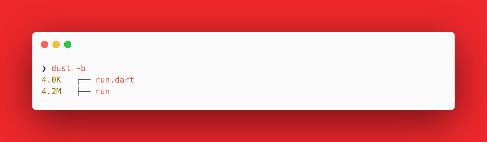
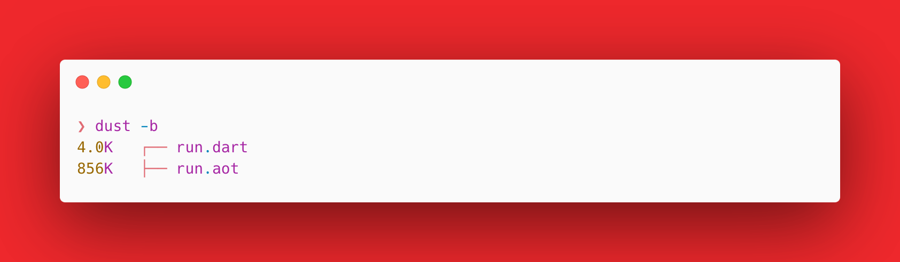

<!--more-->


This post is part of a series.


{}

1. [Nim Adventures](/posts/cross-compilation-adventures/cross-compilation-adventures-nim/)
2. [Kotlin Native Adventures](/posts/cross-compilation-adventures/cross-compilation-adventures-kotlin-native/)
3. **Dart Adventures**  `This post`
4. [Go Adventures](/posts/cross-compilation-adventures/cross-compilation-adventures-go/)
5. [Rust Adventures](/posts/cross-compilation-adventures/cross-compilation-adventures-rust/)
6. [C Lang Adventures](/posts/cross-compilation-adventures/cross-compilation-adventures-c/)
7. [Python Adventures](/posts/cross-compilation-adventures/cross-compilation-adventures-python/)

> TLDR: I want to build cross-platform CLI utility tools that can be compiled on my laptop and run seamlessly on other platforms.

{}

I have some experience working with Flutter, so I have been keeping track of Dart programming language for sometime. Dart in the initial days introduced something called Dart Native, which they eventually rolled back into the dart compiler. Dart can compile to the host platform where you run the compiler. But it cannot cross compile i.e it cannot compile binaries that are compatible with Windows and Linux if the code was compiled on macOS and so on.

From the official website:

> - An approachable, portable, and productive language for high-quality apps on any platform.
> - Use the `dart compile` command to compile a Dart program to a target platform. The output—which you specify using a subcommand—can either include a Dart runtime or be a module (also known as a snapshot).
> - Known limitation: No cross-compilation support ([issue 28617](https://github.com/dart-lang/sdk/issues/28617))
>   The compiler can create machine code only for the operating system on which you’re compiling. To create executables for macOS, Windows, and Linux, you need to run the compiler three times. You can also use a continuous integration (CI) provider that supports all three operating systems.

Sounds good! Let's dive into building a very basic CLI tool.

> You will build the same example as in the last post.

**_A good example to showcase would be to build a CLI tool that can convert from °C to F and vice versa. Our tool will take an input for value and the unit to be converted to, then output would be converted temprature value._**

> **NOTE**: I am using macOS (M2 Pro, Apple Silicon), so the instructions follow through using that only. However the steps should work on all platform with little tweaks.

First we need to install [**dart-sdk**](https://formulae.brew.sh/formula/dart-sdk#default)

```sh
brew install dart-sdk
```

Once installed, you should have access to `dart` compiler in your Terminal. If not restart your session or open a new Terminal window so it is loaded in the PATH. Follow through next steps

- Create a file named `run.dart`.

  ```sh
  touch run.dart
  ```

- Add the below code to the `run.dart` file and save the file.

  ```dart
  double celsiusToFahrenheit(double celsius) {
      return celsius * 9 / 5 + 32;
  }

  double fahrenheitToCelsius(double fahrenheit) {
      return (fahrenheit - 32) * 5 / 9;
  }

  void main(List<String> args) {
      if (args.length != 2) {
          print("Usage: ./run <value> <unit_to_convert_to>");
          return;
      }

      double? value = double.tryParse(args[0]);
      String unit = args[1].toUpperCase();

      if (value == null) {
          print("Invalid temperature value.");
          return;
      }

      double convertedTemperature;

      switch (unit) {
          case "C":
          convertedTemperature = celsiusToFahrenheit(value);
          break;
          case "F":
          convertedTemperature = fahrenheitToCelsius(value);
          break;
          default:
          print("Invalid unit. Please use C or F");
          return;
      }

      print("Converted temperature: $convertedTemperature${unit == "C" ? " °F" : " °C"}");
  }

  ```

  > I am not going to explain this code as it is simple and self explanatory.
  >
  > To understand and learn the language you can use [Learn X in Y minutes: Dart](https://learnxinyminutes.com/docs/dart/) 🚀

- Now to compile, execute the `dart` compiler with `compile exe` argument and the `run.dart` source file, output filename specified using `--output run`:

  ```sh
  dart compile exe run.dart --output run
  ```

  You should now have a binary generated in the same directory with the same name as the dart file i.e run

  > **NOTE**: This binary contains the Dart Runtime.

  

  > **NOTE**: I use [`dust`](https://github.com/bootandy/dust) CLI tool to list files in directory with their sizes.
  > **TIP**: You can generate an optimized binary by passing `aot-snapshot` flags at the time of compilation. i.e `dart compile aot-snapshot run.dart`. Result is an `run.aot` executable that doesnot contain the Dart Runtime.
  > To run this AOT executable, execute `dartaotruntime ./run.aot`

  

- Time to execute our generated `run` binary file:

  ```sh
  ❯ ./run
  Usage: ./run <value> <unit_to_convert_to>
  ```

  Didn't work 🙄, but we have a helpful message stating how to use the CLI tool 😊

  ```sh
  ❯ ./run 49 C
  Converted temperature: 120.2°C
  ```

Done! That was a super quick intro to working with Dart Compiler and Dart Language in less than 5 mins 😅

This generated binary would work on only macOS system. I mentioned earlier that there is a known limitation when it comes to cross-compilation support ([issue 28617](https://github.com/dart-lang/sdk/issues/28617)). Dart is unable to cross compile to other platforms. It can only compile for the platform it is running in.This just means in order to compile for other platforms you will need to install dart sdk on each platform and then compile your code everytime for that platfrom.

This is a big problem for the goal of building a CLI app, since it is an added overhead of having to run the dart compiler on each platform just to compile the code. Luckily though, someone found a way. Their idea is to use Github Actions, install dart sdk on a specific platform container and compile the code into that platform's executable. I am not going to do the whole writeup here, [but here is the link to read about it](https://blog.dantup.com/2019/11/easily-compiling-dart-to-native-executables-for-windows-linux-macos-with-github-actions/).

**BONUS**: Dart supports Portable modules (kernel) which compiles dart code into a single, portable file that can be run on all operating systems and CPU architectures. It contains a binary form of the abstract syntax tree (Kernel AST) for a Dart program. The Dart Intermediate Representation (Dart IR) is a machine-independent format.

> This is similar to how Java creates an intermediate representation as bytecode.

- You compile dart code: `dart compile kernel run.dart`
  > This generates a `run.dill`
- This seems like a good solution, but it isn't. The reason is that you need dart to run this code. i.e `dart run run.dill`
- This means in order to run the CLI app, there will be a dependency on `dart-sdk` to be installed and available in the path. This is a doable approach, although not a good one as Dart SDK itself is couple of Gb of download.

All in all, I think **Dart Compiler and Dart Language** while being easy to use and work with, do not allow to do true cross (platform + compile) even though it can generate binaries for the platform it is compiling on. It does not fit well for my goal of building a CLI app:

| Generate cross-platform binaries | Can cross-compile to platforms | Easy syntax, so maintainable code |
| -------------------------------- | ------------------------------ | --------------------------------- |
| ❌                               | ❌                             | ✅                                |

I'll be trying this approach of evaluating more languages in the future. You can find the code for this post [here](https://github.com/nisrulz/cross-compilation-adventures/tree/master/dart).
