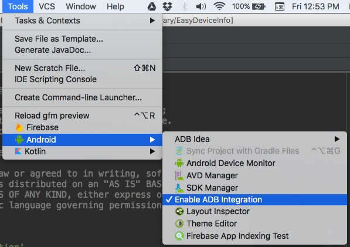

<!--more-->

Lets face it we all have been there , trying to fiddle with managing our emulators and dev devices. And at max we would do is try to manually manage it. Let me make this clear I am not talking about tests here as that's all related to the code. My focus here is on managing the device/emulator that's paired with your dev environment/system (..and to your IDE - Android Studio , if you still use Eclipse you are simply oblivious to the joys of coding in Android _[here is a long blank stare from me to you]_ ).

Technically there is a tool called ADB (Android Debug Bridge) which maintains your connection with your device/emulator and the dev environment/system.

From the [wikipedia](https://en.wikipedia.org/wiki/Android_software_development#ADB), it's described as

> **adb** is the command line tool provided in the Android SDK package. **adb** stands for Android Debug Bridge which allows you to communicate with an emulator instance or connected Android-powered device to:
>
> - Manage the state of an emulator or device.
> - Run shell commands on a device.
> - Manage port forwarding on an emulator or device.
> - Copy files to/from an emulator or device.

Ok... that sounds something of use but not convincing enough for you to try and play with it yet. Let me try and put forward some of the problem as a dev you are facing everyday (..and yet no one admits to them whenever it comes up in a conversation 🙄..) and how can we solve this.

---

### Uninstalling an app

Oh yeah ..you are used to hitting **Run** in the IDE (or the keyboard shortcut for the same) and BOOM the apk installs in the device. But what do you do to uninstall the apk ? **[Rolling eyes]** ohh yeah I know ..you will open up your device/emulator and manually uninstall the app by dragging it to the trash bin in the home screen and hit yes when prompted to uninstall it. Hard ain't it ? Yeah it is.

ADB can make it as simple as executing just a command

```bash
adb uninstall <package_name>
```

if you wish to keep the data and cache directory intact but uninstall the app just add `-k` as an option to the command

```bash
adb uninstall [-k] <package_name>
```

> `[ ]` means its an optional parameter

Of Course you can install an app too via

```bash
adb install [-r] [-s] <package_name>
```

the options available to the command are

- `-r` : reinstall the app, keeping its data
- `-s` : install on SD card instead of internal storage

That looks neat.

---

### Direct ADB commands to specific devices when you have multiple of those connected

Ok this one is my favorite 🙃

So here is the thing. You have like 5-6 devices connected to your dev environment and now you want to do some work with a specific device at a time. Piece of 🍰

Easy you say, right ? Like you can just fire up your Android Studio and execute the app in some specific device.

Not so early 😅. Let me complete. You want to execute commands in a certain order 🙄 ..yeah it isn't easy ar you thought before , eh 🤔

For our example here let's assume we have like 3 devices and 2 emulators running, named as `device_1`, `device_2`, `device_3`, `emu_1`, `emu_2`.

Our end goal is to be able to execute some adb command on the these devices/emulator in order such as

- `emu_1`
- `device_3`
- `device_1`
- `device_2`
- `emu_2`

Cool ? Now first of all let me give you the magic commands to handle this situation. Lets look at what's available to us

```bash
adb -d <command>
```

What this will do is it will directs command to the only connected USB device. Naice 🙂

> You can also use `adb -e <command>` to directs command to the only connected Emulator

But we wanna go a step ahead and orchestrate commands in a pattern (..by writing a bash script, obviously). But to do that I need to specifically direct commands to the device I want to control.

```bash
adb -s <device_id> <command>
```

> Get the device id by using `adb devices`

Now we are talking 😎. Now the only thing I gotta do is create a bash script something like this

```bash
#!/bin/bash

adb -s <emu_1_id> <some_command>
adb -s <device_3_id> <some_command>
adb -s <device_1_id> <some_command>
adb -s <device_2_id> <some_command>
adb -s <emu_2_id> <some_command>
```

> where `<some_command>` does not have to be the same.

..and

- save it as `execute_cmds_as_symphony.sh`
- make it executable by running `chmod +x execute_cmds_as_symphony.sh`
- execute it by running `./execute_cmds_as_symphony.sh`.

That's all there is. Everytime you wanna run it like this just run the bash script 🤓 😎

That's like creating a symphony with your devices , except for the fact it's not ..gonna be a symphony in the first place. And its just code executing🤔 But you get my point , right😅

---

### Connect wirelessly with your device

Read my post ["Life without wires : ADB over WiFi"](https://crushingcode.github.io/life-without-wires-adb-over-wifi/) to learn how to set it up.

---

### Device does not show up in the Android Studio deploy list

There are times when the device would not show up in your IDE. Possible issue could be that adb is not responding.

To fix that simply kill the server and start it again.

```bash
# Kill the server if it is running
adb kill-server

# Start the server
adb start-server
```

> I have seen that you also need to uncheck and then check **ADB Integration** inside Android Studio as an extra step.



<br/>

---

### To get Device Information

```bash
# Prints about the current state of the device : offline | bootloader | device
adb get-state

# Prints the serial number of the device
adb get-serialno

# Prints the device path
adb get-devpath
```

---

### Copy file to/from device/emulator

You can advocate about trying to copy files from your device by opening up some software and then dragging and dropping things onto your desktop. But I am fan of automating things and the above mentioned method is completely fine if you are doing that for one file and only once or twice.

It changes when you wanted to do the same task again and again. When you want to automate things `adb` commands come in handy. You can even add them to a script and run it every time one of the task completes.

**To push a file/dir to device**

```bash
adb push <local> <remote>
```

where `<local>` is file in your local system i.e `my_image.png` and `<remote>` is file location in device/emulator i.e `/sdcard/Downloads/my_image.png`

```bash
adb push ~/Downloads/my_image.png /sdcard/Downloads/my_image.png
```

**To pull a file/dir from device**

```bash
adb pull <remote> [<local>]
```

where `<local>` is file in your local system i.e `my_image.png` and `<remote>` is file location in device/emulator i.e `/sdcard/Downloads/my_image.png`

```bash
adb pull /sdcard/Downloads/my_image.png my_image.png
```

---

### Acting as a Developer utility-belt

**Generate Public/Private Key**

```bash
adb keygen <filename>
```

> The private key is stored in `<file>`, and the public key is stored in <file>.pub.
> Any existing files are overwritten.

**Get a bug report**

```bash
# Prints to the standard output
adb bugreport

# Writes to a file named bugreport.txt
adb bugreport > bugreport.txt
```

**Get list of all connected devices**

```bash
adb devices
```

### Logging

Of Course this is inbuilt into the IDE , but its worth knowing that it's not just a window which you use in Android Studio, but so much more.

Lets check out its power when used from terminal

```bash
# Dumps log entries from 3 log buffers: main, events and radio
adb logcat

# Dumps log entries in long format
adb logcat -v long

# Dumps log entries into rotated log files on the device
adb logcat -f /sdcard/Download/Android.log -r 1024 -n 8

# Dumps only error log entries generated from the "AndroidRuntime" process, including Java exceptions
adb logcat AndroidRuntime:E *:S

# Clears (flushes) the entire log and exits
adb logcat -c

# Dumps the log to the screen and exits
adb logcat -d

# Writes log message output to a file. The default is the "stdout - Standard Output"
adb logcat -f <filename>

# Prints the size of the specified log buffer and exits
adb logcat -g
```

**Logcat Format**

To define the format of each log entry that is dumped , you need to set the output format for log messages

```bash
# The default is brief format
adb logcat -v <format>

# Display priority/tag and the PID of process issuing the message (the default format)
adb logcat -v brief

# Display PID with the log info
adb logcat -v process

# Display the raw log message, with no other metadata fields
adb logcat -v raw

# Display the date, invocation time, priority/tag, and PID of the process issuing the message
adb logcat -v time

# Display the priority, tag, and the PID and TID of the thread issuing the message
adb logcat -v thread

# Display the date, invocation time, priority, tag, and the PID and TID of the thread issuing the message
adb logcat -v threadtime

# Display all metadata fields and separate messages with a blank lines
adb logcat -v long
```

**Filter your log data**

A few people would say that we can always use `| grep "filter_text"` appended to the `adb logcat`. Well you are right you can , but there are some neat tricks hidden in the actual implementation of logcat and you should look at them too.

```bash
adb logcat <options> <process-tag>:<priority-code>
```

> When filters are provided, the "logcat" command will dump log entries that are generated from specified processes with priorities higher than the specified code, plus all log entries that generated from unspecified processes.
>
> A wildcard character, "\*", can be used to represent all processes

List of all priority codes that can be used in the "logcat" command:

- `V` - Verbose (lowest priority)
- `D` - Debug
- `I` - Info (default priority)
- `W` - Warning
- `E` - Error
- `F` - Fatal
- `S` - Silent (highest priority, on which nothing is ever printed)

---

### To control the device

This is pretty well know to people who are into Modding their device. But for people who aren't going to mess with their device, here is what you can do with **ADB**

```bash
# Remounts the /system partition on the device read-write
adb remount

# Reboots the device, optionally into the bootloader or recovery program
adb reboot [bootloader|recovery]

# Reboots the device into the bootloader
adb reboot-bootloader

# Restarts the adbd daemon with root permissions
adb root

# Restarts the adbd daemon listening on USB
adb usb

# Restarts the adbd daemon listening on TCP on the specified port
adb tcpip <port>
```

---

### Some other base functionality

I am just going to list some more commands , just because well they exist! 😋

```bash
# Show help about all commands for adb, check this to get info about more commands in adb
adb help

# Shows the version number for adb
adb version
```

Comment/Suggestions always welcome.

If you would like to get more of such android tips and tricks, just hop onto my **[Android Tips & Tricks](https://github.com/nisrulz/android-tips-tricks)** github repository. I keep updating it constantly.

Keep on crushing code!🤓 😁

I would like to mention that [@pbreault](https://twitter.com/pbreault) wrote a plugin for Android Studio and Intellij IDEA called [ADB Idea](https://plugins.jetbrains.com/plugin/7380) [[Github]](https://github.com/pbreault/adb-idea), which allows you to do some of the common and straightforward interactions with ADB inside IntelliJ platform i.e Android Studio. Do check it out too 🙂
