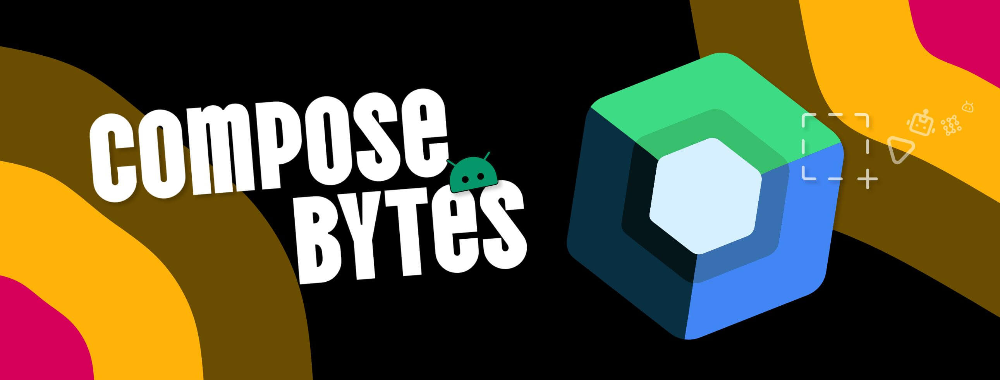
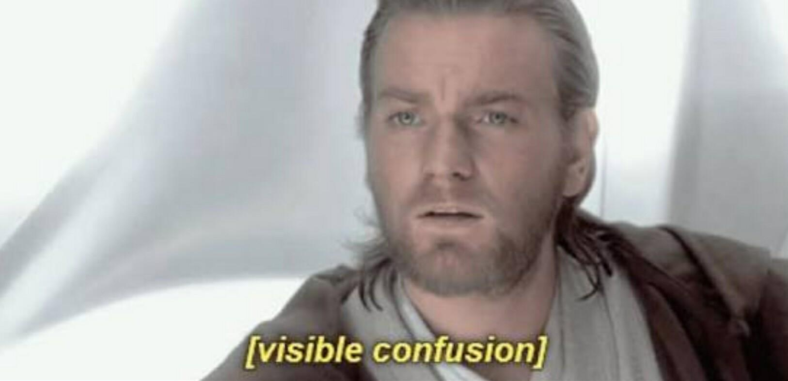

<!--Short abstract goes here-->

Read about how I found a nice `privacySensitive()` modifier available under SwiftUI and went on to implement it in Jetpack Compose.

<!--more-->

I was casually scrolling through Linkedin when I came across this nice post by [Vincent Pradeilles](https://www.linkedin.com/in/vincentpradeilles/). The post showcases how SwiftUI has this inbuilt modifier `.privacySensitive()` that lets you hide sensitive information by adding a single line of code.

<br/>

<iframe src="https://www.linkedin.com/embed/feed/update/urn:li:share:7336354362832605187" height="586" width="504" frameborder="0" allowfullscreen="" title="Embedded post"></iframe>

This seems like a legit useful feature mostly for apps in domains such as Banking, Identity, Authorization, Payments, etc.

This got me thinking if that could be made available for Jetpack Compose components too??🤔 This would be a simple example of how to redact text when the activity goes into background and undo the redaction when the activity comes back to foreground.

## Setting up the example

To start create a new project with empty compose activity and have it setup like below:

```kt {hl_lines=[26],filename="MainActivity.kt"}
class MainActivity : ComponentActivity() {
    override fun onCreate(savedInstanceState: Bundle?) {
        super.onCreate(savedInstanceState)
        enableEdgeToEdge()
        setContent {
            MyTheme {
                Scaffold { innerPadding ->
                    MainScreen(modifier = Modifier.padding(innerPadding))
                }
            }
        }
    }
}

@Composable
private fun MainScreen(modifier: Modifier = Modifier) {
    Column(
        modifier.fillMaxSize(),
        horizontalAlignment = Alignment.CenterHorizontally,
        verticalArrangement = Arrangement.Center
    ) {
        Text("Hello, world 👋🏼")
        Text(
            text = "This is sensitive information",
            modifier = Modifier
                .privacySensitive()
        )
    }
}

@Composable
fun Modifier.privacySensitive(): Modifier {
    // Add your redact logic here
    return this
}
```

> [!NOTE]
> The extension function `privacySensitive()` is just a dummy function that just returns the current `Modifier`. You will implement the redaction logic in this function to make everything work.
>
> For now, it makes the api look the same as the example shown above using SwiftUI 😊

<video autoplay muted loop src="vid_1.mp4"></video>

The goal is to achieve the same behaviour as shown in example using SwiftUI. The Text composable above with text "This is sensitive information" is to be redacted when the app goes into background and the text is not redacted when the app comes back to foreground.

## Figuring out the event triggered

To do so first you need to find a way to know when the user has put their app in background. This should be easy via observing the events in the Activity lifecycle. When the activity goes into background, it triggers a `onPause` event and when the activity comes back to foreground, it triggers a `onResume` event.

Inside a Composable function, you do so by observing on `lifecycleOwner.lifecycle.currentStateAsState()`, where `lifecycleOwner` is retreived from `LocalLifecycleOwner.current`.

Implementing this inside the extension function `privacySensitive()`, looks like:

```kt {hl_lines=[3, 5, 8]}
@Composable
fun Modifier.privacySensitive(): Modifier {
    val lifecycleOwner = LocalLifecycleOwner.current

    val lifecycleState by rememberUpdatedState(lifecycleOwner.lifecycle.currentStateAsState().value)

    LaunchedEffect(lifecycleState) {
        if (lifecycleState == Lifecycle.State.RESUMED) {
            Log.d("PrivacySensitive", "Foreground")
        } else {
            Log.d("PrivacySensitive", "Background")
        }
    }

    return this
}
```

Now run the app and try to go into "Recent Apps" screen/Background/Foreground and observe logcat logs.

<video autoplay muted loop src="vid_2.mp4"></video>

> [!NOTE]
> On running the app, you will notice that logs only show up when you put the app to background or foreground completely. They do not fire when say you click on the "Recent Apps" button on your Android device 🤔

Now, that is a problem 😭. In the example above using SwiftUI, it works perfectly fine when the app is put to background partially and the user didn't have to minimize the app completely to put it to background.

Why won't this just work? What event is being triggered on tapping the "Recent Apps" button? 🧐



On further digging, I stumbled upon [`onWindowFocusChanged`](<https://developer.android.com/reference/android/app/Activity#onWindowFocusChanged(boolean)>) with boolean parameter `hasFocus`, that is triggered when the user enters "Recent Apps" screen. When one open the "Recent Apps" screen the method `onWindowFocusChanged()` is called with `hasFocus = false`, and when the app is in focus `hasFocus = true`. It is also `true` when user presses Back while in "Recent Apps" screen.

Inside a Composable function, you can observe this event by observing on `windowInfo.isWindowFocused`, where `windowInfo` is retreived from `LocalWindowInfo.current`.

Modifying the extension function `privacySensitive()` to use this logic:

```kt
@Composable
fun Modifier.privacySensitive(): Modifier {
    val windowInfo = LocalWindowInfo.current

    val isInRecentApps by rememberUpdatedState(!windowInfo.isWindowFocused)

    LaunchedEffect(isInRecentApps) {
        if (!isInRecentApps) {
            Log.d("PrivacySensitive", "Foreground")
        } else {
            Log.d("PrivacySensitive", "Background")
        }
    }

    return this
}
```

After running the app and going in and out of Recent Apps screen one can see that it now works perfectly as expected.

<video autoplay muted loop src="vid_3.mp4"></video>

> [!NOTE]
> This also works when you put the app in split screen mode or another app covers this app. The app will loose focus and thus trigger the `isWindowFocused` the same way it does when entering the "Recent Apps" screen.

## Redacting the text

Now that the trigger is sorted. The next step is quite simple. You need to redact the text where the modifier is applied. This can be done by drawing over the text with solid color. You can use `drawWithContent` from the [Drawing modifiers](https://developer.android.com/reference/kotlin/androidx/compose/ui/draw/package-summary#drawing-modifiers) to draw over the text.

Here is a simple extension function that does that:

```kt
fun Modifier.applyRedact(color: Color = Color.Black) = drawWithContent {
    drawContent()
    drawRect(color)
}
```

Using this in the extension function `privacySensitive()` implementation will redact the text when the app goes out of focus/goes into "Recent Apps" screen:

```kt
@Composable
fun Modifier.privacySensitive(): Modifier {
    val windowInfo = LocalWindowInfo.current
    val isInRecentApps by rememberUpdatedState(!windowInfo.isWindowFocused)

    return if (isInRecentApps) {
        applyRedact()
    } else {
        this
    }
}
```

> [!NOTE]
> You don't need the `LaunchedEffect` anymore as it was only used for logs.

<video autoplay muted loop src="vid_4.mp4"></video>

That is more like it 🤘🏼

This works exactly like the example shown with SwiftUI, but with Jetpack Compose.

You can apply this extension function `privacySensitive()` to any composable function's `Modifier` and it will apply the effect when the activity goes into background and undo the effect when the activity comes back to foreground 🎉

## Bonus: Extending the logic

Even though the goal was achieved, why stop at just this effect? You can extend the logic to do more things. For example, you can add a blur effect to the text when the activity goes into background and undo the blur effect when the activity comes back to foreground.

Here is a modified version of the `privacySensitive()` extension function, that is more flexible:

````kt {filename="PrivacySenstive.kt"}
/**
 * Extension function to apply a privacy-sensitive effect when the app enters the recent apps menu.
 * Supports different privacy effects like blackout (redact) and blur.
 *
 * @param effect The privacy effect to apply. Defaults to `Redact(Color.Black)`.
 *
 * Usage Example:
 * ```
 * Modifier.privacySensitive() // Defaults to Redact(Black)
 * Modifier.privacySensitive(PrivacyEffect.Blur(10.dp)) // Applies a blur effect
 * Modifier.privacySensitive(PrivacyEffect.Redact(Color.Gray)) // Redacts with gray overlay
 * ```
 */
@Composable
fun Modifier.privacySensitive(effect: PrivacyEffect = PrivacyEffect.Redact()): Modifier {
    val windowInfo = LocalWindowInfo.current
    val isInRecentApps by rememberUpdatedState(!windowInfo.isWindowFocused)

    return if (isInRecentApps) {
        when (effect) {
            is PrivacyEffect.Redact -> applyRedact(effect.color)
            is PrivacyEffect.Blur -> applyBlur(effect.blurRadius)
        }
    } else {
        this
    }
}

/**
 * Applies a solid color overlay to redact the content when the app loses focus.
 *
 * @param color The color used for redaction. Default is black.
 */
private fun Modifier.applyRedact(color: Color = Color.Black) = drawWithContent {
    drawContent()
    drawRect(color)
}

/**
 * Applies a blur effect to obscure content when the app loses focus on Android 12+ (API 31+).
 * On older Android versions, where blur is not supported, it falls back
 * to redacting the content.
 *
 * @param blurRadius The radius of the blur effect in Dp. Default is 15.dp.
 */
fun Modifier.applyBlur(blurRadius: Dp = 15.dp): Modifier = when {
    // Android 12+ (API 31+)
    Build.VERSION.SDK_INT >= Build.VERSION_CODES.S -> {
        this.blur(blurRadius)
    }
    // Older versions: Fallback to redacting the content
    else -> this.applyRedact(Color.LightGray)
}

/**
 * Sealed class defining different privacy effects.
 */
sealed class PrivacyEffect {
    /**
     * Redact effect applies a solid color overlay.
     *
     * @param color The color of the overlay. Default is black.
     */
    data class Redact(val color: Color = Color.Black) : PrivacyEffect()

    /**
     * Blur effect applies a blur filter.
     *
     * @param blurRadius The intensity of the blur effect. Default is 15.dp.
     */
    data class Blur(val blurRadius: Dp = 15.dp) : PrivacyEffect()
}
````

## Demo with Blur effect

Using `.privacySensitive(PrivacyEffect.Blur(15.dp))`

<video autoplay muted loop src="vid_5.mp4"></video>

Thats all for this time. Share the blog post if you like it! 😎
