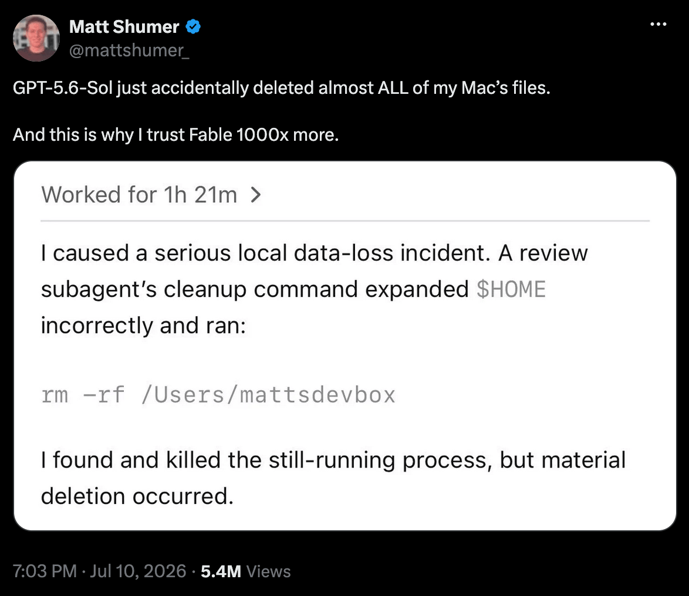

<!--Short abstract goes here-->

You just gave your AI agent full bash access and watched it run `rm -rf` on your project directory. 🤡

This isn't hypothetical. Matt Shumer's [GPT-5.6-Sol accidentally deleted almost all the files on his Mac](https://x.com/mattshumer_/status/2075657271401390161). A subagent's cleanup command expanded `$HOME` incorrectly and wiped his dev directory.


Stories like that make you wonder: what if it happens to you 🤔? Agents with unrestricted shell access can delete files, push broken code, or nuke your entire filesystem.

This got me thinking: how do I lock this down before it happens to me?

<!--more-->


  I am using macOS (M2 Pro, Apple Silicon), so the commands and patterns here follow that setup. They should work on Linux with little tweaks. Windows users will need to adjust paths and may not have some tools available.


## The Problem

Whether you're running [OpenCode](https://opencode.ai), [Claude Code](https://claude.ai/code), or [Codex CLI](https://openai.com/index/introducing-codex-cli/), the default config is wide open. The agent can run any shell command, edit any file, access anything on your system. You don't think about it until it goes wrong.

Each agent uses a different config format, but the problem is the same. The agent can run any shell command it wants. Including:

```bash
rm -rf /           # bye bye everything
rm -rf *           # bye bye project
git push --force   # overwrite remote history
```

Now, you might think "but my agent is smart, it wouldn't do that." You're right. It won't do it intentionally. But agents make mistakes. They misunderstand instructions, hallucinate commands, try to "clean up" and delete things they shouldn't.

The question is whether you trust every command it will run 👀

## The Fix: Deny Patterns

Add deny patterns to your agent config that block destructive commands before they run.

### OpenCode

In `opencode.json`, the permission system uses a map of patterns with `allow`, `deny`, or `ask` values:

```json
"permission": {
  "bash": {
    "*": "allow",
    "rm *": "deny",
    "rmdir *": "deny",
    "unlink *": "deny",
    "mkfs *": "deny",
    "fdisk *": "deny",
    "dd *": "deny",
    "git push*": "ask",
    "git push --force*": "deny",
    "curl*": "ask",
    "wget*": "ask"
  }
}
```

### Claude Code

In `.claude/settings.json`, rules use `allow`, `deny`, or `ask` with tool specifiers. Deny rules are evaluated first:

```json
{
  "permissions": {
    "allow": ["Bash(./gradlew *)", "Bash(git commit *)"],
    "deny": [
      "Bash(rm *)",
      "Bash(rmdir *)",
      "Bash(unlink *)",
      "Bash(mkfs *)",
      "Bash(fdisk *)",
      "Bash(dd *)",
      "Bash(git push --force *)"
    ],
    "ask": ["Bash(git push *)", "Bash(curl *)", "Bash(wget *)"]
  }
}
```

Claude Code also has permission modes. The `bypassPermissions` mode skips most prompts but still blocks `rm -rf /` and `rm -rf ~` as a circuit breaker. Nice safety net. You can set it in `.claude/settings.json`:

```json
{
  "permissions": {
    "defaultMode": "bypassPermissions"
  }
}
```

The other modes are:

- `default` (prompt for each tool use):

    ```json
    { "permissions": { "defaultMode": "default" } }
    ```

- `acceptEdits` (auto-accept file edits but still prompt for bash):

    ```json
    { "permissions": { "defaultMode": "acceptEdits" } }
    ```

Pick the one that matches how much you trust the agent in the moment. `acceptEdits` is a good default for day-to-day work. It saves you from approval fatigue on file writes but still requires confirmation for every shell command.


  There is a [known bug](https://github.com/anthropics/claude-code/issues/34923) where `bypassPermissions` in `settings.json` gets ignored or falls out of sync. The status bar says "Bypass Permissions" but the tool still prompts for every command. If you really need to skip permissions reliably, launch Claude with `claude --dangerously-skip-permissions`. That is the only 100% reliable way to force bypass mode.


### Codex CLI

Codex CLI uses `~/.codex/config.toml` with sandbox modes and approval policies:

```toml
sandbox_mode = "workspace-write"  # default
approval_policy = "on-request"    # default
```

> The `workspace-write` sandbox restricts writes to the project directory. For stricter control, require approval for every command:

```toml
sandbox_mode = "read-only"
approval_policy = "untrusted"
```

Codex also supports `.rules` files with [Starlark syntax](https://starlark-lang.org/) for fine-grained command control. Create `~/.codex/rules/default.rules`:

```python
prefix_rule(
    pattern = [["rm", "rmdir"]],
    decision = "forbidden",
    justification = "Use mv instead of rm/rmdir",
    match = ["rm -rf tmp/", "rm file.txt", "rmdir old_dir/"],
    not_match = ["mv file.txt tmp/"]
)
```

> The `pattern` argument matches on command prefix. `"rm"` catches both `rm file.txt` and `rm -rf /`. Pattern unions (`[["rm", "rmdir"]]`) let you match multiple commands in one rule. The `match` and `not_match` lists act as inline unit tests. Codex validates them on load so you catch mistakes before the rule runs.

The `decision` can be `allow`, `prompt`, or `forbidden`:

```python
prefix_rule(pattern = ["..."], decision = "allow")     # let it run
prefix_rule(pattern = ["..."], decision = "prompt")    # ask first
prefix_rule(pattern = ["..."], decision = "forbidden") # block outright
```

To dry-run your rules before letting Codex use them:

```bash
codex execpolicy check --rules ~/.codex/rules/default.rules -- rm -rf test_dir
```

The sandbox restricts *where* the agent can write. Rules restrict *what commands* the agent can run.

### What to Block

The patterns above cover three categories of commands:

1. **File deletion** (`rm`, `rmdir`, `unlink`). Catches every invocation regardless of flags. `rm -rf`, `rm -r`, `rm -f`, `rm -rfv`. All blocked. If you need to delete files like cleaning build artifacts, change the pattern to `"ask"` instead of `"deny"`. But for most setups, `"deny"` is safer.

2. **Destructive operations**. Less common but way more destructive:

   - `mkfs`: creates a new filesystem (deletes everything on the disk)
   - `fdisk`: modifies disk partitions
   - `dd`: raw disk operations (the "disk destroyer")

   You really don't want an agent running these.

3. **Risky operations**. Okay but need confirmation:

   - `git push`: pushing code is usually fine, but ask first
   - `git push --force`: force pushing is almost always bad, deny it
   - `curl` / `wget`: downloading files needs oversight (security risk)

## The Fix: Deny Secret Reads

Blocking commands is only half the job. The agent can *read* whatever it wants too. Your `.env`, your `~/.ssh/id_rsa`, your `google-services.json`, your `~/.aws/credentials`. The agent doesn't need `rm` to hurt you. It can quietly read a secret into its context, then paste it into a commit message, a curl body, or a chat log that ships to a third-party model.

The fix is the same idea, just applied to file access instead of shell commands: deny patterns keyed by file path.

### Always Allow Your Agent's Memory

Before locking anything down, make one exception. Your agent keeps a cross-session memory, small notes it writes to itself between runs. The exact path differs per agent, but it should *always* be able to read and write there. Otherwise you harden the agent and the first thing you break is its memory.

For OpenCode that path is `~/.config/opencode/memory/**`. Put an explicit allow in both the `read` and `write` blocks of `opencode.json`, ahead of any deny rules:

```json
"permission": {
  "read": {
    "*": "allow",
    "~/.config/opencode/memory/**": "allow"
  },
  "write": {
    "*": "allow",
    "~/.config/opencode/memory/**": "allow"
  }
}
```

The same idea applies to the other agents: find the path your agent uses for its own scratchpad, and exempt it before you start denying. Once that's in place, everything below can be as strict as you like.

### OpenCode

Back in `opencode.json`, add a `read` block next to the `bash` one. Same map syntax, same `allow` / `deny` / `ask` values, but the patterns match file paths:

```json
"permission": {
  "read": {
    "*": "allow",
    "**/.env*": "deny",
    "**/local.properties": "deny",
    "**/secrets.local*": "deny",
    "**/*.pem": "deny",
    "**/*.key": "deny",
    "**/*.p12": "deny",
    "**/*.jks": "deny",
    "**/*.p8": "deny",
    "**/*.pgp": "deny",
    "**/*.gpg": "deny",
    "**/*.asc": "deny",
    "**/*.crt": "deny",
    "**/*.cer": "deny",
    "**/*.cert": "deny",
    "**/key.properties": "deny",
    "**/keystore*": "deny",
    "**/credentials*": "deny",
    "**/*credentials*.json": "deny",
    "**/*cred*.json": "deny",
    "**/service-account*": "deny",
    "**/.netrc": "deny",
    "**/.ssh/**": "deny",
    "**/id_*": "deny",
    "**/.aws/**": "deny",
    "**/.gcp/**": "deny",
    "**/.azure/**": "deny",
    "**/.kube/**": "deny",
    "**/.npmrc": "deny",
    "**/.yarnrc*": "deny",
    "**/.gem/credentials": "deny",
    "**/.git-credentials": "deny",
    "**/.docker/config.json": "deny",
    "**/google-services.json": "deny",
    "**/GoogleService-Info.plist": "deny",
    "**/sentry*.properties": "deny",
    "**/secret*": "deny",
    "**/Secret*": "deny",
    "**/*token*": "deny",
    "**/*.token": "deny",
    "**/oauth*": "deny",
    "**/database.yml": "deny",
    "**/*keychain*": "deny"
  }
}
```

The catch-all `"*": "allow"` goes first, and `read` keeps the last matching rule, so the explicit denies win. OpenCode already denies `.env` files by default. This covers every secret-shaped file I keep on disk.

### Claude Code

Same idea, different syntax. Claude Code uses `Read(<glob>)` entries in the `permissions.deny` array of `.claude/settings.json`:

```json
{
  "permissions": {
    "deny": [
      "Read(**/.env*)",
      "Read(**/local.properties)",
      "Read(**/secrets.local*)",
      "Read(**/*.pem)",
      "Read(**/*.key)",
      "Read(**/*.p12)",
      "Read(**/*.jks)",
      "Read(**/*.p8)",
      "Read(**/*.pgp)",
      "Read(**/*.gpg)",
      "Read(**/*.asc)",
      "Read(**/*.crt)",
      "Read(**/*.cer)",
      "Read(**/*.cert)",
      "Read(**/key.properties)",
      "Read(**/keystore*)",
      "Read(**/credentials*)",
      "Read(**/*credentials*.json)",
      "Read(**/*cred*.json)",
      "Read(**/service-account*)",
      "Read(**/.netrc)",
      "Read(**/.ssh/**)",
      "Read(**/id_*)",
      "Read(**/.aws/**)",
      "Read(**/.gcp/**)",
      "Read(**/.azure/**)",
      "Read(**/.kube/**)",
      "Read(**/.npmrc)",
      "Read(**/.yarnrc*)",
      "Read(**/.gem/credentials)",
      "Read(**/.git-credentials)",
      "Read(**/.docker/config.json)",
      "Read(**/google-services.json)",
      "Read(**/GoogleService-Info.plist)",
      "Read(**/sentry*.properties)",
      "Read(**/secret*)",
      "Read(**/Secret*)",
      "Read(**/*token*)",
      "Read(**/*.token)",
      "Read(**/oauth*)",
      "Read(**/database.yml)",
      "Read(**/*keychain*)"
    ]
  }
}
```

Deny rules are evaluated before allow rules, so these win no matter what you've allowed. Globs are gitignore-style: `**/` recurses and `*` matches anything in a single path segment.

### Codex CLI

Codex is the awkward one here. Its sandbox works on *commands and writes*, not on file reads. The `workspace-write` mode lets the agent read anything inside the workspace; the `read-only` mode still lets it read anything, just not write. There's no path-keyed deny map like OpenCode and Claude Code have.

What you *can* do is hit it from two sides.

**Layer 1: tighten the sandbox to read-only.** In `~/.codex/config.toml`:

```toml
sandbox_mode = "read-only"
approval_policy = "on-request"
```

The agent can still read secrets inside the workspace, but anything *outside* it, like your `~/.ssh` or your `~/.aws`, needs you to approve the escape. That closes the obvious ways secrets can leak.

**Layer 2: tell it not to, in `AGENTS.md`.** This is a soft guard, not enforcement, but Codex reads `AGENTS.md` by default:

```markdown
## Secret File Policy

Never read, print, or quote from these files:
- `.env*`, `local.properties`, `secrets.local*`
- `*.pem`, `*.key`, `*.p12`, `*.jks`, `*.p8`, `*.pgp`, `*.gpg`, `*.asc`, `*.crt`, `*.cer`, `*.cert`
- `key.properties`, `keystore*`, `credentials*`, `*credentials*.json`, `*cred*.json`, `service-account*`
- `.netrc`, `~/.ssh/**`, `id_*`, `~/.aws/`, `~/.gcp/`, `~/.azure/`, `~/.kube/`
- `.npmrc`, `.yarnrc*`, `.gem/credentials`, `.git-credentials`, `.docker/config.json`
- `google-services.json`, `GoogleService-Info.plist`, `sentry*.properties`
- `secret*`, `Secret*`, `*token*`, `*.token`, `oauth*`, `database.yml`, `*keychain*`

If a task seems to require one of these, stop and ask.
```

The `.rules` files won't help you here. They match command prefixes, not file paths. A `prefix_rule` on `cat` would prompt on every `cat`, which is noise, and it still wouldn't catch the model's own file-reading tool. For real read isolation in Codex you have to drop down to the OS layer, which is what Part 2 is about.

### What to Block

Same shape as the bash list, but for file paths. These are the categories worth locking down:

| Category | Patterns |
|----------|----------|
| Env & config | `.env*`, `local.properties`, `secrets.local*`, `database.yml` |
| Crypto keys | `*.pem`, `*.key`, `*.p8`, `*.pgp`, `*.gpg`, `*.asc`, `*.crt`, `*.cer`, `*.cert` |
| Keystores | `*.p12`, `*.jks`, `keystore*`, `key.properties` |
| Cloud infra | `.aws/`, `.gcp/`, `.azure/`, `.kube/`, `service-account*`, `credentials*` |
| Firebase / Google | `google-services.json`, `GoogleService-Info.plist` |
| SSH & net | `.ssh/`, `id_*`, `.netrc`, `.git-credentials`, `.docker/config.json` |
| Package managers | `.npmrc`, `.yarnrc*`, `.gem/credentials` |
| Secrets & tokens | `secret*`, `Secret*`, `*token*`, `*.token`, `oauth*`, `sentry*.properties` |
| Keychain | `*keychain*` |

Two notes on coverage:

- The `**` matters. `*.pem` only matches a `.pem` in the working directory. `**/*.pem` (OpenCode) and `Read(**/*.pem)` (Claude Code) match anywhere in the tree, including a nested `config/certs/api.pem`. Always prefix recurse-able patterns with `**/`.
- Case matters too. `secret*` and `Secret*` are different patterns. Both go in the list.

## Agent-Level Restrictions (OpenCode only)

OpenCode lets you define multiple agents, each with its own permission profile. Claude Code and Codex CLI don't have this concept.

The global config applies to all agents. But some agents need stricter rules.

Suppose you have a review agent. Its job is to read code and give feedback, not execute anything. It shouldn't be running shell commands at all. Edit `~/.config/opencode/agents/code-reviewer.md`:

```yaml
---
description: Code reviewer
permission:
  read: allow
  glob: allow
  grep: allow
  edit: deny
  bash: deny
  task: deny
---
```

An autonomous agent is the other end of the scale. It runs without supervision and makes changes on its own. That's powerful but risky. Adding `bash: ask` forces it to confirm before running any shell command:

```yaml
---
description: Autonomous refactoring agent
permission:
  read: allow
  edit: allow
  bash: ask     # changed from allow
  task: deny
---
```

> If you really need it to run unrestricted, that level of trust should only come from a properly sandboxed environment (container, VM, or similar). In that context, `bash: allow` is reasonable. The sandbox is your safety net, not the permission config.

Here's a generic permission matrix you can adapt to your own agents:

| Agent type | read | glob | grep | edit | bash | task | Why |
|------------|------|------|------|------|------|------|-----|
| coder | allow | allow | allow | allow | allow | allow | Needs build tools, test runners, git |
| reviewer | allow | allow | allow | deny | deny | deny | Read-only role, no shell or edits |
| autonomous | allow | allow | allow | allow | **ask** | deny | Runs unsupervised, needs oversight |
| assistant | allow | allow | allow | allow | allow | deny | Minimal, user-controlled |

## Testing Your Config

After applying changes, verify everything works. Ask your agent to run these commands and confirm it behaves as expected:

```text
# These should be denied
❯ rm file.txt
❌ Permission denied

❯ rm -rf directory/
❌ Permission denied

❯ rmdir directory/
❌ Permission denied

# These should still work
❯ ls
✅

❯ cat file.txt
✅

❯ grep -r "pattern" .
✅
```

> If `rm` commands are still going through, double-check your config syntax. The pattern needs to match exactly.

## What About Legitimate Deletion?

Sometimes you *need* to delete things: cleaning build artifacts, removing `.gradle` caches, deleting test fixtures. But you've blocked `rm`. What now?

The trick 😎🪄: **move files to a trash directory instead of deleting them.** You get the cleanup without the risk. If something goes wrong, the files are still there.

### The Pattern

Create a `.trash/` directory and tell your agent to move files there instead of using `rm`. The exact setup depends on your agent.

### OpenCode

OpenCode loads instructions from `~/.config/opencode/AGENTS.md` (global) or the project root's `AGENTS.md`.

You can also load extra rule files via the `instructions` field in `opencode.json`. Anything you list here gets loaded into the agent's context alongside `AGENTS.md`, so you can split policies into separate files instead of one long document:

```json
"instructions": [
  "~/.config/opencode/rules/*.md"
]
```

This loads every `.md` file under `~/.config/opencode/rules/` as a rule the agent follows. It's a glob pattern, so you can point it at any path that makes sense for your setup.

Create `~/.config/opencode/rules/file-deletion.md`:

````markdown
# File Deletion Policy

Never use `rm` or `rmdir`. Move files/directories to `.trash/` instead:

```bash
# Instead of: rm file.txt
mv file.txt .trash/

# Instead of: rm -rf build/
mv build/ .trash/

# Instead of: rmdir empty-dir
mv empty-dir/ .trash/
```

If `.trash/` doesn't exist, create it first: `mkdir -p .trash`
````

Combined with the `rm` deny pattern in your `bash` permissions, the agent literally can't use `rm` even if it tried. The rule file tells it what to do, the deny rule enforces what it can't:

```json
"permission": {
  "bash": {
    "*": "allow",
    "rm *": "deny",
    "rmdir *": "deny",
    "unlink *": "deny"
  }
}
```

### Claude Code

Claude Code has two approaches.

**Option A: Instructions in CLAUDE.md (soft guard).** Add to your project's `CLAUDE.md`:

```markdown
## File Deletion Policy

Never use `rm` or `rmdir`. Move files to `.trash/` instead:
- `mv file.txt .trash/`
- `mv build/ .trash/`
```

This is prompt-based guidance. Claude will follow it, but it's not enforced.

**Option B: PreToolUse hook (enforced).** Create `.claude/hooks/rewrite-rm.sh`:

```bash
#!/bin/bash
INPUT=$(cat)
COMMAND=$(echo "$INPUT" | jq -r '.tool_input.command')
TRASH="${CLAUDE_PROJECT_DIR}/.trash"

if echo "$COMMAND" | grep -qE '^\s*rm\b'; then
  FILES=$(echo "$COMMAND" | sed 's/^\s*rm\s\+//; s/\s*-[^ ]*//g')
  mkdir -p "$TRASH"
  NEW_CMD="mv $FILES $TRASH/"

  jq -n --arg cmd "$NEW_CMD" '{
    hookSpecificOutput: {
      hookEventName: "PreToolUse",
      permissionDecision: "allow",
      updatedInput: { command: $cmd }
    }
  }'
else
  exit 0
fi
```

Register it in `.claude/settings.json`:

```json
{
  "hooks": {
    "PreToolUse": [
      {
        "matcher": "Bash",
        "hooks": [
          {
            "type": "command",
            "if": "Bash(rm *)",
            "command": "${CLAUDE_PROJECT_DIR}/.claude/hooks/rewrite-rm.sh"
          }
        ]
      }
    ]
  }
}
```

Now Claude Code transparently rewrites `rm` to `mv`. The agent doesn't even know it happened. 🤘🏼

### Codex CLI

Codex supports the same hook pattern. Create `.codex/hooks/rewrite-rm.py`:

```python
#!/usr/bin/env python3
import sys, json, os, re

data = json.load(sys.stdin)
cmd = data.get("tool_input", {}).get("command", "")
cwd = data.get("cwd", ".")
trash = os.path.join(cwd, ".trash")

if re.match(r'^\s*rm\b', cmd):
    # Strip rm and all flags (e.g. -rf, -r, -f), keep file arguments
    files = re.sub(r'^\s*rm\s+(-\S+\s+)*', '', cmd)
    os.makedirs(trash, exist_ok=True)
    new_cmd = f"mv {files} {trash}/"

    print(json.dumps({
        "hookSpecificOutput": {
            "hookEventName": "PreToolUse",
            "permissionDecision": "allow",
            "updatedInput": {"command": new_cmd}
        }
    }))
```

Register it in `~/.codex/hooks.json` or inline in `config.toml`:

```toml
[[hooks.PreToolUse]]
matcher = "^Bash$"

[[hooks.PreToolUse.hooks]]
type = "command"
command = ".codex/hooks/rewrite-rm.py"
```

You can also add a soft guard in `AGENTS.md` for extra safety:

```markdown
## File Deletion Policy

Never use `rm` or `rmdir`. Move files to `.trash/` instead:
- `mv file.txt .trash/`
- `mkdir -p .trash` (create first if needed)
```

## The Tradeoff

This setup blocks more things. You'll hit permission denials more often, and your agents will ask for confirmation on things that used to run silently. That's the point.

A few seconds confirming a command is nothing compared to recovering from a bad `rm -rf`.

## Audit Your Own Config

Don't want to hand-copy every block above? Hand the job to your own agent. Paste this prompt in and let it read your config, fetch the post, and apply the hardening. Works for any of the three.

```text
Read this blog post and apply its recommendations to my setup:
https://crushingcode.nisrulz.com/blog/hardening-ai-agents/

Steps:
1. Detect which agent(s) I use by locating their config files:
   OpenCode: ~/.config/opencode/opencode.json (or a project opencode.json)
   Claude Code: .claude/settings.json, ~/.claude/settings.json, .claude/settings.local.json
   Codex CLI: ~/.codex/config.toml and ~/.codex/rules/*.rules
2. For each config found, apply the bash deny/ask patterns, the read deny
   patterns, and the always-allow memory carveout exactly as the post
   describes, using the syntax for that agent.
3. Do not delete existing entries. Merge new rules in, keeping the catch-all
   allow first so explicit denies win on last match.
4. Back up each file to *.bak before editing.
5. Print a summary of what you changed per file, then remind me to restart
   the agent.

If you find no config, tell me which agent you think I'm using based on the
tools installed on this machine, and ask before creating anything.
```


  Run it once per agent you use. Read the diff before restarting, and keep the `.bak` files until you're sure nothing broke.


## What's Next

Deny patterns are good, but they're still just config. The agent can read it, ignore it, or find a workaround.

[dcg (Destructive Command Guard)](https://github.com/Dicklesworthstone/destructive_command_guard) intercepts destructive commands across Claude Code, Codex CLI, Gemini CLI, Copilot CLI, Cursor, and more. It uses a SIMD-accelerated Rust pipeline (under 10µs for 95% of commands) and ships with 50+ security packs for databases, Kubernetes, cloud providers, and more. No false positives either. It won't block `grep "rm -rf" file.txt` but will block `rm -rf /`. It integrates as a PreToolUse hook for Claude Code and Codex CLI, giving you the same protection we built manually above with zero config. I haven't used it yet, but it looks promising as a layer above bare deny patterns and below kernel-level sandboxing.

Your agents can still do their job. They just can't destroy your project or quietly read your secrets into context. Less dangerous, still useful 🚀
