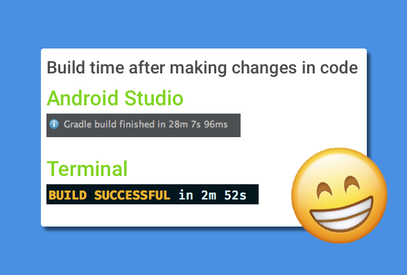
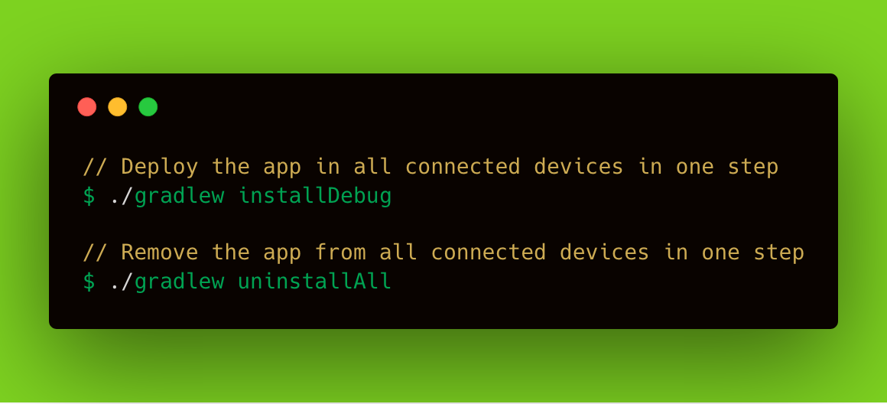
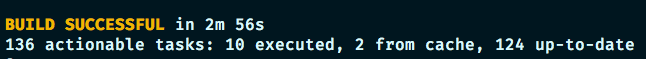

This isn’t a click-bait article! I will explain how to make your Android build time shorter than the reading time of this post (hopefully) 🏃🏻

Android build times are really slow, Ugh. I get it. Especially if you own a low spec machine with 4GB RAM.

##### TL;DR: Build your Android Project via terminal with gradle assembleDebug

> Read on for the longer version describing how I got to this.
> Also, make sure to check Bonus section at the end where I reduce the whole build+deployment to device into one command!

### First, the Problem

**My Laptop**: MacBook Air early 2014, 4GB Ram and 128 GB SSD.
My laptop does not pack much power, meaning when I would be coding on small-average android projects the build times would take 6–10 minutes.


I recently joined a new company, inherited a big Android code-base and …

**My build time when generating a debug APK was 37 minutes. Yes, 37 MINUTES! Let that sink in.**


I was able to drop this to 28 minutes by using a couple of tricks (checkout more of those in my[ Android Tips & Tricks repo](https://github.com/nisrulz/android-tips-tricks)) and following the official Gradle performance suggestions such as enabling [Build Cache, Parallelize builds, Configure on demand, Offline builds, etc](https://guides.gradle.org/performance/)

Updated my gradle config inside `~/.gradle/gradle.properties` which now looks like:

```text
# Enable Gradle Daemon
org.gradle.daemon=true

# Enable Configure on demand
org.gradle.configureondemand=true

# Enable parallel builds
org.gradle.parallel=true

# Enable Build Cache
android.enableBuildCache=true

# Enable simple gradle caching
org.gradle.caching=true

# Increase memory allotted to JVM
org.gradle.jvmargs=-Xmx2048m -XX:MaxPermSize=512m -XX:+HeapDumpOnOutOfMemoryError -Dfile.encoding=UTF-8
```

At 28 minutes build time, this wasn’t anywhere near acceptable.


### The Solution

After 2 days of trying and failing to reduce the build time, I decided to ditch Android Studio in favor of a text editor to write code. The reasoning behind that was that I wanted to get rid of any bells and whistles Android Studio brings with it. To build/compile code I turned to one of the most common ways of building a project, TERMINAL!

<center></center>

Guess what, I was able to clock my builds at ~3 minutes via Terminal!

```bash
# To build your debug apk from terminal, run the below
./gradlew assembleDebug
```

I noticed Android Studio was particularly bad at only the Gradle builds, hence I switched back to _writing code in Android Studio but stuck to running builds via my terminal._

**At almost 3 minutes build time down from 28 minutes, I had achieved 89% reduction in build times! That’s insane!**



### Bonus

**Edit 1:** As pointed out by [Frank Harper](https://twitter.com/franklinharper) you can effectively build and install the debug apk to your device using just a single command:

```bash
./gradlew installDebug
```

This however will not launch the apk but only install it.[This is also mentioned here in official documentation.](https://developer.android.com/studio/build/building-cmdline.html#DebugMode)



> If you would like to install as well as launch the apk on your connected device, read on…

I have created some terminal aliases to help me install the apk and then launch it too on the connected device.

```bash
# I use ZSH, here is what I added to my .zshrc file (config file)
# at ~/.zshrc

# Have the adb accessible, by including it in the PATH
export PATH="$PATH:path/to/android_sdk/platform-tools/"

# Setup your Android SDK path in ANDROID_HOME variable
export ANDROID_HOME=~/sdks/android_sdk

# Setup aapt tool so it accessible using a single command
alias aapt="$ANDROID_HOME/build-tools/29.0.3/aapt"

# Install APK to device
# Use as: apkinstall app-debug.apk
alias apkinstall="adb devices | tail -n +2 | cut -sf 1 | xargs -I X adb -s X install -r $1"
# As an alternative to apkinstall, you can also do just ./gradlew installDebug

# Alias for building and installing the apk to connected device
# Run at the root of your project
# $ buildAndInstallApk
alias buildAndInstallApk='./gradlew assembleDebug && apkinstall ./app/build/outputs/apk/debug/app-debug.apk'

# Launch your debug apk on your connected device
# Execute at the root of your android project
# Usage: launchDebugApk
alias launchDebugApk="adb shell monkey -p `aapt dump badging ./app/build/outputs/apk/debug/app-debug.apk | grep -e 'package: name' | cut -d \' -f 2` 1"

# ------------- Single command to build+install+launch apk------------#
# Execute at the root of your android project
# Use as: buildInstallLaunchDebugApk
alias buildInstallLaunchDebugApk="buildAndInstallApk && launchDebugApk"

# Note: Here I am building, installing and launching the debug apk which is usually in the path: `./app/build/outputs/apk/debug/app-debug.apk`
# when this command is executed from the root of the project
# If you would like to install and run any other apk, simply replace the path for debug apk with path of your own apk
```

..the apk is built, pushed and installed to device. Here is the result



I would however like to inspect more about the Gradle build times in my Android Project, but only when time permits. For those who like to know how that is done,

```bash
# Profile your build from the terminal
# In my case, <task> would be assembleDebug
gradle --profile <tasks>
```

My work cycle is super fast now. I am able to iterate at 10x the speed than I was earlier. I plan on revisiting this with more in-depth info. But for now, this Android Developer with not-so-fast-machine is happy and productive.

**EDIT 2:** Created a twitter thread with all my terminal aliases for Android Development (at the end there is a link to a gist for easy copy pasting). If you would like to follow, you can do so at\*

<center></center>

**Edit 3:** As pointed out by [Alejandro H. Cruz](https://twitter.com/AlejandroHCruz), in a reddit thread [Jake Wharton](https://twitter.com/JakeWharton) mentions that it is possible to speed up Android Studio by disabling a lot of plugins. In any case if you feel that you need the functionality they provide, one can just enable them. Most of these plugins aren’t used in day to day development work. I went ahead and disabled a bunch and saw a drastic change in builds run from Android Studio, a drop from 28 minutes to around 5 minutes.\* [Direct link](https://www.reddit.com/r/androiddev/comments/7sxhig/android_studio_slower_when_using_kotlin/dt88pgn/)

I hope this helps someone who is in the same boat as me. Give it a try at least and probably let me know if you find something new in this regards.
If it did help you in any way, then please share this in your network for it to reach people like you and more.

If you have suggestions or maybe would like me to add something to the content here, please let me know.

> A big thank you to **Mario Sanoguera** de Lorenzo for proof reading this article.
