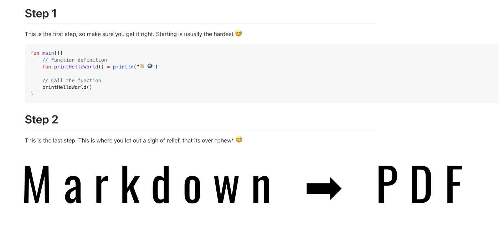
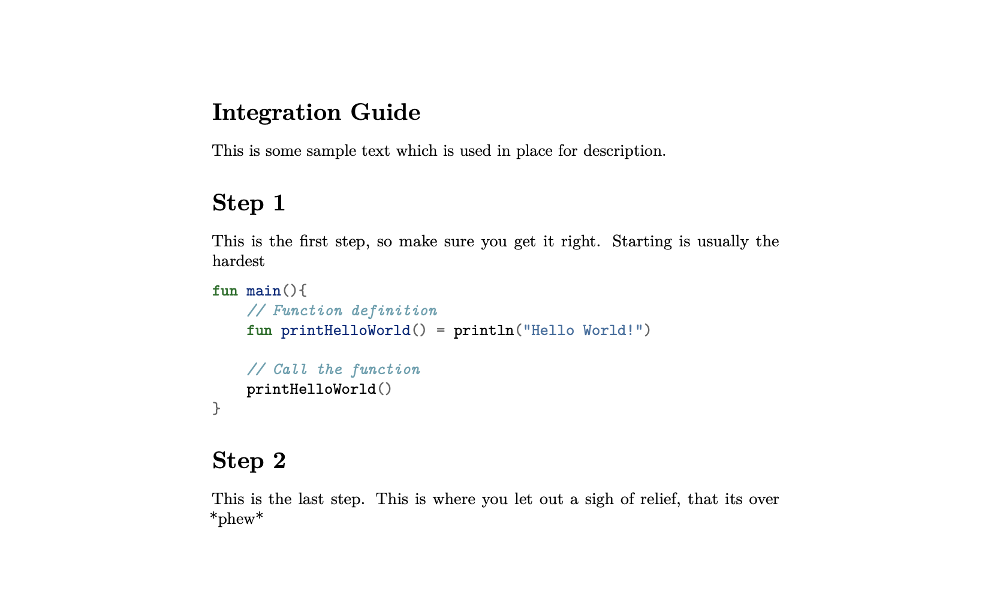
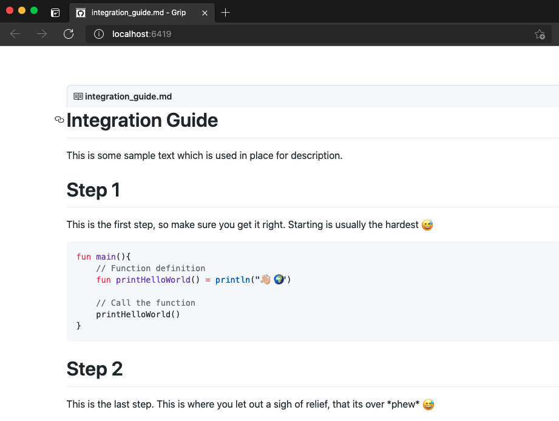
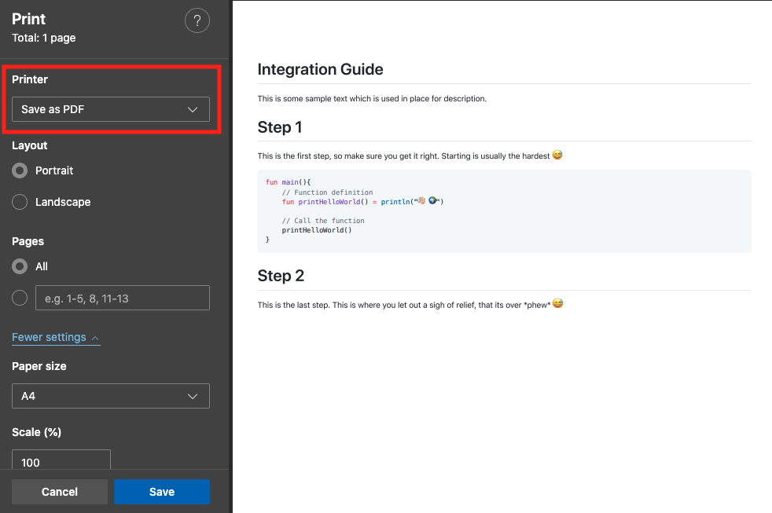
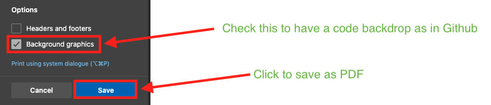
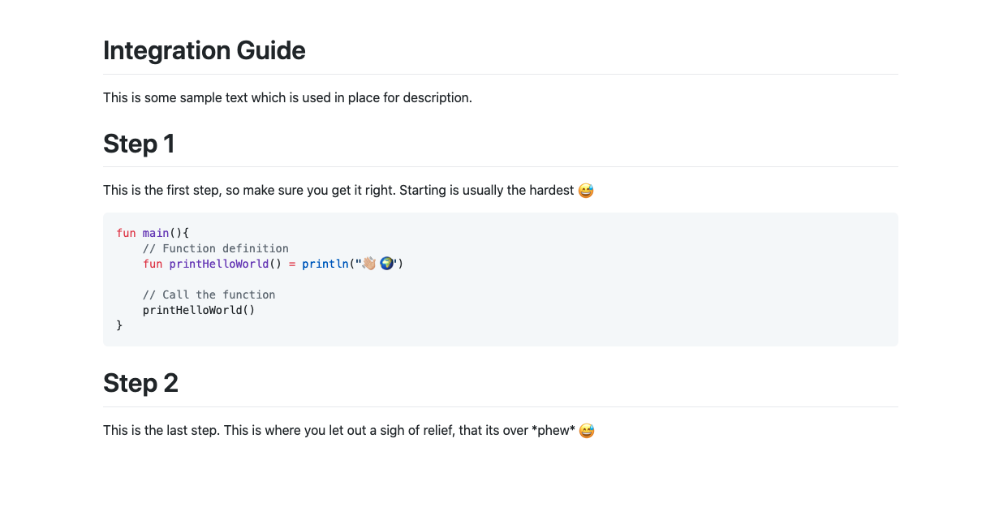

Writing documentation is part of almost all developer jobs. Although writing code is the primary focus for any developer, the core understanding/reasoning of the implementation can only be captured in a well-written **human-readable** documentation.

<!--more-->

I put emphasis on **human-readable** because this documentation needs to be understood by, well humans. If we throw in a lot of jargon words, acronyms and code without explaining it in a simple language then it is close to not usable by people.

Another aspect that is important is how the documentation is formatted. If it is just blobs of text it becomes boring to read and people tend to just skip parts of it. This is easy to fix. The best and easiest way is to write in [Markdown](https://www.markdownguide.org/getting-started/), which takes care of syntax highlighting as well as is simple to write. It is written following a certain [syntax](https://www.markdownguide.org/basic-syntax/) and is saved to a file with an extension of `.md`. In fact, this post is written in markdown 😎

The only problem is that many folks, don't actually know how to consume this `.md` file. Most folks are familiar with a more common format i.e `.pdf` file. Almost all major operating systems can handle **PDF** files.

I recently had to write a specific integration guide as part of documentation and deliver it to a client separately from our hosted documentation. Now I could totally write all of that in a Word doc/Normal Text file or in a Google Doc. However, I don't get all the nice features that markdown provides. Plus I have to deal with the GUI tools of each of these tools. So I decided to write the integration guide as a markdown file. The whole write-up was quickly done as I have been using markdown for some time now. Now comes the tricky part.

I needed to provide this file as a **PDF** file. So I started searching for possible ways I could do that.

The golden tool to pick for this would be [**pandoc**](https://pandoc.org/).

> Read about how to install pandoc [here](https://pandoc.org/installing.html).
> NOTE: In order to render pdf, pandoc requires [latex installed](https://www.latex-project.org/get/). Make sure it is installed before proceeding.

Considering our markdown file is called [integration_guide.md](./integration_guide.txt), below command would convert it to an `integration_guide.pdf`:

```sh
pandoc integration_guide.md -s -o integration_guide.pdf
```

As soon as I ran this command, it threw an error:

```sh
Error producing PDF.
! Package inputenc Error: Unicode character 😅 (U+1F605)
```

So it cannot handle emojis! Oh no 😕

Anyways, I still wanted to confirm it works, so I got rid of all emojis in the markdown file and ran the command again.



> Checkout the final generated [integration_guide.pdf](pandoc_gen_integration_guide.pdf) file.

Simple and fast!

This should solve the problem. Well not really 🥺

The thing is that I like Github Flavored Markdown (Yes there are different [flavors of Markdown](https://www.markdownguide.org/extended-syntax/#lightweight-markup-languages), like icecream 🍦).

Turns out while using **pandoc** this is not quite possible (or I couldn't find it. If you have an idea how to do it let me know on [twitter](https://twitter.com/nisrulz) 😅). Also, I found out that installing **LaTex** is a huge download 👀. Not to mention again, but not being able to render emojis is already a deal-breaker for me because I ♥️ using emojis. So I started looking for some other tool that would let me render my markdown into a PDF that looks the same as how Github renders markdown.

After an hour of trying out various tools, I stumbled upon [**grip**](https://github.com/joeyespo/grip). From the Github repository

> Render local readme files before sending off to GitHub.
>
> Grip is a command-line server application written in Python that uses the GitHub markdown API to render a local readme file. The styles and rendering come directly from GitHub, so you'll know exactly how it will appear. Changes you make to the Readme will be instantly reflected in the browser without requiring a page refresh.

> NOTE: Make sure **grip** is installed by executing `pip3 install grip` in your directory.

Using **grip** for my use-case was as simple as running

```sh
grip integration_guide.md
```

... this will start a local server with a url, `http://localhost:6419/`

```sh
 * Serving Flask app "grip.app" (lazy loading)
 * Environment: production
   WARNING: This is a development server. Do not use it in a production deployment.
   Use a production WSGI server instead.
 * Debug mode: off
 * Running on http://localhost:6419/ (Press CTRL+C to quit)
```

On opening `http://localhost:6419/` in a browser of your choice (I use MS Edge), you are presented with a nice Github Flavored Markdown render of your file



Sweet 😎

But wait, what is this fake tab in the rendered webpage?


In order to get rid of this _"Fake Tab"_, I checked the documentation of **grip**. Nothing stood out as a proper solution until I found this [issue/comment](https://github.com/joeyespo/grip/issues/331#issuecomment-733925600).

Basically, the solution is to load the markdown via **stdin** and then export it as an **HTML** file. Sounds good. I did a bit of a mix and came up with the below oneliner command:

```sh
cat integration_guide.md | grip - --export integration_guide.html && open integration_guide.html
```

which I converted into a bash function like below:

```sh
# Drop these in your ~/.bashrc or ~/.zshrc file

# Single command to open a file in your OS
# Use as: openFile filename.extension
function openFile(){
    # Open the generated output file
    if [[ $(uname -s) == "Darwin" ]]; then
        # macOS
        open $1
    else
        # Linux
        xdg-open $1
    fi
}

# Convert Markdown to HTML
# Dependency: Install grip, https://github.com/joeyespo/grip
# Use as: convertMarkdownToHtml your_markdown_file.md
# Use as with open flag: convertMarkdownToHtml your_markdown_file.md --open
function convertMarkdownToHtml(){
    if [[ $1 == *".md"* ]]; then
        # Filename without extension
        local FILE_NAME=$(basename "$1" .md)
        local OUTPUT_FILE="$FILE_NAME.html"
        # Read the markdown file and then convert it to an HTML file
        cat $FILE_NAME.md | grip - --export $OUTPUT_FILE

        if [[ $2 == "--open" ]]; then
          # Open the generated output file
          openFile $OUTPUT_FILE
        fi
    else
        echo "Passed file is not of markdown type. Please pass a .md file"
    fi
}
```

Using the bash function, I simply need to call the below line of code:

```sh
convertMarkdownToHtml integration_guide.md
```

Aditionally if called with the command with `--open` flag:

```sh
convertMarkdownToHtml integration_guide.md --open
```

Then the generated HTML file is opened in the associated Browser window!

At this point I can open the generated HTML file and utilize the **Print** functionality of the browser (**CMD** + **P**/ **Ctrl** + **P**) to save as PDF:



...and hit **Print** or **Save**.



On opening the generated PDF file I have:



> Checkout the final generated [integration_guide.pdf](integration_guide.pdf) file.

However, I am not quite happy with this solution. It works, yes, but I really don't want to open a browser and then have a few keystrokes to print the final pdf file. Would be nice if I could skip this step and directly convert HTML file to PDF via some commandline tool. This gave me an idea 💡 What if I could open a browser window in headless mode and print the document programmitically 🧐? Kind of like emulating the current process we figured earlier 👀

This is not new for me and I knew where to start for this part. The best tool out there for a headless and programmable browser is [Puppeteer](https://github.com/puppeteer/puppeteer). Reading through the docs quickly for my specific use case, I came up with the below script, which I saved as `renderToPdf.js`:

> NOTE: Make sure **puppeteer** is installed by executing `npm i -g puppeteer` in your directory.

```js
const puppeteer = require("puppeteer");

(async () => {
  // Get the cmdline arguments
  const myArgs = process.argv.slice(2);
  // The first argument is the HTML file
  const inputHtmlFile = myArgs[0];
  // Extract the filename from input file, to create the output filename
  const outputHtmlFileName = inputHtmlFile.replace(/\.[^/.]+$/, "") + ".pdf";
  // Prepare the file path
  const filePath = "file:///" + __dirname + "/" + inputHtmlFile;

  // Launch the headless browser
  const browser = await puppeteer.launch();
  const page = await browser.newPage();
  await page.goto(filePath, { waitUntil: "networkidle0" });
  await page.pdf({
    path: outputHtmlFileName,
    printBackground: true,
    format: "A4",
    margin: {
      left: "40px",
      right: "40px",
    },
  });
  await browser.close();
})();
```

Now in order to execute my `renderToPdf.js` script I need to execute in terminal the below command:

```sh
node renderToPdf.js integration_guide.html
```

> Checkout the final generated [integration_guide.pdf](puppeteer_gen_integration_guide.pdf) file via Puppeteer.

We can even incorporate this step as part of our bash function we created earlier. The updated function looks like below:

```sh
# Convert Markdown to PDF
# Use as: convertMarkdownToPdf your_markdown_file.md
# Use as with open flag: convertMarkdownToPdf your_markdown_file.md --open
function convertMarkdownToPdf(){
    if [[ $1 == *".md"* ]]; then
        # Filename without extension
        local FILE_NAME=$(basename "$1" .md)
        local TEMP_FILE="$FILE_NAME.html"
        # Read the markdown file and then convert it to an HTML file
        cat $FILE_NAME.md | grip - --export $TEMP_FILE
        # Render HTML to PDF
        node renderToPdf.js $TEMP_FILE
        # Remove intermediate html file
        rm $TEMP_FILE

        if [[ $2 == "--open" ]]; then
          # Open the generated output file
          openFile $FILE_NAME.pdf
        fi
    else
        echo "Passed file is not of markdown type. Please pass a .md file"
    fi
}
```

Using the bash function, I simply need to call the below line of code:

```sh
convertMarkdownToPdf integration_guide.md
```

> NOTE: The bash function has been renamed from `convertMarkdownToHtml` to `convertMarkdownToPdf`

...and the markdown file is converted to HTML first, opened in Headless browser and printed as a PDF file. Aditionally if called with the command with `--open` flag:

```sh
convertMarkdownToPdf integration_guide.md --open
```

Then the generated PDF file is opened in the associated PDF file reader!

That's it! Everything works 😎 It is quick and solved my immediate requirement.

[All this code now exists also on Github as a project](https://github.com/nisrulz/convert-md-to-pdf)! 🎉

Sidenote:
There are possibly many other tools, which could have been useful too i.e [markdown-pdf](https://www.npmjs.com/package/markdown-pdf). However I am quite happy with my setup here 😅
