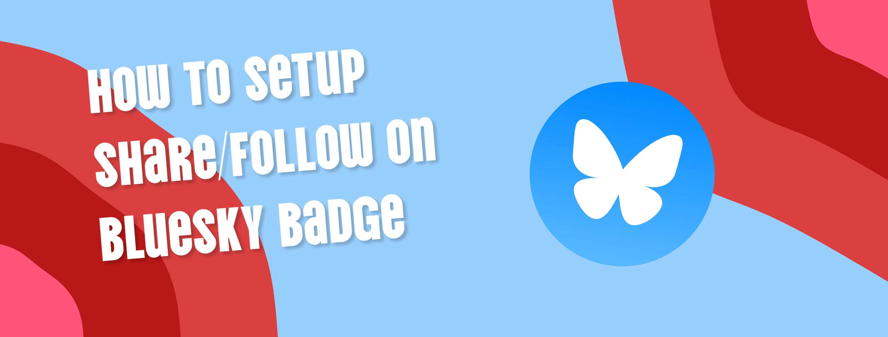
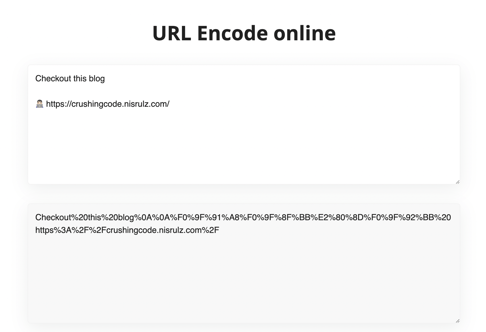
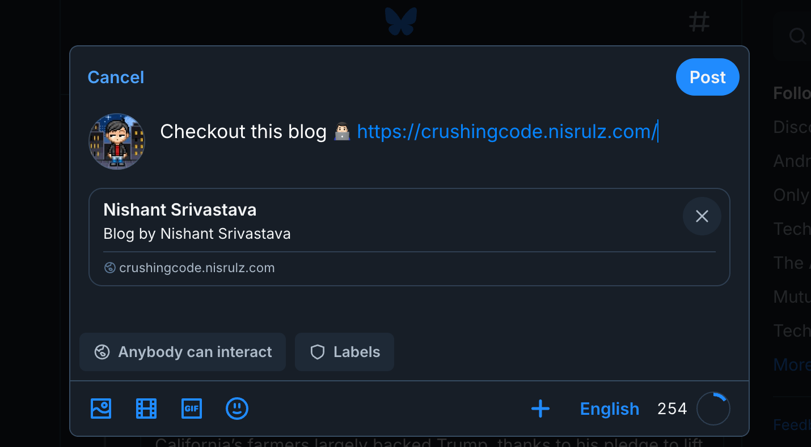

Incase you wanted to setup a **Follow me on Bluesky** or a **Share on Bluesky** badge in your project's Readme file or maybe on blog/website, there is a way. Using [static badge from Shields.io](https://shields.io/badges/static-badge) plus a simple Markdown-foo, you can do so quite easily.

<!--more-->

> This post assumes you know how to work with Markdown.

## Follow me on Bluesky Badge

To setup a **Follow me on Bluesky** badge, you need to add a 1-line code snippet to your `Readme.md` file:

```md {filename="Markdown"}

```

Preview:


### Follow me on Bluesky Badge's on-click action to open a url

You can setup badge's on-click action to open any url by following the template:

```txt
[badge_in_markdown](some_valid_url)
```

i.e To open my own website url `www.nisrulz.com` when one clicks on the **Follow me on Bluesky** badge, I modify the 1-line code snippet to:

```md {filename="Markdown"}
[](https:www.nisrulz.com)
```

Preview:

[](https:www.nisrulz.com).

But usually, you would want to open the Bluesky profile as the on-click action on the badge.

Bluesky's profile url is of the pattern:

```txt
https://bsky.app/profile/username_handle
```

i.e My profile url is: **https://bsky.app/profile/nisrulz.com**

So the badge with on click action would be setup as per the template shown below:

`[badge_in_markdown](url_to_bluesky_profile)`

```md {filename="Markdown"}
[](https://bsky.app/profile/nisrulz.com)
```

Preview: [](https://bsky.app/profile/nisrulz.com)

## Share on Bluesky Badge

To setup a **Share on Bluesky** badge, you need to add a 1-line code snippet to your `Readme.md` file:

```md {filename="Markdown"}

```

Preview:


### Share Badge's on-click action to create a post

You can setup badge's on-click action to a Share URL, that needs to adhere to a template as defined by Bluesky's [Action Intent Link](https://docs.bsky.app/docs/advanced-guides/intent-links)

Share URL template is thus of the pattern:

```txt
https://bsky.app/intent/compose?text=YOUR_URL_ENCODED_TEXT_HERE
```

> NOTE: Here `YOUR_URL_ENCODED_TEXT_HERE` is the content that is prefilled in the bluesky post. It must be URL-encoded and should not exceed 300 Unicode Grapheme Clusters.

To create your URL encoded text, you can use [UrlEncoder.io](https://www.urlencoder.io/).

For example, the text that you wish to prefill in the Bluesky post is:

```txt
Checkout this blog

👨🏻‍💻 https://crushingcode.nisrulz.com/
```

Now, open [UrlEncoder.io](https://www.urlencoder.io/) and copy-paste the above text into the web app.



The url encoded text is then:

```txt
Checkout%20this%20blog%0A%0A%F0%9F%91%A8%F0%9F%8F%BB%E2%80%8D%F0%9F%92%BB%20https%3A%2F%2Fcrushingcode.nisrulz.com%2F
```

Copy paste this into the Share URL template as shown below:

```txt
https://bsky.app/intent/compose?text=Checkout%20this%20blog%0A%0A%F0%9F%91%A8%F0%9F%8F%BB%E2%80%8D%F0%9F%92%BB%20https%3A%2F%2Fcrushingcode.nisrulz.com%2F
```

Now you can use this share url with the "Share on Bluseky" badge.

So the final badge with share url would be setup as shown below:

`[badge_in_markdown](share_url)`

```md {filename="Markdown"}
[](https://bsky.app/intent/compose?text=Checkout%20this%20blog%0A%0A%F0%9F%91%A8%F0%9F%8F%BB%E2%80%8D%F0%9F%92%BB%20https%3A%2F%2Fcrushingcode.nisrulz.com%2F)
```

Preview: [](https://bsky.app/intent/compose?text=Checkout%20this%20blog%0A%0A%F0%9F%91%A8%F0%9F%8F%BB%E2%80%8D%F0%9F%92%BB%20https%3A%2F%2Fcrushingcode.nisrulz.com%2F)



> Note: You are free to use the Share URL created in this post on some other HTML component such as `a` or `img` tags and everything would work the same way.
