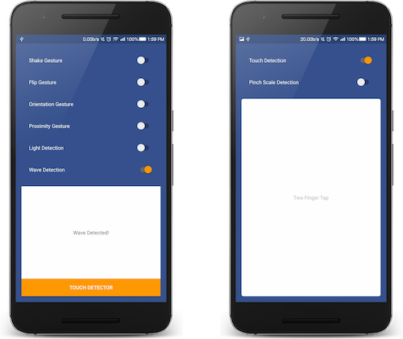

While working on various projects, there have been times when I have had to implement various gesture-based events. Every time I have had to do that I had to write the whole code for getting the `SensorManager` and getting access to the `SensorEvent`, plus the extra logic to detect the gesture. At first, it was just fine to do that since I was a beginner around that time. Then soon I got weary of the whole boilerplate. Around this time I started looking for a solution like an android library which would help me avoid all that boilerplate as well as enable me to maintain my code properly.

### Problem

Well, the problem at hand is basically the boilerplate code and the need to maintain your code. Duplicating code across projects and remembering the logic for each gesture was bound to end up in one of the projects in some form of error. It was no doubt inefficient and very repetitive. I was looking for a solution to all this because as Software Engineers we all strive to automate tasks or remove the need for duplicating code. As Douglas Crockford has said

> “Code reuse is the Holy Grail of Software Engineering.”

What was disappointing was that everything available was either too complex in terms of implementation or was very limiting.
**..and that’s when I decided to write my own Android Library, Sensey.**


**Sensey** was born out of a need to be able to make Gesture Detection in android as simple as it can get. Not everyone needs to look up `x`, `y`, `z` values of **_Accelerometer_** or `Azimuth`, `Pitch` and `Roll` values of **\*Orientation Sensor\*\***. There are other devs who only wish to detect if a certain Gesture was detected or not (period).

So when I set out to build **Sensey**, I had a very clear mindset that I want it to be exactly that — simple and clean.
When I first wrote Sensey, it wasn’t perfect. But it did the job well for me. Since I couldn’t find the solution for myself in the first place, I guessed (or assumed) that at least a few devs in the community would be in the same boat as me and thus from the start I was sure to make it open sourced ([You can check it out on Github](https://github.com/nisrulz/sensey)).



I recently released the version `1.6.0` of **Sensey** and you can tell that it has come a long way from what it was in version `1.0`. Let’s walk through the process of integrating Sensey.It is super simple to integrate Sensey in your current android project.

Simply add the below to your build.gradle file

```groovy
compile 'com.github.nisrulz:sensey:1.6.0'
```

..sync your gradle and then initialize Sensey in your activity

```java
Sensey.getInstance().init(context);
```

That’s it! Sensey at this point is integrated into your app. Now based on what kind of Gesture you want to detect, you will need to start and stop detectors provided by Sensey.

Say for the sake of a simple example, if we wanted to detect a Shake Gesture. All you need to do is

- Create an instance of ShakeListener

```java
ShakeDetector.ShakeListener shakeListener=new ShakeDetector.ShakeListener() {
    @Override public void onShakeDetected() {
       // Shake detected, do something
   }
   @Override public void onShakeStopped() {
       // Shake stopped, do something
   }
};
```

Now to start listening for Shake gesture, pass the instance `shakeListener` to `startShakeDetection()` function

```java
Sensey.getInstance().startShakeDetection(shakeListener);
```

To stop listening for Shake gesture, pass the instance `shakeListener` to `stopShakeDetection()` function

```java
Sensey.getInstance().stopShakeDetection(shakeListener);
```

Yup, that’s about all it takes to know if a shake gesture was performed and when it stopped.

Let’s check out the complete list of gesture detectors Sensey provides

#### Flip Detector

Sensey can detect if your device facing up or facing down. Check out the implementation [here](https://github.com/nisrulz/sensey/wiki/Usage#flip).

#### Light Detector

Sensey can detect if your device in a position where it is receiving any light or not. Check out the implementation [here](https://github.com/nisrulz/sensey/wiki/Usage#light)

#### Orientation Detector

Sensey can detect if your device’s top side is up or bottom side is up. It can tell if your device’s left side is up vs right side being up. Check out the implementation [here](https://github.com/nisrulz/sensey/wiki/Usage#orientation).

#### Proximity Detector

Sensey can detect if there is an object in the proximity of the device i.e either it is far or near to the device. Check out the implementation [here](https://github.com/nisrulz/sensey/wiki/Usage#proximity).

#### Shake Detector

Detects a Shake gesture performed on the device and also when the gesture stops.Check out the implementation [here](https://github.com/nisrulz/sensey/wiki/Usage#shake).

#### Wave Detector

This one is a simple implementation. It uses proximity sensor with timing to detect if a hand wave gesture is performed in front of the device screen. Check out the implementation [here](https://github.com/nisrulz/sensey/wiki/Usage#wave).

#### Chop Detector

Added in release 1.6.0 this one is brand new. It allows you to detect if a Chop gesture is performed with the device. Check out the implementation [here](https://github.com/nisrulz/sensey/wiki/Usage#chop).

#### Wrist Twist Detector

Added in release 1.6.0 this one is another brand new detector. This one allows you to detect if the wrist was twisted in a circular manner while holding the device. Check out the implementation [here](https://github.com/nisrulz/sensey/wiki/Usage#wristtwist).

#### Movement Detector

Another brand new detector added in release 1.6.0, it allows you to know if the device was moved or not. Once moved, it will also detect when the device becomes stationary. Check out the implementation [here](https://github.com/nisrulz/sensey/wiki/Usage#movement).

#### Sound Level Detector

Another brand new detector added in release 1.6.0, it allows you to measure the loudness of sound in the environment around the device (calculated on a scale of dB i.e decibel).Check out the implementation [here](https://github.com/nisrulz/sensey/wiki/Usage#soundlevel).

#### Pinch Scale Detector

Sensey can use this detector to know if the user is executing a pinch scale in or out gesture on the touch screen. It will also be able to detect when the scale gesture was stopped. Check out the implementation [here](https://github.com/nisrulz/sensey/wiki/Usage#pinchscale).

#### Touch Type Detector

This one can do a lot of things, you can choose which one to use or not to use. It can detect when someone on the device screen does the following:

- Single Tap
- Double Tap
- Two Finger Tap
- Three Finger Tap
- Scroll Up, Down, Left or Right
- Swipe Left or Right
- Long Press

Check out the implementation [here](https://github.com/nisrulz/sensey/wiki/Usage#touchtype).

Phew! That’s a lot of gesture detectors packed inside one android library. Well, the list will keep on growing when more gestures get implemented in future releases. The core focus though would always remain the same,

> simplicity over complexity and ease of use.

### Who is it for

For people who simply want to detect gesture as an event.

### Who is it not for

For anyone who wishes to get more advance and wants to tap into the raw SensorEvent values.

That said, the android library isn’t perfect and I would love it if you can try it out and file [issues](https://github.com/nisrulz/sensey/issues) on Github to make it better.

[Check out Sensey on Github (Star the repo if you find it useful)](https://github.com/nisrulz/sensey)

If you have suggestions or maybe would like me to add something to the content here, please let me know.
