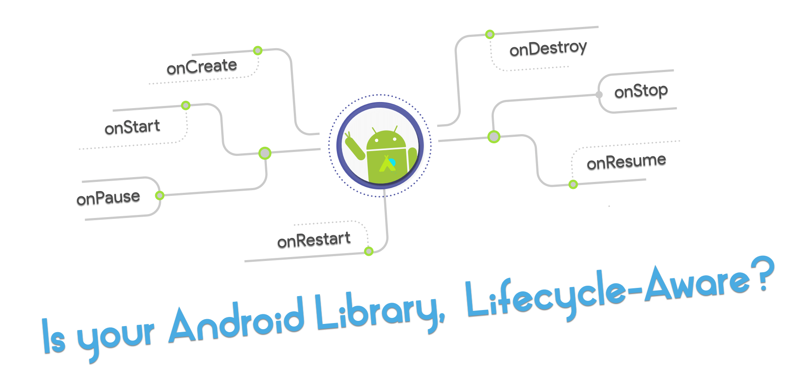
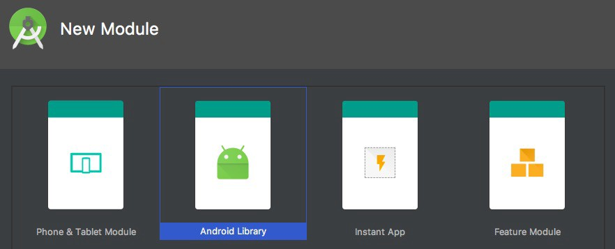
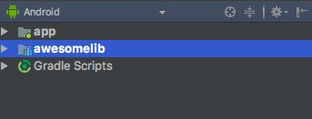
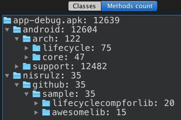

<!--more-->

**Lifecycle events in Android.**

It has been a pain point for Android developers all over the world. It is no brainer that, most of the times the main cause of a memory leak in the codebase is because an invalid state is accessed which is out of sync with the lifecycle of the activity/fragment of the app.

What this means is that as an Android Developer you are forced to put up a lot of checks in place, making sure that your code state is in sync with the lifecycle of the Activity/Fragment.

Things start to get a bit more messy when that is something you expect from others to do, which is the case when you are an Android Library Developer. As an android library developer, you need other app developers to conform to un-registering callbacks/call cleanup methods or specific functions to re-initialize at certain points in the lifecycle of Activity/Fragment.i.e onDestroy(), onResume(), onCreate(), etc.

Now that is a lot to expect and ask for. We all know developers tend to avoid going through documentations (..to build features quickly and achieve deadlines, obviously 😅 ). So what that means is sometimes the cleanup part is missed or not understood quite properly for them to put in the right places in code. For example, if an `Activity` receives a callback after it’s been stopped, then it’s pretty likely that your app is going to crash due to memory leak. Un-registering the callback is right before the Activity is destroyed is what is the needed, which is possible if the app developer calls the `cleanup()` method from your android library, but it is expected of them. You cannot make sure that they will conform to it.

### Well that is a problem, so what is the solution?

The solution is to make your android library **_Lifecycle-Aware_**. Making android library aware of the states of the lifecycle of Activity/Fragment gives us, the Android library developers greater control over making sure that callbacks are unregistered and calls to cleanup methods or re-initialization happens at the right state in the lifecycle of Activity/Fragment. At the same time it means less dependence on app developer to conform to putting more code and checks in their app to handle the states of your android library. **_Sounds like a win-win for both, eh!_** 😎

### But how do we make our library code Lifecycle Aware ?

#### Enter, Lifecycle Arch Components!

[Lifecycle Arch Components](https://developer.android.com/topic/libraries/architecture/lifecycle.html) are a new set of lifecycle-aware components that can track the lifecycle of an activity or fragment, and adjust their behavior accordingly.

They are created by good folks at Google, were introduced at Google I/O 2017 and are currently in `beta` stage. Being in `beta` does not mean they aren’t ready. They seem to be the way most people are going to be moving forward in the near future as the library itself becomes stable. But we can get on the band wagon right now, as they are fairly ready.

> Update: _Core lifecycle artifacts (runtime, common) have reached stable version `v1.0.0`. The lifecycle compiler and extensions are now at version `v1.0.0-beta1`_

Without taking much time, lets jump right into understanding how to wire these lifecycle components for your own android library…

I will be using a simple example to demonstrate the wiring up process, which is available as a completely functional example app on github [here](https://github.com/nisrulz/android-examples/tree/develop/LifeCycleCompForLib).

Lets start by creating a new app. Once done, you can add a new library module



Your folder structure should look like the below



Next add this `awesomelib` module as a dependency to the `app` module, so that the `app` module has access to the public classes contained by the `awesomelib` library module. To do that add the below to the `build.gradle` of the `app` module.

```groovy
implementation project(':awesomelib')
```

Next you want to add a class to your `awesomelib` library module. I created mine named as `AwesomeMainLib` . This class is just to showcase the code for library which will be referenced in the `app` module later on. For simplicity sake, lets make `AwesomeMainLib` class a singleton. The code in that case would look like below

```java
public class AwesomeLibMain {
  static final AwesomeLibMain ourInstance = new AwesomeLibMain();

  public static AwesomeLibMain getInstance() {
    return ourInstance;
  }

  private AwesomeLibMain() {
  }

  public void init() {
    System.out.println("Called From AwesomeLibMain Class, init()");
  }

  public void cleanup() {
    System.out.println("Called From AwesomeLibMain Class, cleanup()");
  }
}
```

and in your `app` module you would call `init()` method via `AwesomeLibMain.getInstance().init()` in `onCreate()` and `cleanup()` method via `AwesomeLibMain.getInstance().cleanup()` in `onDestroy()` respectively. Here is the code of `MainActivity.java` class in `app` module

```java
public class MainActivity extends AppCompatActivity {

  @Override
  protected void onCreate(Bundle savedInstanceState) {
    super.onCreate(savedInstanceState);
    setContentView(R.layout.activity_main);

    // Init
    AwesomeLibMain.getInstance().init();
  }

  @Override
  protected void onDestroy() {
    super.onDestroy();

    // Cleanup
    AwesomeLibMain.getInstance().cleanup();
  }
}
```

But thats not the point here, right! We do not want the app developer to be calling these themselves. Also what happens if you want to trigger more methods at specific points in lifecycle of Activity/Fragment? The dependence on app developer increases by many folds and expecting them to do everything right is a like a chink in the armour.

Well let us solve this situation by integrating with Lifecycle Arch Components.

The first thing we need to do is add the required dependencies to `build.gradle` to each module.

Add the below to the `build.gradle` for `awesomelib` module

```groovy
implementation "android.arch.lifecycle:runtime:1.0.0"
annotationProcessor "android.arch.lifecycle:compiler:1.0.0-beta1"
```

and add the below to the `build.gradle` for `app` module

```groovy
implementation "com.android.support:appcompat-v7:26.1.0"
```

> [!NOTE]
> We are using the latest [support lib v26.1.0](https://developer.android.com/topic/libraries/support-library/revisions.html#26-1-0) , which now has AppCompatActivity implementing [LifecycleOwner](https://developer.android.com/reference/android/arch/lifecycle/LifecycleOwner.html) interface from [Architecture Components](https://developer.android.com/topic/libraries/architecture/index.html). More about this, later in the post. For now just know you need support lib `v26.1.0`

… that done, sync your project.

Now is the time for us to integrate Lifecycle Arch Components into our android library module, `awesomelib`

We start by first implementing [LifecyleObserver](https://developer.android.com/reference/android/arch/lifecycle/LifecycleObserver.html) class in our `AwesomeLibMain` class.

> **From android official docs**: LifecycleObserver is an interface which does not have any methods, instead, relies on [OnLifecycleEvent](https://developer.android.com/reference/android/arch/lifecycle/OnLifecycleEvent.html) annotated methods to mark the class for lifecycle events.

**_Now comes the magic_**. Once you have integrated Lifecycle Arch components, you have access to annotations which correspond to lifecycle events of Activity/Fragment such as

```java
@OnLifecycleEvent(Lifecycle.Event.ON_CREATE)
or
@OnLifecycleEvent(Lifecycle.Event.ON_DESTROY)
...
```

Once you annotate the right method with the specific annotation, that method would be triggered at the specified lifecycle event state, during the execution of Activity/Fragment.

Lets have a look at what our `AwesomeLibMain` class look, after we have annotated the methods

```java
import android.arch.lifecycle.Lifecycle;
import android.arch.lifecycle.LifecycleObserver;
import android.arch.lifecycle.OnLifecycleEvent;

public class AwesomeLibMain implements LifecycleObserver {
  static final AwesomeLibMain ourInstance = new AwesomeLibMain();

  public static AwesomeLibMain getInstance() {
    return ourInstance;
  }

  private AwesomeLibMain() {
  }

  @OnLifecycleEvent(Lifecycle.Event.ON_CREATE)
  public void init() {
    System.out.println(
        "Called From AwesomeLibMain Class, called onCreate() of Activity >>>>>> init()");
  }

  @OnLifecycleEvent(Lifecycle.Event.ON_START)
  public void LibOnStart() {
    System.out.println(
        "Called From AwesomeLibMain Class, called onStart() of Activity >>>>>> LibOnStart()");
  }

  @OnLifecycleEvent(Lifecycle.Event.ON_STOP)
  public void LibOnStop() {
    System.out.println(
        "Called From AwesomeLibMain Class, called onStop() of Activity >>>>>> LibOnStop()");
  }

  @OnLifecycleEvent(Lifecycle.Event.ON_RESUME)
  public void LibOnResume() {
    System.out.println(
        "Called From AwesomeLibMain Class, called onResume() of Activity >>>>>> LibOnResume()");
  }

  @OnLifecycleEvent(Lifecycle.Event.ON_PAUSE)
  public void LibOnPause() {
    System.out.println(
        "Called From AwesomeLibMain Class, called onPause() of Activity >>>>>> LibOnPause()");
  }

  @OnLifecycleEvent(Lifecycle.Event.ON_DESTROY)
  public void cleanup() {
    System.out.println(
        "Called From AwesomeLibMain Class, called onDestroy() of Activity >>>>>> cleanup()");
  }
}
```

as you can see I added more methods and annotated them to get triggered at specific lifecycle event state.

But we are not done here yet. This just tells which method will be triggered when a specific lifecycle event state is reached for the Activity/Fragment. What is still required is to add our `AwesomeLibMain` class as an **Observer** for the lifecycle of the desired Activity. Turns out it is a really simple step, as can be seen below

> [!NOTE]
> `MainActivity` here extends `AppCompatActivity` because we are using the latest [support lib v26.1.0](https://developer.android.com/topic/libraries/support-library/revisions.html#26-1-0) , which now has `AppCompatActivity` implementing [LifecycleOwner](https://developer.android.com/reference/android/arch/lifecycle/LifecycleOwner.html) interface from [Architecture Components](https://developer.android.com/topic/libraries/architecture/index.html).
>
> **From android official docs**: [LifecycleOwner](https://developer.android.com/reference/android/arch/lifecycle/LifecycleOwner.html) is a single method interface that denotes that the class has a [Lifecycle](https://developer.android.com/reference/android/arch/lifecycle/Lifecycle.html). It has one method, [`getLifecycle()`](https://developer.android.com/reference/android/arch/lifecycle/LifecycleOwner.html#getLifecycle%28%29), which must be implemented by the class.
>
> If you are using a version of support lib below `v26.1.0` then `MainActivity` will need to extend `LifecycleActivity` and app module’s `build.gradle` will need to include to get access to `LifecycleActivity`.
>
> `implementation "android.arch.lifecycle:extensions:1.0.0-beta1`

```java
public class MainActivity extends AppCompatActivity {

  @Override
  protected void onCreate(Bundle savedInstanceState) {
    super.onCreate(savedInstanceState);
    setContentView(R.layout.activity_main);

    // Add Lifecycle Observer
    getLifecycle().addObserver(AwesomeLibMain.getInstance());
  }

  @Override
  protected void onDestroy() {
    super.onDestroy();

    // Remove Lifecycle Observer
    getLifecycle().removeObserver(AwesomeLibMain.getInstance());
  }
}
```

so you basically needed to add it as an **Observer** for lifecycle in `onCreate()` of Activity via

```java
// Add Lifecycle Observer
getLifecycle().addObserver(AwesomeLibMain.getInstance());
```

…and then remove the Observer for lifecycle in onDestroy() of Activity via

```java
// Remove Lifecycle Observer
getLifecycle().removeObserver(AwesomeLibMain.getInstance());
```

Thats it! No, really thats all there is. You have successfully integrated lifecycle arch components in your `awesomelib` and now it is observing Activity Lifecycle events and triggering the right methods at the right time, without requiring the `app` developer to worry about anything.

> [!NOTE]
> This is the only step `app` developer needs to do when going to use your android library in terms of integrating your library code in the activity, apart from adding it in the `build.gradle` dependency section. All methods will be triggered automatically when a said lifecycle event state is reached during the execution of the Activity/Fragment.

What I have tried to explain here is more like a proof of concept, I am sure one can very easily implement it in an existing android library code and make use of the benefits lifecycle arch components bring along.

For people worried about adding a lot of method counts to their app, below is a snapshot of method counts (used [Classyshark](https://github.com/google/android-classyshark) Tool) for the used arch component libs, `awesomelib` module and the sample app itself (from the sample `app` I have linked below)



Simple rundown shows the method count for

- arch component libs–**122 methods**
- awesomelib-**5 methods**

So as you can see they are pretty light in terms of adding method count. Support library is part of the app module and something usually all apps nowadays have, so you are basically not shipping your android library with that. 😅

As mentioned at the start of this post, the code for above is available on github [here](https://github.com/nisrulz/android-examples/tree/develop/LifeCycleCompForLib).

If you have suggestions or maybe would like me to add something to the content here, please let me know.

---

> I gave a talk on this topic at [Droidcon Berlin ’17](http://droidcon.de/en/sessions/things-i-wish-i-knew-when-i-started-building-android-sdklibraries), checkout the slides [here](https://speakerdeck.com/nisrulz/libraries).This post got featured in [Android Weekly Issue 276](http://androidweekly.net/issues/issue-276)! 😎
