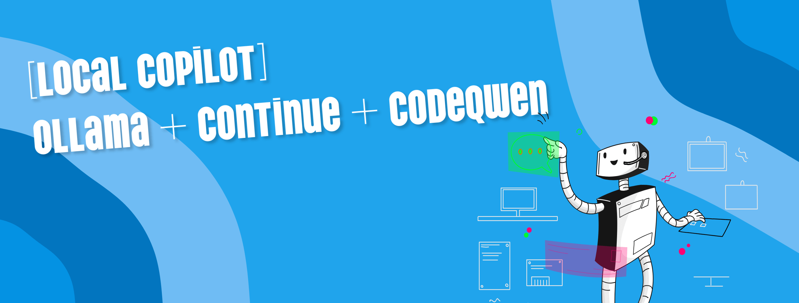

<!--more-->


This post is part of a series.


{}

1. [Local GPTs: Off the Grid, On Your Machine](/blog/llm/local-gpts-off-the-grid-on-your-machine/)
2. [Local Copilot: Ollama + Tabby + Starcoder](/blog/llm/local-copilot-your-own-off-the-grid-and-local-code-assistant/)

{}

https://www.continue.dev/

CodeQwen1.5
Best coding assistant for individuals
Today's Best Deals
Visit Site
Reasons to buy
+Open source
+Has options for local hosting
+Can be trained further using your own code repositories
+Offers a range of model sizes to fit your requirements
Reasons to avoid
-No first-party extensions for popular IDEs
-Up front hardware, cost needs to be considered when hosted locally
CodeQwen1.5 is a version of Alibaba’s open-source Qwen1.5 LLM specifically trained using public code repositories to assist developers in coding related tasks. This specialized version was released in April 2024, a few months after the release of Qwen1.5 to the public in February 2024.

There are 2 different versions of CodeQwen1.5 available today. The base model of CodeQwen1.5 is designed for code generation and suggestions but has limited chat functionality, while the second version can also be used as a chat interface that can answer questions in a more human-like way. Both models have been trained with 3 trillion tokens of code related data and support a very respectable 92 languages, which include some of the most common languages in use today such as Python, C++, Java, PHP, C# and JavaScript.

Unlike the base version of Qwen1.5, which has several different sizes available for download, CodeQwen1.5 is only available in a single size of 7B. While this is quite small when compared to other models on the market that can also be used as coding assistants, there are a few advantages that developers can take advantage of. Despite its small size, CodeQwen1.5 performs incredibly well compared to some of the larger models that offer coding assistance, both open and closed source. CodeQwen1.5 comfortably beats GPT3.5 in most benchmarks and provides a competitive alternative to GPT-4, though this can sometimes depend on the specific programming language. While GPT-4 may perform better overall by comparison, it’s important to remember that GPT-4 requires a subscription and has per token costs that could make using it very expensive compared to CodeQwen1.5 and GPT-4 cannot be hosted locally. Like with all LLMs, its risky to implicitly trust any suggestions or responses provided by the model. While steps have been taken to reduce hallucinations, always check the output to make sure it is correct.

As CodeQwen1.5 is open source, you can download a copy of the LLM to use at no additional cost beyond the hardware needed to run it. You’ll still need to make sure your system has enough resources to ensure the model can run well, but the bonus of the smaller model size means a modern system with GPU that has at least 16GB of VRAM and at least 32GB of system RAM should be sufficient. CodeQwen1.5 can also be trained using code from existing projects or other code repositories to further improve the context of the generated responses and suggestions. The ability to host CodeQwen1.5 within your own local or remote infrastructure, such as a Virtual Private Server (VPS) or dedicated server, should also help to alleviate some of the concerns related to data privacy or security often connected to submitting information to third party providers.

Alibaba surprised us by releasing their new Qwen2 LLM at the start of June that they claim offers significant gains over the base model of Qwen1.5. Alibaba also mentioned that the training data used for CodeQwen1.5 is included in Qwen2-72B, so has the potential to offer improved results, but it’s currently unclear if there is a plan to upgrade CodeQwen to use the new model.

https://qwenlm.github.io/blog/qwen2/

https://ollama.com/library/deepseek-coder-v2

https://bigcode-bench.github.io/

