<!--more-->


This post is part of a series.


{}

1. [Local GPTs: Off the Grid, On Your Machine](/blog/llm/local-gpts-off-the-grid-on-your-machine/)
2. **Local Copilot: Ollama + Tabby + Starcoder**  `This post`

{}

Coding assistants are all the rage nowadays, all thanks to [Github Copilot](https://github.com/features/copilot). Coding assistants as basically LLM models that help the developer in writing code. They are trained on code so can predict a lot of logic that developers write daily. Most code that developers write is quite similar, the only difference being business usecase and the programming language used.

However Github Copilot isn't private. It is hosted on Github servers and it sends code related information to Github for the Copilot model to suggest solution that is relayed back to your IDE. This is quite a big deal as it means that the code that most companies and individuals keep closed source will be sent to Github servers and Github could potentially use it to further train it. That would mean that for folks who use Github Copilot, it would suggest the solutions using that training data. This is a breach of IP and goes against privacy.

There is a need for a private and off the grid version of this Github Copilot which will keep everything on your own servers or your local machine. This means the same code assistant funtionality is available while everything is secure and private. Nothing is shared with Github.

Goals that such an alternative needs to fulfill, for my usecase as a developer:

- Keep everything on local machine/own server
- Be able to use it offline
- Learn from code in context
- Be able to help find bugs and suggest/predict solutions
- Predict and automate writing repeating code
- Be performant in response
- Work with VSCode and Jetbrain IDEs (IntelliJ IDEA, Android Studio, etc.)
- (Optional) Be opensource and free

There are a few available options to do this, but I have found the following to be the most promising:

- [Llama Coder](https://github.com/ex3ndr/llama-coder?tab=readme-ov-file#llama-coder)
  > This one only works with VSCode and is a [VSCode extension](https://marketplace.visualstudio.com/items?itemName=ex3ndr.llama-coder).
  - Prequisite is to have [Ollama](https://ollama.com/) installed. You can read about how to set it up Ollama from my earlier post [here](/blog/local-gpts-off-the-grid-on-your-machine/#oh-lama--setup-ollamahttpsollamaai).
  - Once installed in VSCode you can simply open a file and it will suggest you code when you start typing.
- [Tabby](https://tabby.tabbyml.com/)
- [Continue](https://continue.dev/)

From my experience, **Tabby** is the most stable, out of others listed above. In this blog post we will setup Tabby and see how it works.

First things first, this post makes use of a configuration that I have access to (i.e. my laptop) but should work for anyone else too (with little tweaks). Below is my machine specs:

- Macbook Pro, M2 Pro Apple Silicon
- 16 Gb RAM
- 512 Gb SDD
- macOS Sonoma 14.3.1

### Enter Tabby

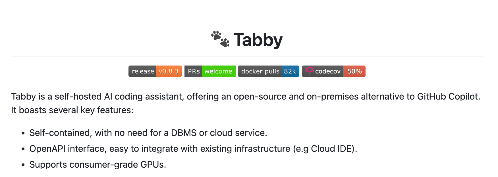

> Note: Github project for Tabby can be found [here](https://github.com/TabbyML/tabby)

[Tabby](https://tabby.tabbyml.com/) is described as a self-hosted AI coding assistant. It is free and open source. It works with both VSCode and Jetbrains IDEs out of the box as well as has a language server which makes it work with Vim also. Everything you do with it stays private. It can work completely offline and does not require any internet connection. The server literally runs on your own machine. However it is versatile enough that if you want to host it on your own server, you can do so too.

The setup is fairly simple. Lets start 🚀

### Step 1: Install Tabby using homebrew on macOS

```sh
brew install tabbyml/tabby/tabby
```

> NOTE: There are other ways to install Tabby too. You can read about it [here](https://tabby.tabbyml.com/docs/installation/).

### Step 2: Start Tabby server using a model

The command looks like this:

```sh
tabby serve --device metal --model <model_id>
```

> where `<model_id>` is the id/name of the model Tabby supports. You can find the list of supported models [here](https://tabby.tabbyml.com/docs/models/).

For example, to start the server with model `TabbyML/StarCoder-1B` you would execute:

```sh
tabby serve --device metal --model TabbyML/StarCoder-1B
```

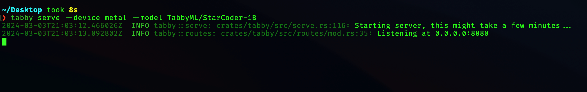

> NOTE: This terminal window needs to be open as the server is running in its process. If you close the Terminal window, the server will also shutdown.

#### **BONUS**

If you would like to run the server all the time without having to keep the terminal window running, you can run the below command

```sh
nohup tabby serve --device metal --model TabbyML/StarCoder-1B 2>&1 </dev/null &
```

Here

1. `nohup` keeps the command running no matter whether the terminal windows is closed or you logout.
2. `tabby serve --device metal --model TabbyML/StarCoder-1B` is the command that starts the Tabby server with a specific model.
3. `2>&1` redirects stderr to stdout.
4. `</dev/null` means that don't expect input.
5. `&` runs the command in background.

After running this command, you can close the terminal window and the server will be kept running in the background. This allows you to use it in VSCode and Jetbrain's IDEs all the time.

In order to stop Tabby server, you first look for the process in your terminal and then use the `kill` command with the PID/Process ID. Open Terminal and run the below command:

```sh
ps -e | awk '!/awk/ && /tabby serve --device/ { print $1 }' | xargs kill
```

This is how it would look like:

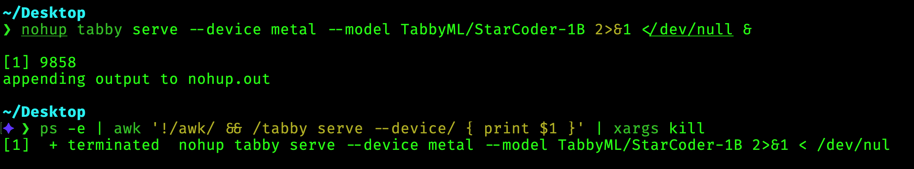

### Step 3: Install VSCode Extension

- Open VSCode and search for `TabbyML` in the extensions search bar. Install the extension.

  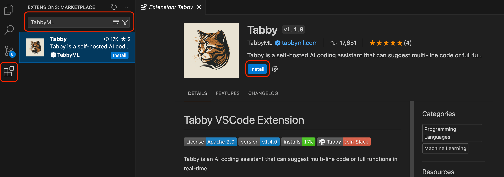

- Once installed, restart VSCode. You should see the extension installed and functional on the bottom right of the screen.

  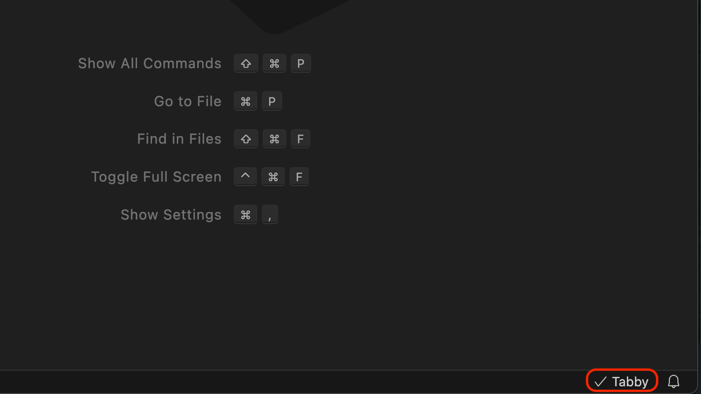

- Now you can already start using code completion using Tabby

  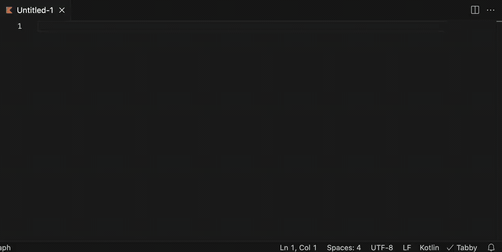

### Step 4: Install Android Studio Extension

- Open Android Studio and search for `Tabby` in the plugins search bar. Install the plugin.

  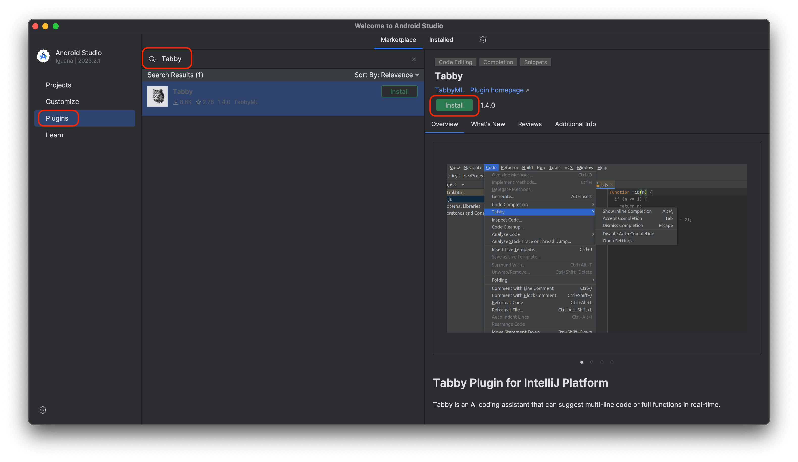

- Once installed, restart Android Studio. You should see the plugin installed and functional on the bottom right of the screen.

  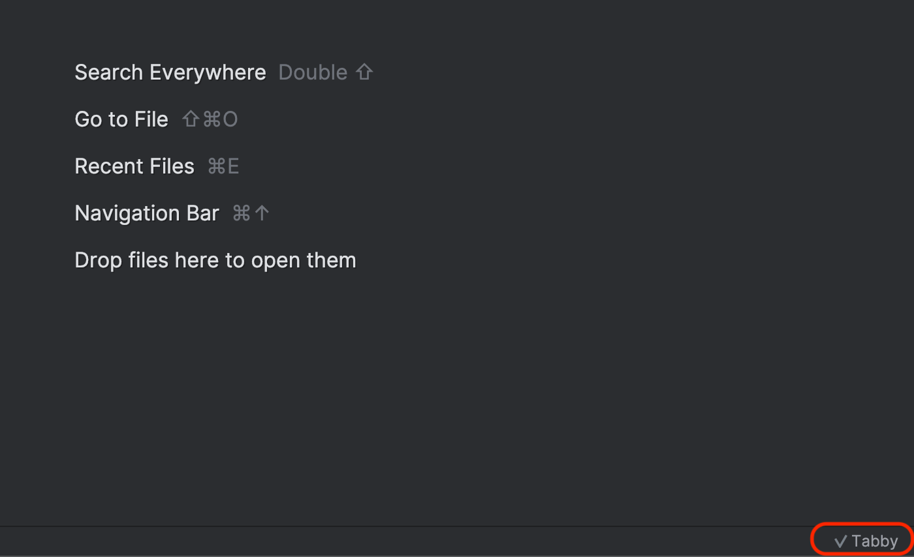

- Now you can already start using code completion using Tabby

  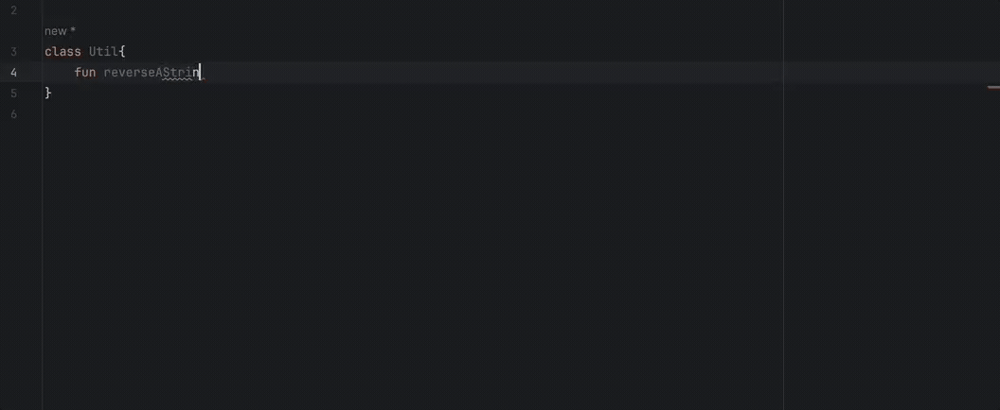

### Bonus

I used Tabby code completion to help me write parts of this blog post itself 😎 Here is a sneak peek:

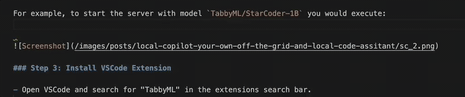

Also Tabby team maintains a leaderboard of models and their performance [here](https://leaderboard.tabbyml.com/).

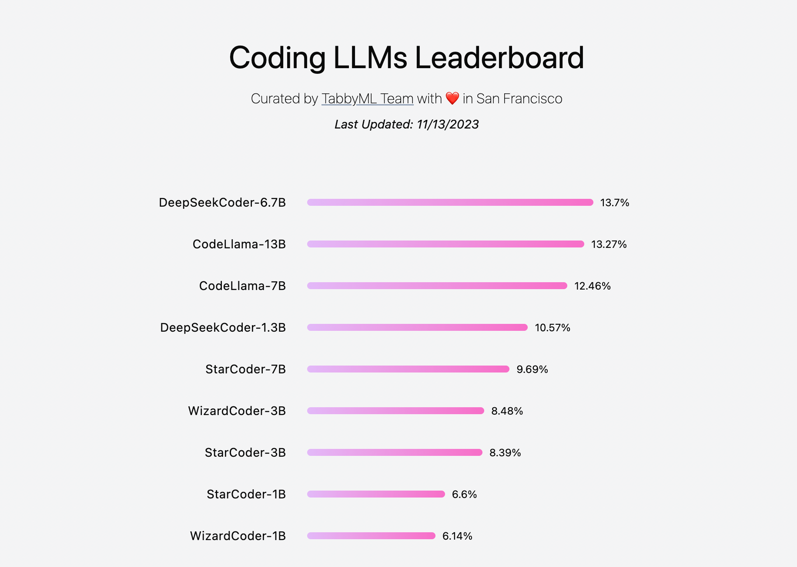
