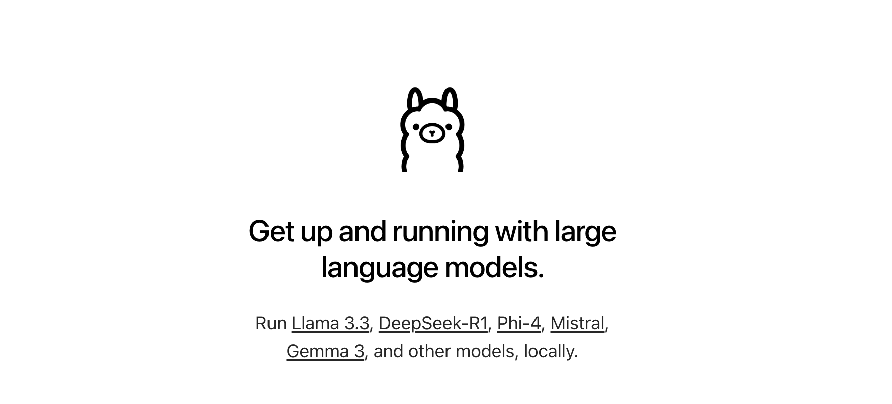

<!--more-->


This post is part of a series.


{}

1. **Local GPTs: Off the Grid, On Your Machine**  `This post`
2. [Local Copilot: Ollama + Tabby + Starcoder](/blog/llm/local-copilot-your-own-off-the-grid-and-local-code-assistant/)

{}

Are you tired of the tech giants having access to your personal data? Are you concerned about snooping and telemetry? Then it's time to take matters into your own hands by running a fully offline GPT model on your own local machine! By doing so, you can have privacy and security, as all processing will occur locally without any third-party involvement. Say goodbye to companies profiting from your personal information and take back control with a completely offline GPT model!

First things first, this post makes use of a configuration that I have access to (i.e. my laptop) but should work for anyone else too (with little tweaks). Below is my machine specs:

- Macbook Pro, M2 Pro Apple Silicon
- 16 Gb RAM
- 512 Gb SDD
- macOS Sonoma 14.3.1

Now, let us dive into setting up an offline, private and local GPT like [ChatGPT](https://chat.openai.com/) but using an open source model.

### Oh Lama 🦙: Setup Ollama



> Note: Github project for Ollama can be found [here](https://github.com/jmorganca/ollama)

[Ollama](https://ollama.com/) is a frontend built so you can easily get up and running with large language models on your local machine. You can run pre-trained models like Llama 2 and Code Llama, as well as customize and create your own models offline in a private and local environment. This allows you to have full control over your data and models, ensuring that they remain secure and confidential.

To begin with, install [Ollama App + CLI](https://formulae.brew.sh/cask/ollama#default) using homebrew:

```sh
brew install --cask ollama
```

Once downloaded, open the application from Application Launchpad in macOS.

> If prompted, just select "Open"
> 

It will run a wizard to set everything up including running Ollama in the background. You can see Ollama running as an icon of lama in your menu bar 😄


After installing Ollama, verify that Ollama is running by accessing the following link in your web browser: [http://127.0.0.1:11434/](http://127.0.0.1:11434/)


### Pull in Large Language Model(LLM)

Ollama is just the front end for interfacing with LLM models. You will need to download a model to work with.

> Note: These models are usualy quite big ranging from 3Gb to upwards of 60Gb, based on trillions of tokens they are trained on. You would need to have free disk space to download the model.

Download one of the models mentioned [here](https://ollama.ai/library), by running the `pull` command in Terminal:


```sh
ollama pull <name_of_model>
```

> where `<name_of_model>` is to be replaced with a valid name of model picked from the [Ollama Model Library](https://ollama.ai/library).

For demonstration purpose, let us download the [`llama2` model](https://ollama.ai/library/llama2).


```sh
ollama pull llama2
```

You can use Ollama right away with the model you have downloaded, in a Chat style within the terminal by using the `run` command

```sh
ollama run llama2
```


However, it would be much nicer if you could use a UI like ChatGPT and not have to work with Terminal, right?

That is what you will setup next 🤓

### Setup Docker Desktop

To begin with, install [Docker](https://formulae.brew.sh/cask/docker#default) using homebrew:

```sh
brew install --cask docker
```

Once downloaded, open the application and it will run a wizard to set everything up including running Docker in background. You can see Docker running as an icon in your menu bar 😄


> Note: You do not need to sign in/sign up anything for using any funtionality mentioned in this post.

### Setup [Open WebUI](https://github.com/open-webui/open-webui)

Open WebUI is a user-friendly ChatGPT-Style Web Interface for LLMs (formerly known as Ollama WebUI). This will make it easier for you to talk to your GPT like you are used to, ChatGPT-Style.


To start it up, open Terminal app and run the below command

```sh
docker run -d -p 3000:8080 \
--add-host=host.docker.internal:host-gateway \
-v open-webui:/app/backend/data \
--name open-webui \
--restart always \
ghcr.io/open-webui/open-webui:main
```

This command starts the docker container and makes the Ollama Web UI available at port 3000 of localhost.

If you want to verify this, open Docker Desktop dashboard and you will see


**Note**: To upgrade your local docker image for _**open-webui**_ to latest version, run

```sh
docker pull ghcr.io/open-webui/open-webui:main
echo "✅ Pull the latest image tagged main of open webui"

docker container stop open-webui
echo "✅ Stop existing open webui container"

docker container rm open-webui
echo "✅ Remove existing open webui container"

docker run -d -p 3000:8080 \
--add-host=host.docker.internal:host-gateway \
-v open-webui:/app/backend/data \
--name open-webui \
--restart always \
ghcr.io/open-webui/open-webui:main
echo "✅ Create and run the new container using the latest image of open webui"
```

At this point, you are done with the setup 😎

You can now access the Ollama Web UI Chat interface at [http://localhost:3000](http://localhost:3000/).

> You might need to sign up as an Admin user for your first run. Simply create a username and password.

### Bonus: Adding more models

Ollama Model Library provides more than one variation of each model. You can find the other variations under the **Tags** tab on the model's page. Also note the size of the model mentioned, to access if the model is not too big in size for your machine's storage space.


```sh
ollama pull llama2:13b
```

Then go back to the Chat interface at [http://localhost:3000](http://localhost:3000/) and select the model from drop down


### How to Use - Walkthrough


