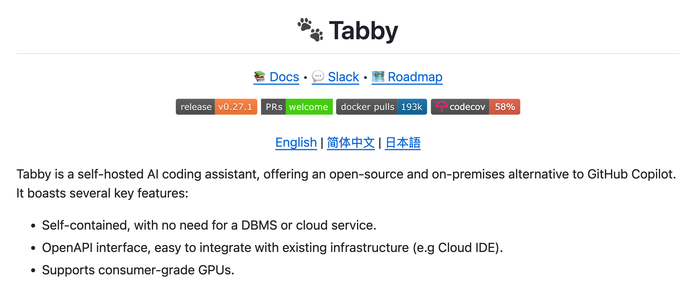
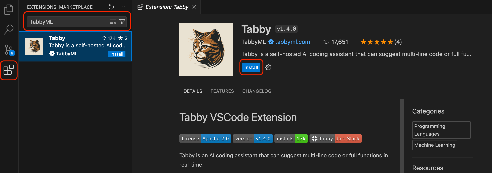
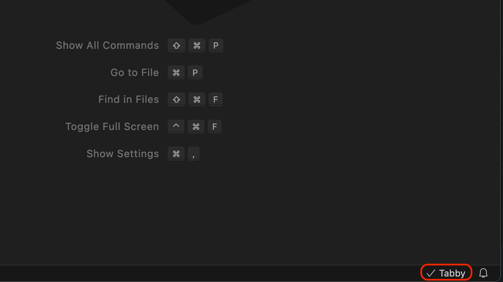
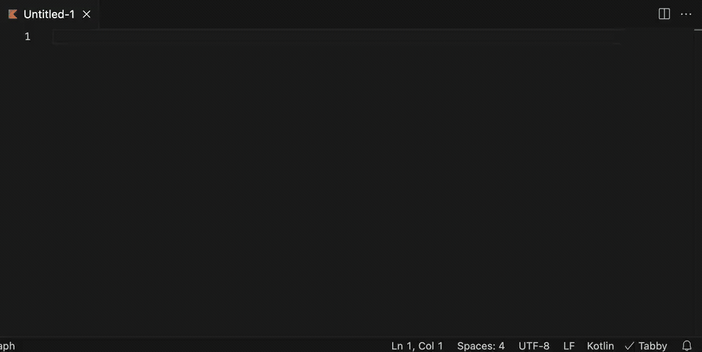
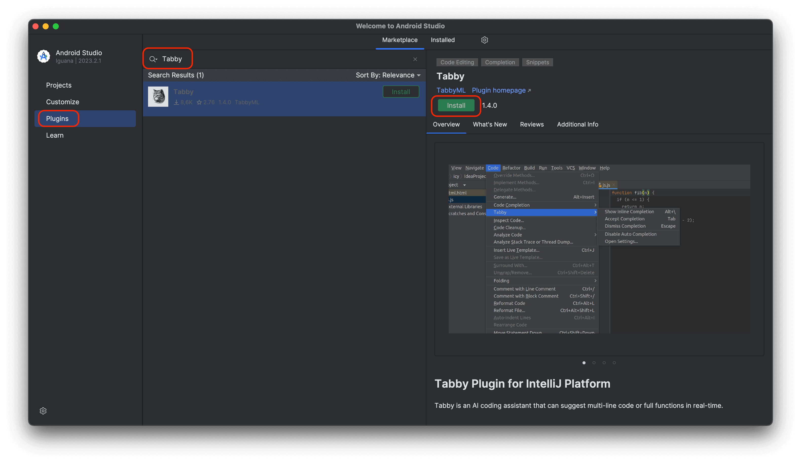
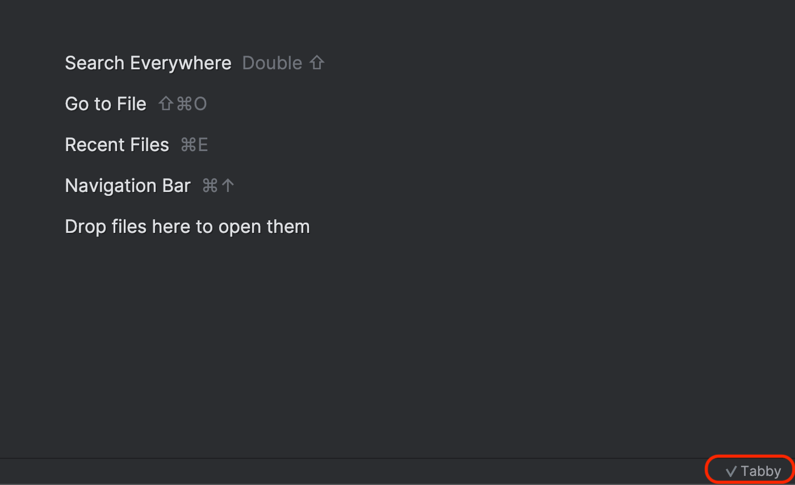
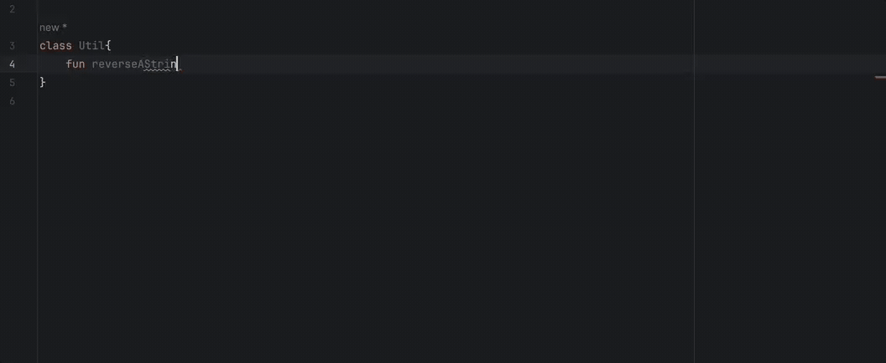
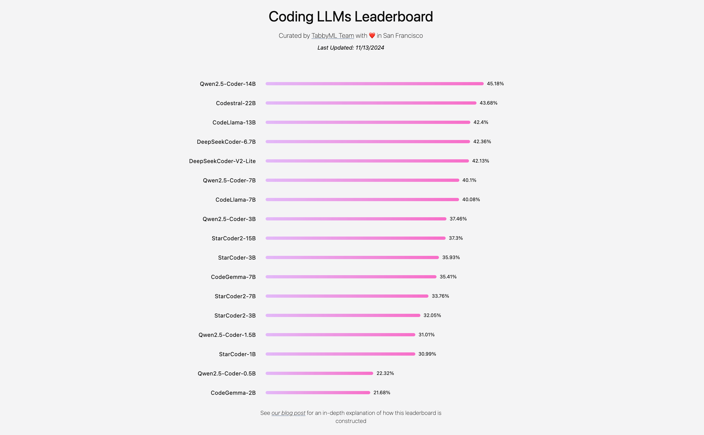
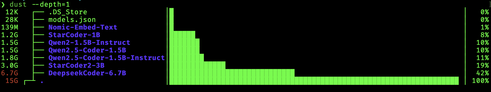

<!--Short abstract goes here-->

Looking for a private, local AI coding assistant? Tabby lets you run a powerful code completion tool entirely on your own machine, no sharing your code.

<!--more-->

Coding assistants are all the rage nowadays, all thanks to [Github Copilot](https://github.com/features/copilot). Coding assistants as basically LLM models that help the developer in writing code. They are trained on code so can predict a lot of logic that developers write daily. Most code that developers write is quite similar, the only difference being business usecase and the programming language used.

However Github Copilot isn't private. It is hosted on Github servers and it sends code related information to Github for the Copilot model to suggest solution that is relayed back to your IDE. This is quite a big deal as it means that the code that most companies and individuals keep closed source will be sent to Github servers and Github could potentially use it to further train it. That would mean that for folks who use Github Copilot, it would suggest the solutions using that training data. This is a breach of IP and goes against privacy.

There is a need for a private and off the grid version of this Github Copilot which will keep everything on your own servers or your local machine. This means the same code assistant funtionality is available while everything is secure and private. Nothing is shared with Github.

Goals that such an alternative needs to fulfill, for my usecase as a developer:

- Keep everything on local machine/own server
- Be able to use it offline
- Learn from code in context
- Be able to help find bugs and suggest/predict solutions
- Predict and automate writing repeating code
- Be performant in response
- Work with VSCode and Jetbrain IDEs (IntelliJ IDEA, Android Studio, etc.)
- (Optional) Be opensource and free

There are a few available options to do this, but I have found the following to be the most promising:

- [Llama Coder](https://github.com/ex3ndr/llama-coder?tab=readme-ov-file#llama-coder)
  > [!NOTE]
  > This one only works with VSCode and is a [VSCode extension](https://marketplace.visualstudio.com/items?itemName=ex3ndr.llama-coder).
  - Prequisite is to have [Ollama](https://ollama.com/) installed. You can read about how to set it up Ollama from my earlier post [here](/blog/local-gpts-off-the-grid-on-your-machine/#oh-lama--setup-ollamahttpsollamaai).
  - Once installed in VSCode you can simply open a file and it will suggest you code when you start typing.
- [Tabby](https://tabby.tabbyml.com/)
- [Continue](https://continue.dev/)

From my experience, **Tabby** is the most stable, out of others listed above. In this blog post we will setup Tabby and see how it works.

First things first, this post makes use of a configuration that I have access to (i.e. my laptop) but should work for anyone else too (with little tweaks). Below is my machine specs:

- Macbook Pro, M2 Pro Apple Silicon
- 16 Gb RAM
- 512 Gb SDD
- macOS Sonoma 14.3.1

### Enter Tabby



> [!NOTE]
> Github project for Tabby can be found [here](https://github.com/TabbyML/tabby)

[Tabby](https://tabby.tabbyml.com/) is described as a self-hosted AI coding assistant. It is free and open source. It works with both VSCode and Jetbrains IDEs out of the box as well as has a language server which makes it work with Vim also. Everything you do with it stays private. It can work completely offline and does not require any internet connection. The server literally runs on your own machine. However it is versatile enough that if you want to host it on your own server, you can do so too.

The setup is fairly simple. Lets start 🚀

### Step 1: Install Tabby using homebrew on macOS

```sh
brew install tabbyml/tabby/tabby
```

> [!NOTE]
> There are other ways to install Tabby too. You can read about it [here](https://tabby.tabbyml.com/docs/installation/).

### Step 2: Start Tabby server using a model for chat and completion

The command looks like this:

```sh
tabby serve --device metal \
   --chat-model <model_id> \
   --model <model_id>
```

> [!NOTE]
> Where `<model_id>` is the id/name of the model Tabby supports. You can find the list of supported models [here](https://tabby.tabbyml.com/docs/models/).

For example, to start the server with chat model `Qwen2.5-Coder-1.5B-Instruct` and completion model `StarCoder-1B` you would execute:

```sh
tabby serve --device metal \
   --chat-model Qwen2.5-Coder-1.5B-Instruct \
   --model StarCoder-1B
```

Output:

```sh
~/Desktop took 13s
❯ tabby serve --device metal \
   --chat-model Qwen2.5-Coder-1.5B-Instruct \
   --model StarCoder-1B

Writing to new file.
🎯 Downloaded https://huggingface.co/ikw/Qwen2.5-Coder-1.5B-Instruct-GGUF/resolve/main/Qwen2.5-Coder-1.5B-Instruct-q8_0.gguf to /Users/<username>/.tabby/models/TabbyML/Qwen2.5-Coder-1.5B-Instruct/ggml/model-00001-of-00001.gguf.tmp

   00:00:30 ▕████████████████████▏ 1.53 GiB/1.53 GiB  52.03 MiB/s  ETA 0s.
   ✅ Checksum OK.


████████╗ █████╗ ██████╗ ██████╗ ██╗   ██╗
╚══██╔══╝██╔══██╗██╔══██╗██╔══██╗╚██╗ ██╔╝
   ██║   ███████║██████╔╝██████╔╝ ╚████╔╝
   ██║   ██╔══██║██╔══██╗██╔══██╗  ╚██╔╝
   ██║   ██║  ██║██████╔╝██████╔╝   ██║
   ╚═╝   ╚═╝  ╚═╝╚═════╝ ╚═════╝    ╚═╝

📄 Version 0.29.0
🚀 Listening at http://0.0.0.0:8080

```

> [!NOTE]
> This terminal window needs to be open as the server is running in its process. If you close the Terminal window, the server will also shutdown. To stop Tabby server press `Ctrl+C`

#### Keep Tabby Server Running

If you would like to run the server all the time without having to keep the terminal window running, you can run the below command

```sh
nohup tabby serve --device metal \
   --chat-model Qwen2.5-Coder-1.5B-Instruct \
   --model StarCoder-1B >/dev/null 2>&1 &
```

Here

1. `nohup` keeps the command running no matter whether the terminal windows is closed or you logout.
2. `tabby serve --device metal --chat-model Qwen2.5-Coder-1.5B-Instruct --model StarCoder-1B` is the command that starts the Tabby server with the specific models.
3. `2>&1` redirects stderr to stdout.
4. `</dev/null` means that don't expect input.
5. `&` runs the command in background.

After running this command, you can close the terminal window and the server will be kept running in the background. This allows you to use it in VSCode and Jetbrain's IDEs all the time.

In order to stop Tabby server, you first look for the process in your terminal and then use the `kill` command with the PID/Process ID. Open Terminal and run the below command:

```sh
ps -e | awk '!/awk/ && /tabby serve --device/ { print $1 }' | xargs kill
```

When you run these, this is how it would look like:

```sh
~/Desktop took 5m2s
❯ nohup tabby serve --device metal\
   --chat-model Qwen2.5-Coder-1.5B-Instruct \
   --model StarCoder-1B >/dev/null 2>&1 &

[1] 26704
appending output to nohup.out

~/Desktop
✦ ❯ ps -e | awk '!/awk/ && /tabby serve --device/ { print $1 }' | xargs kill
[1]  + terminated  nohup tabby serve --device metal --chat-model Qwen2.5-Coder-1.5B-Instruct   >
```

To make it easier to run these commands, you can create bash functions that you can append to your `.bashrc`/`.zshrc` file:

```sh
# Start Tabby Code Assistant
# Usage: tabby-start
function tabby-start() {
    nohup tabby serve --device metal \
      --chat-model Qwen2.5-Coder-1.5B-Instruct \
      --model StarCoder-1B >/dev/null 2>&1 &
    echo "\n✅ Tabby started"
}

# Stop Tabby Code Assistant
# Usage: tabby-stop
function tabby-stop() {
    ps -e | awk '!/awk/ && /tabby serve --device/ { print $1 }' | xargs kill
    echo "\n✅ Tabby stopped"
}
```

When you run these, this is how it would look like:

```sh
~/Desktop
❯ tabby-start
[2] 28164

✅ Tabby started

~/Desktop
✦ ❯ tabby-stop

✅ Tabby stopped
[2]  + terminated  nohup tabby serve --device metal --chat-model Qwen2.5-Coder-1.5B-Instruct   >
```

### Step 3: Install VSCode Extension

1. Open VSCode and search for `TabbyML` in the extensions search bar. Install the extension.

   

1. Once installed, restart VSCode. You should see the extension installed and functional on the bottom right of the screen.

   

1. Now you can already start using code completion using Tabby

   

### Step 4: Install Android Studio Extension

1. Open Android Studio and search for `Tabby` in the plugins search bar. Install the plugin.

   

1. Once installed, restart Android Studio. You should see the plugin installed and functional on the bottom right of the screen.

   

1. Now you can already start using code completion using Tabby

   

### FAQ: What model should I pick?

Tabby team maintains a leaderboard of models and their performance [here](https://leaderboard.tabbyml.com/).



Based on how much memory and processing power you have, you can pick the model that best suits your needs.

> I prefer to use really small models such as `Qwen2.5-Coder-1.5B-Instruct` for chat and `StarCoder-1B` for code completion as they are light and fast on my Macbook Pro (M2 Pro, 16 Gb) machine.

### Bonus - Integration with Ollama/LMStudio

TabbyML team [maintains its own set of models](https://tabby.tabbyml.com/docs/models/), which it recommends people use. This means Tabby would download its own model to a directory in your machine: `~/.tabby/models/TabbyML/`.

When I navigate to that directory on my machine and list the files in that directory, I see all the downloaded models:

```sh
❯ cd ~/.tabby/models/TabbyML/

.tabby/models/TabbyML
❯ ls
DeepseekCoder-6.7B  Nomic-Embed-Text     Qwen2.5-Coder-1.5B           StarCoder-1B
models.json         Qwen2-1.5B-Instruct  Qwen2.5-Coder-1.5B-Instruct  StarCoder2-3B
```

This is probably occupying a lot of disk space. I can check that by running the [`dust`](https://github.com/bootandy/dust) CLI tool.
On running the command `dust --depth=1`, I get



That is a lot of disk space taken. While this makes Tabby work, it would be nice to not download LLMs for every tool.

If you already use [Ollama](https://ollama.com/) or [LMStudio](https://lmstudio.ai/), then you already some models downloaded through them. This set of models is just duplication/bloat and not worth downloading, if somehow you could make Tabby access the models through Ollama or LMStudio.

Tabby allows you to configure the models it uses using a config file. The file is usually at path `~/.tabby/config.toml`

The content of this file is:

```toml {filename="config.toml"}
[model.chat.http]
kind = "openai/chat"
model_name = "model_name"
api_endpoint = "api_endpoint"
api_key = ""

[model.completion.http]
kind = "openai/completion"
model_name = "model_name"
api_endpoint = "api_endpoint"
api_key = ""
prompt_template = "<PRE> {prefix} <SUF>{suffix} <MID>"

[model.embedding.http]
kind = "openai/embedding"
model_name = "model_name"
api_endpoint = "api_endpoint"
api_key = ""
```

#### Updating the API Enpoint and Model Name in config

Ollama and LMStudio both come with OpenAI compatible Rest API for accessing LLMs downloaded via their interface.

To make Tabby work with those LLMs, all you need is the API endpoint. That is simple, default API endpoint for

- Ollama is `http://localhost:11434/`
- LMStudio is `http://localhost:1234/v1`

> If you configured to run Ollama or LMStudio on a different port other than default, your url would be of the form:
>
> - Ollama is `http://localhost:port/`
> - LMStudio is `http://localhost:port/v1`

Now for model name, simply get the list of models you already have downloaded:

- For Ollama, use `ollama list`

  ```sh
  ❯ ollama list
   NAME                       ID              SIZE      MODIFIED
   nomic-embed-text:latest    0a109f422b47    274 MB    10 days ago
   gemma3:4b-it-qat           d01ad0579247    4.0 GB    3 months ago
   gemma3:1b-it-qat           b491bd3989c6    1.0 GB    3 months ago

  ```

- For LMStudio, use `lms ls`

  ```sh
  ❯ lms ls

   You have 5 models, taking up 10.00 GB of disk space.

   LLMs (Large Language Models)         PARAMS      ARCHITECTURE         SIZE
   qwen2.5-coder-1.5b-instruct-mlx                     Qwen2          1.66 GB
   qwen/qwen3-1.7b                                     qwen3          1.84 GB      ✓ LOADED
   microsoft/phi-4-mini-reasoning                      Phi-3          2.18 GB
   google/gemma-3n-e4b                    6.9B        gemma3n         4.24 GB

   Embedding Models                          PARAMS      ARCHITECTURE          SIZE
   text-embedding-nomic-embed-text-v1.5                   Nomic BERT       84.11 MB

  ```

Thats it, the name of listed models are what you will be able to use in place of `model_name`.

Update value for `api_endpoint` and `model_name` in the config.toml file using the above relevant value as shown below:

> I use LMStudio, so I am using LMStudio api endpoint and model names listed by LMStudio.

```toml {filename="config.toml"}
[model.chat.http]
kind = "openai/chat"
model_name = "qwen2.5-coder-1.5b-instruct-mlx "
api_endpoint = "http://localhost:1234/v1"
api_key = ""

[model.completion.http]
kind = "openai/completion"
model_name = "google/gemma-3n-e4b  "
api_endpoint = "http://localhost:1234/v1"
api_key = ""
prompt_template = "<PRE> {prefix} <SUF>{suffix} <MID>"

[model.embedding.http]
kind = "openai/embedding"
model_name = "text-embedding-nomic-embed-text-v1.5 "
api_endpoint = "http://localhost:1234/v1"
api_key = ""
```

Save the contents of this file.

Now when you start Tabby, you can omit passing in model names. i.e

```sh
tabby serve --device metal
```

The output looks like:

```sh
❯ tabby serve --device metal


████████╗ █████╗ ██████╗ ██████╗ ██╗   ██╗
╚══██╔══╝██╔══██╗██╔══██╗██╔══██╗╚██╗ ██╔╝
   ██║   ███████║██████╔╝██████╔╝ ╚████╔╝
   ██║   ██╔══██║██╔══██╗██╔══██╗  ╚██╔╝
   ██║   ██║  ██║██████╔╝██████╔╝   ██║
   ╚═╝   ╚═╝  ╚═╝╚═════╝ ╚═════╝    ╚═╝

📄 Version 0.29.0
🚀 Listening at http://0.0.0.0:8080
```

You can now also update your helper bash function inside `.bashrc`/`.zshrc` file as below:

```sh
# Start Tabby Code Assistant
# Usage: tabby-start
function tabby-start() {
    nohup tabby serve --device metal 2>&1 &
    echo "\n✅ Tabby started"
}
```

When you run the alias commands, the output should look like:

```sh
❯ tabby-start
[2] 66497

✅ Tabby started
appending output to nohup.out

✦ ❯ tabby-stop

✅ Tabby stopped
[2]  + terminated  nohup tabby serve --device metal 2>&1
```

Thats all. Now, the user can run `tabby-start` to start Tabby and `tabby-stop` to stop it, while accessing models donwloaded by LMStudio/Ollama 😎
