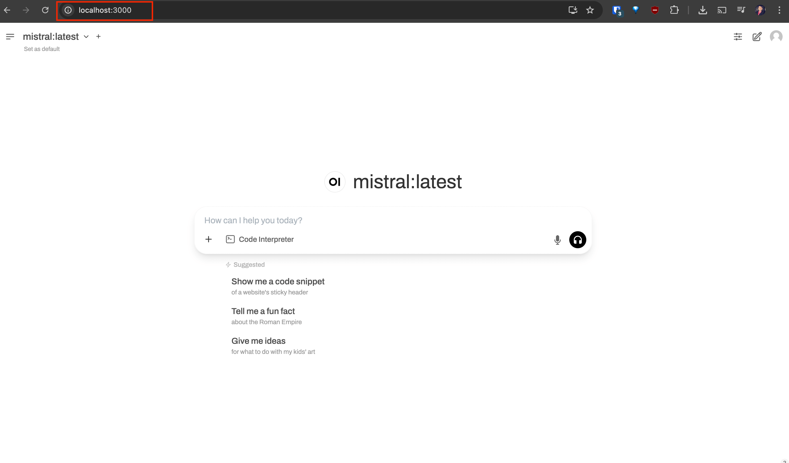
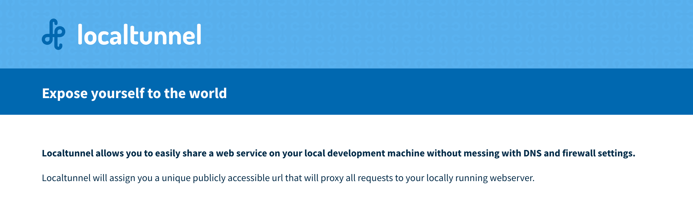
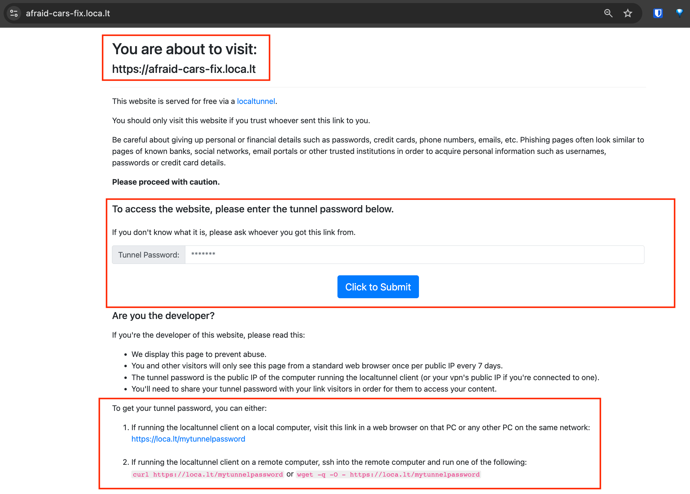
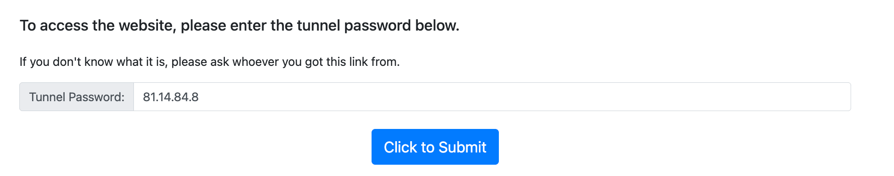
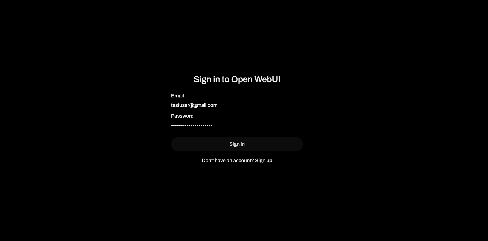
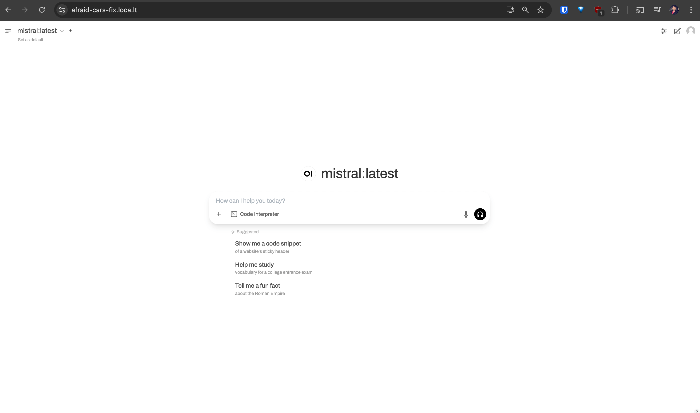
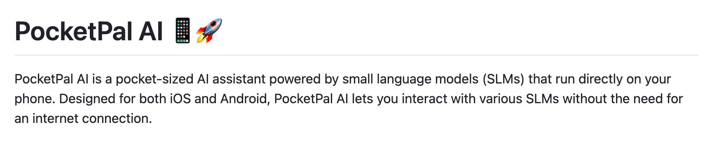
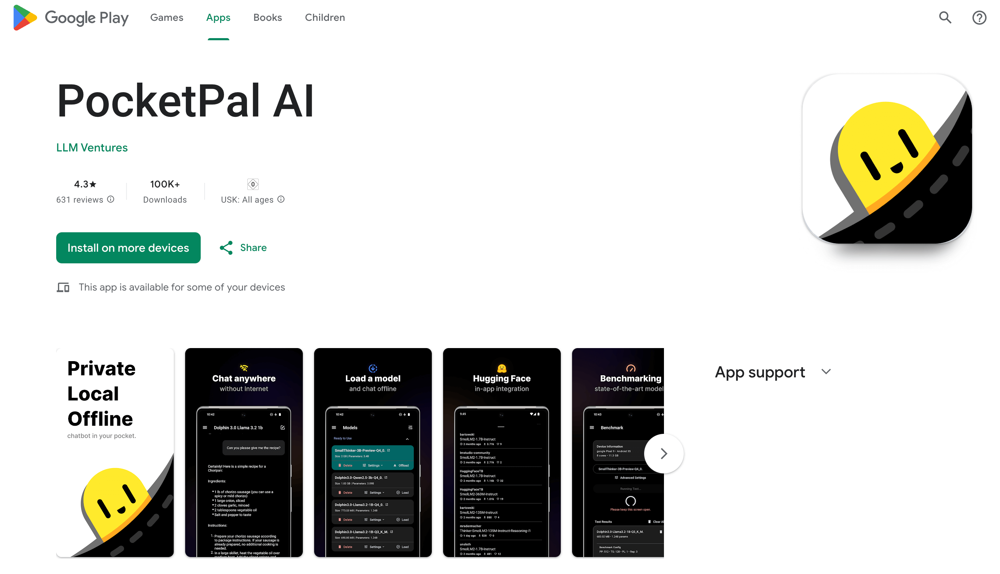
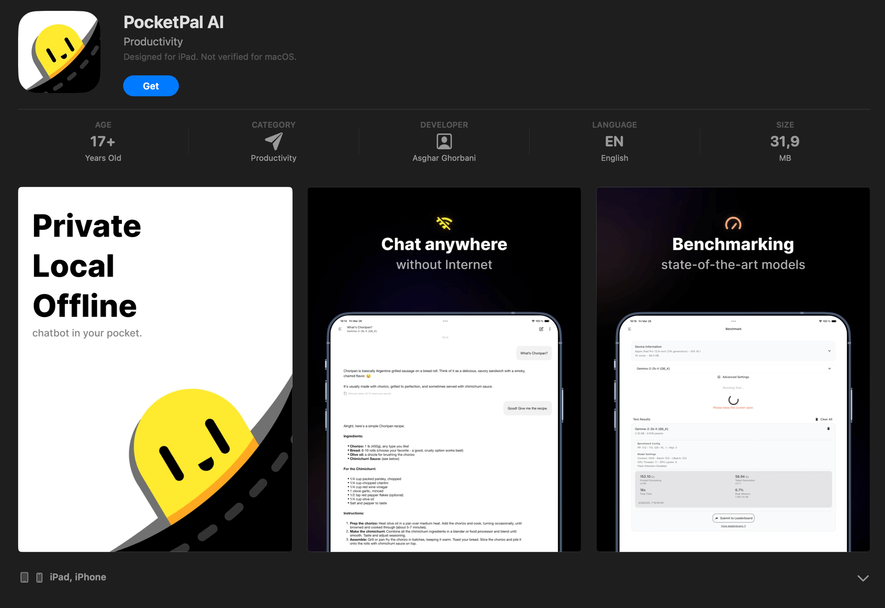

<!--Short abstract goes here-->

Want to use your local LLM on your phone? This post shows you how to easily share your local web app with the internet using LocalTunnel. Plus, we’ll look at running smaller LLMs directly on your device with PocketPal AI – all offline and private! 🎉

<!--more-->

Another one in the series, this time we'll be looking at how to use local GPTs on your mobile device. I had this desire to extend using a local GPT on my mobile phone. I already talked about how one can [setup a local GPT on their machine](/blog/llm/local-gpts-off-the-grid-on-your-machine/) and how to [setup a co-pilot alternative](/blog/llm/local-copilot-your-own-off-the-grid-and-local-code-assistant/), everything running locally and offline.

If I could also do the same on my phone, that would be awesome 😎

## Exposing the OpenWeb UI Webapp to Internet

In the first post in this series I showed how to [setup OpenWeb UI as a Web App](/blog/llm/local-gpts-off-the-grid-on-your-machine/) that can act as an alternative to ChatGPT, backed by local LLM via Ollama, running completely offline and private.

This web app is exposed on the local machine at [`http://localhost:3000/`](http://localhost:3000/).



This Web app works quite well on a mobile device as it is responsive. It would be awesome if I can leverage my machine for doing all the heavy lifting of running the model and use the Web App as an interface to interact with on my mobile device.

Looking at the possiblity of exposing my localhost to web, I found a CLI tool called [localtunnel](https://github.com/localtunnel/localtunnel).



Installation is quite straightforward:

```sh
npm install -g localtunnel
```

or if you are on macOS, you can use homebrew to install it:

```sh
brew install localtunnel
```

Then, to expose the localhost at port 3000 to the internet, I can run the following command:

```sh
lt --port 3000
```

Which will print the URL to the console, which in this case is:

```sh
❯ lt --port 3000
your url is: https://afraid-cars-fix.loca.lt
```

If you open this URL in a browser in a machine or a mobile device connnected to internet, you should see:



You are directed to a page that requests for a password to access the new tunnel created. This is to avoid the possibility of someone else using your machine to access the tunnel and also to avoid abuse of the free service.

<!-- If you want to use the tunnel in a machine that is not connected to internet, you can use the `--local` flag to create a local tunnel. -->

Interesting 🤔

So what is the password? It is mentioned on the same page. It is your public IP address of the computer running the localtunnel client. You can get the password by accessing the page at url [`https://loca.lt/mytunnelpassword`](https://loca.lt/mytunnelpassword) and copy the IP address from the page.


Or, simply use `curl` to get the password. You can run the below command in another terminal window:

```sh
❯ curl https://loca.lt/mytunnelpassword
81.14.84.8%
```

Your password is `81.14.84.8`.

Paste the IP address in the password field and click on the `Click to Submit` button.



You should see the OpenWeb UI login page:



Enter your username and password for accessing the OpenWeb UI and hit "Sign in" button. You will soon log into the OpenWeb UI.



Here is me using it on my Pixel 7 Android phone:

<video controls autoplay muted width=320 src="video_1.mp4" controls></video>


This works, but it is not the best. Why? Because I need the OpenWeb UI running on my laptop. Since everything is running locally, so as soon as I close my laptop the OpenWeb UI will be closed as well. This means it won't be accessible on the mobile device anymore. I need to have the OpenWeb UI running on my laptop all the time. So this is not a good solution, although it is something that opens the doors to access LLM models in a secure manner on my device itself.


### Bonus

I have created a quick shell script to start a local tunnel in background and fetch the password in one script named `expose_localhost.sh`

```sh {filename="expose_localhost.sh"}
#!/bin/bash

# Start LocalTunnel and append the PID
echo "🚀 Starting LocalTunnel..."
lt --port 3000 & echo $! >> /tmp/localtunnel_pids

# Wait to ensure the tunnel is running
sleep 3

# Fetch LocalTunnel password (if needed)
PASSWORD=$(curl -s https://loca.lt/mytunnelpassword)

# Print password
echo "🔐 Your tunnel password: $PASSWORD"
echo "✅ LocalTunnel started successfully!"
```

The output looks like below when you run this script in terminal:

```sh
❯ ./expose_localhost.sh
🚀 Starting LocalTunnel...
your url is: https://afraid-cars-fix.loca.lt
🔐 Your tunnel password: 81.14.84.8
✅ LocalTunnel started successfully!
```

Because the local tunnel is opened and put into background, you can close the terminal and the tunnel will still be running. This is desired, but sometimes you want to close these opened and running local tunnels from background.

You can create a new script named `cleanup_localtunnels.sh` and execute it to do so.

```sh {filename="cleanup_localtunnels.sh"}
#!/bin/bash

echo "🛑 Cleaning up LocalTunnel..."

if [[ -f /tmp/localtunnel_pids ]]; then
    while IFS= read -r PID; do
        kill -9 "$PID" && echo "✅ Terminated LocalTunnel process (PID: $PID)"
    done < /tmp/localtunnel_pids
    rm /tmp/localtunnel_pids
    echo "✅ All LocalTunnel instances have been cleaned up!"
else
    echo "⚠️ No LocalTunnel processes found."
fi
```

which when run, outputs:

```sh
❯ ./cleanup_localtunnels.sh
🛑 Cleaning up LocalTunnel...
✅ Terminated LocalTunnel process (PID: 80481)
✅ Terminated LocalTunnel process (PID: 80491)
✅ Terminated LocalTunnel process (PID: 80501)
✅ All LocalTunnel instances have been cleaned up!
```

## Run the LLM models on the device itself

What would be really nice, is to be able to run the LLM models on my device itself. This is what we are going to do next.

First thing first, running LLM models on your device is going to be taxing on its resources if you decide to run a large LLM. For a mobile device we need to conside smaller LLM models. Something under 1.5Gb is good enough.

While trying to research about loading LLM models on a mobile device, I came across the [PocketPal AI project](https://github.com/a-ghorbani/pocketpal-ai). This project is geared towards downloading, loading and running small LLM models on device.



It has 2 apps, one for iOS and Android.

You can find it in [Playstore](https://play.google.com/store/apps/details?id=com.pocketpalai):



For iOS, you can find it in [Appstore](https://apps.apple.com/us/app/pocketpal-ai/id6502579498):



Rest is quite easy and straightforward. You can download and install the app from the Playstore or Appstore.

Once you have installed the app, you can download and load the model from within the app. There is also ability to download and load model from HuggingFace.

Here is a video of the app in action:

<video controls autoplay muted width=320 src="video_2.mp4" controls></video>

Everything here is running on the device, completely offline 🚀

Thats it! Now enjoy using your very own local GPT on the go, on your mobile device whenever and wherever you want, offline and private 🎉
