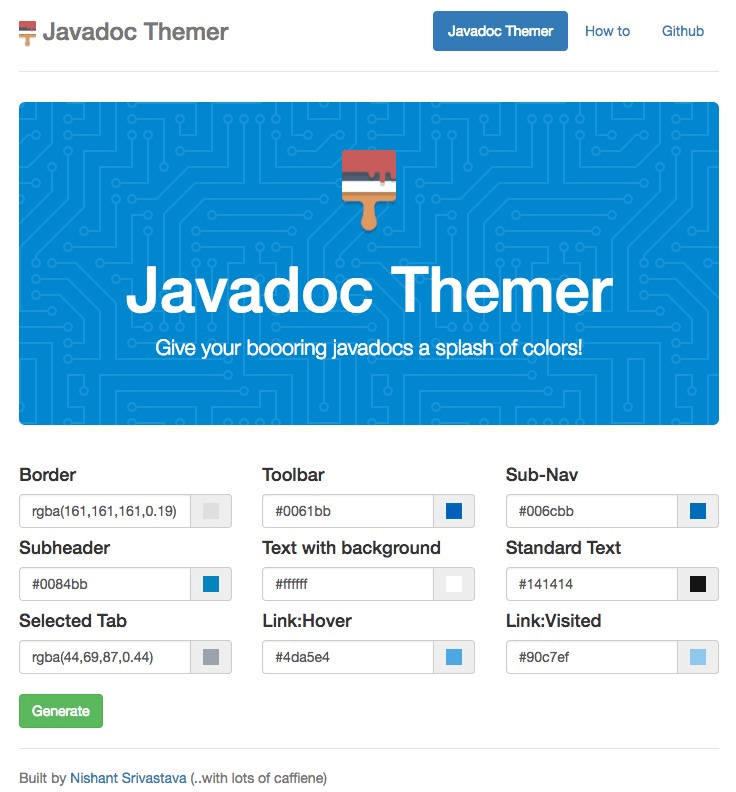
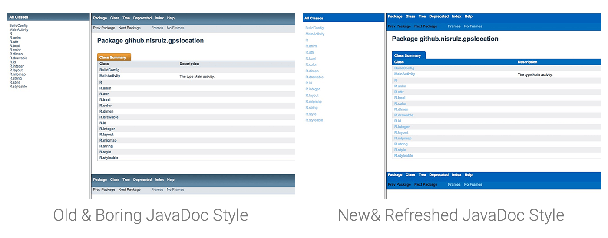

<!--more-->

I am pretty sure you would agree to the fact that the usual javadoc is not a something everyone likes. The colors are what makes it superrrrrrr boring. Yeah , I actually despise those weird colors and the fact that its been around for so long , made me think how to solve this. Also if you try looking it up on the internet there aren't any solutions that basically solved this in a programmatic way.

Well look no more.... TADAAAAAAA !!

Introducing **[Javadoc-Themer](https://nisrulz.com/javadoc-themer/)** 😊

So what does this do actually ? Well it basically makes it easy for you to control what colors your generated javadoc uses.

Using Javadoc-Themer you can choose the colors for each part of your javadoc and generate a stylesheet of it. Next you provide the stylesheet as an argument while generating your javadocs and there you have a better looking javadoc (^\_^)

Refer to **How to** section in the **Javadoc-Themer** for more information.

Here is a comparison of both

The code for Javadoc-Themer is open sourced on [github](https://github.com/nisrulz/javadoc-themer) and you can find the webapp [here](https://nisrulz.com/javadoc-themer/)

Star it, fork it or simply use it to build better looking javadocs.
