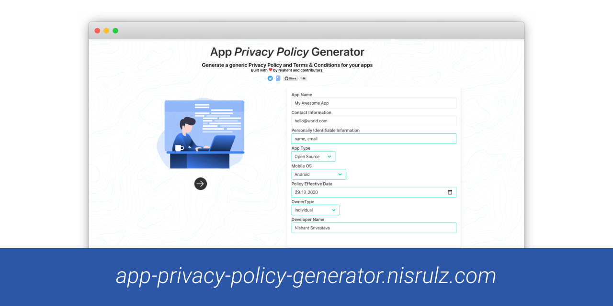
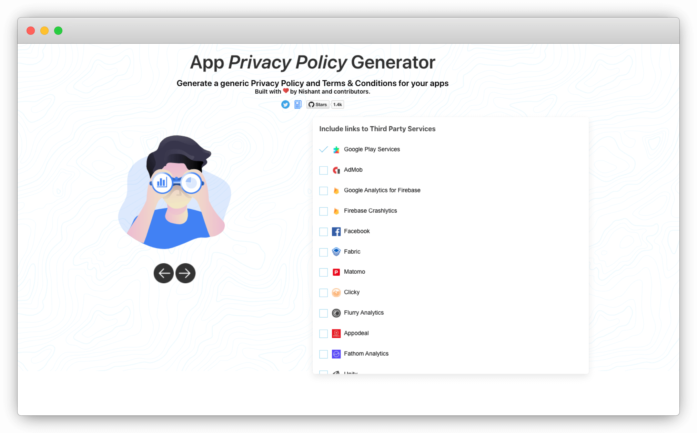
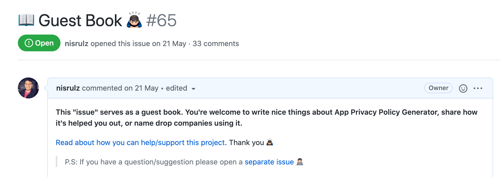

[App Privacy Policy Generator](https://app-privacy-policy-generator.nisrulz.com/) is a simple web app to generate a generic privacy policy for your Android/iOS apps.

<!--more-->

### Backstory

It was built with a core idea and vision, to enable indie developers from having to jump through the weeds of legality around putting up a Privacy Policy or Terms & Conditions in their applications. I built this web app because I wanted to do the same and every other alternative out there was charging me money. At that time, I was not that well off to consider buying the services of such companies. So I built the app, used it in my apps and [open sourced](https://github.com/nisrulz/app-privacy-policy-generator) it hoping someone who would be in the same situation as me would benefit from it. Over the years this project has shown that it has helped many and that I was not the only one with this problem. Thus the core of all of this has led to me trying my best to keep this project always free and open-source.

Since the web app's inception in the year 2017, it has always been licensed under Apache 2.0. Over the few years between 2017 and now (2020 as of writing), many people have tried to acquire this project/make an exact copy and host it on their domain (without contributing back to the project at all). Whenever I have declined the offer for acquisition citing the ideas and vision for my project or requested for contribution back to the project, folks have taken offense and declined my request or sent me 😡 emails.

This was allowed under a more liberal Apache 2.0 license and I had no say in any of such cases 🤷

So, after thinking much about all this and keeping my vision of keeping this project free and open source forever I started looking around what I can do. Then I came across a recent [article from the folks at Plausible Analytics](https://plausible.io/blog/open-source-licenses), where they were in a similar situation. They were first MIT licensed and then moved to AGPLv3 recently. They go into more details to explain AGPLv3 license too, you should read their article.

However, that gave me ideas that I felt the same about App Privacy Policy Generator. So, I decided to do any further development under the AGPLv3 license.

**_What does that mean for the project?_**

Well simply worded this project and its derivatives will always be open source (including hosted ones!)

### App Privacy Policy Generator v3.1.0 is out! 🚀

The new release is licensed under the **AGPLv3 license**. Head over to the [latest release's changelog](https://github.com/nisrulz/app-privacy-policy-generator/releases/tag/3.1.0) to read about it 🤗

With v3.1.0, I have set the base for supporting more templates in the future. Additionally, it is now easier to add 3rd party services now. No more fidgeting with JSON. A simple YAML block will do the work, enabling an easier contribution path for non-developers too.

Adding a 3rd party service to the web app is as simple as adding the below to the `thirdpartyservices.yml` file:

```yaml
- name: Google Play Services
  model: gps
  gps: false
  logo: images/gps.png
  link:
    privacy: https://www.google.com/policies/privacy/
    terms: https://policies.google.com/terms
```

Read more about it [here](https://github.com/nisrulz/app-privacy-policy-generator/blob/master/dev-doc.md#contributing-more-3rd-party-services-links).



Lastly, if App Privacy Policy Generator has helped you or your company in anyway then [consider supporting the project](https://github.com/nisrulz/app-privacy-policy-generator#author--support). You can also [sponsor me on Github](https://github.com/sponsors/nisrulz) 🙇🏻‍♂️

Also, did you know I maintain a Guest book issue for App Privacy Policy Generator!😳
[Read what others have to say about the project](https://github.com/nisrulz/app-privacy-policy-generator/issues/65).

One of the ways of supporting the project would be to [write about how it helped you out](https://github.com/nisrulz/app-privacy-policy-generator/issues/65) 😄



### What's next

Well, there a few things that are already in the pipeline and would see the light in the next releases, like supporting:

- GDPR compliant Privacy Policy
- Localization
- Enabling Github Actions for the project

There is more to this project and I have a lot of stuff planned. Keep an eye on it 🤗
