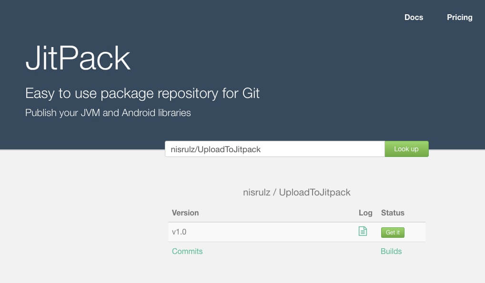
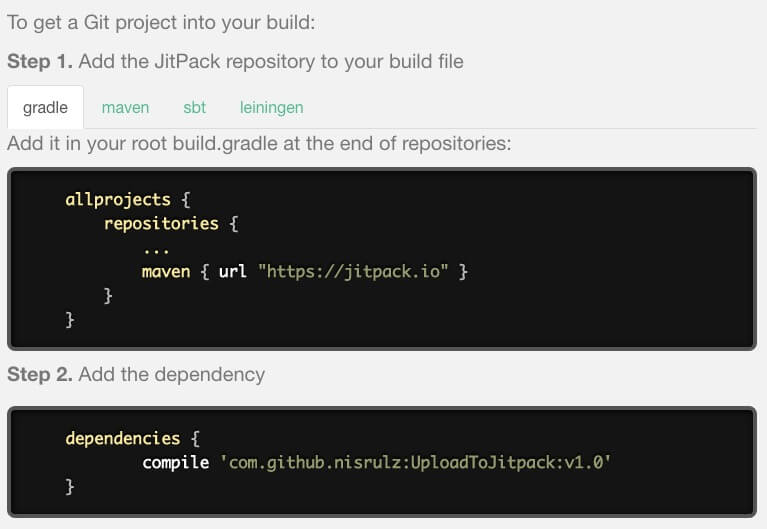
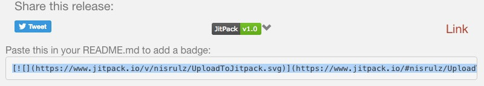

Ok so you already know how to build your android library and publish it to JCenter/MavenCentral. This post is third in parts of a series.

P.S. : If you dont know how to , go ahead and have a look

1. [Guide to publishing your Android Library via Jcenter/Bintray](/blog/publish-your-android-library-via-jcenter/)
2. [Guide to publishing your Android Library via MavenCentral](/blog/publish-your-android-library-via-mavencentral/)
3. [Guide to publishing your Android Library via JitPack](#)

The very first question that people would have is

### What is JitPack

As per their [website](https://www.jitpack.io/)

> Easy to use package repository for Git. Publish your JVM and Android libraries

So basically JitPack builds Git projects on demand and provides you with ready-to-use artifacts (jar, aar).

### Why would I use it instead of JCenter or MavenCentral ?

Publishing to MavenCentral or JCenter is a well set process which involves people to go through steps in order to let their artifacts be hosted on these repositories. The process also involves you to wait for a certain few hours to get everything synced up.

On the other hand JitPack is the most simplest way of publishing the artifacts. There is no need to go through project build and upload steps. All you need to do is

1. Push your project to GitHub
1. Tag a `release`
1. Head over to JitPack and request to publish the `release`.

...and thats it. You have your library code available in just few minutes.

**It just works! Cool , isn't it!**

I will walk you through the process to help understand the process in a more practical mannner.

The first step that you need is to create and build your Android "Awesome" Library, which can be read in the [first post of this series here](/publish-your-android-library-via-jcenter/). If you have not done so , then please go ahead and read it up. Once done comeback here to read further.

Assuming you already have your Android "Awesome" Library built , I will jump directly to steps involved in publishing your library to JitPack

##### Publishing your Android "Awesome" Library

1. Once project is synced, add the `android-maven-gradle-plugin` to `classpath` in `build.gradle` file at **root project** level.

```gradle
 dependencies {
    classpath 'com.android.tools.build:gradle:2.1.2'
    ..
    ..
    // Setup the android-maven-gradle-plugin in the classpath
    classpath 'com.github.dcendents:android-maven-gradle-plugin:1.3'
    ..
```

1. Next, apply the `android-maven-gradle-plugin` to the `build.gradle` file at **library module** level. Also add the group variable.

   ```gradle
    apply plugin: 'com.android.library'
    // Required plugin in library module
    apply plugin: 'com.github.dcendents.android-maven'
    // Replace nisrulz with <your_github_username>
    group='com.github.nisrulz'
   ```

1. Create a release TAG in git

```
git tag -a 1.0 -m "v1.0"
git push origin 1.0
```

1. Once everything is pushed and the release TAG is also pushed, goto `https://www.jitpack.io/#username/reponame` where replace `username` with your github username and `reponame` with the reponame of the android project.

1. Select the release you would like to share by clicking the ‘Get It’ button next to the list of releases of your repository.



##### Using your Android "Awesome" Library in other projects

- Next the same page at Jitpack would show you how to use the library in your other android projects. Something like below

  

  Selectable code

  ```gradle
  repositories {
      jcenter()
      maven { url “https://jitpack.io” }
  }
  dependencies {
      implementation 'com.github.nisrulz:awesomelib:1.0'
  }
  ```

- Let the world know of your **AwesomeLib**
  - Add a readme that explains how to integrate and use your Awesome library
  - Add a license block.
  - Also include the JitPack badge provided by jitpack in your readme
    
  - Promote your lib on social media so that others can know about it.
  - Always add a working sample app in your project that demonstrates your library in use.
  - Add screenshots if possible in your readme.

The code for the AwesomeLibrary and this guide itself is open sourced and available on [github](https://github.com/nisrulz/UploadToJitpack)

Star it or just fork it to use it.

And thats it for this series. I hope it helps people to deploy their android libraries for the world to use.

If you have suggestions or maybe would like me to add something to the content here, please let me know.

Have fun crushing code :D
