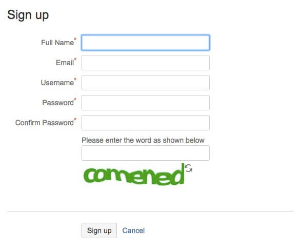
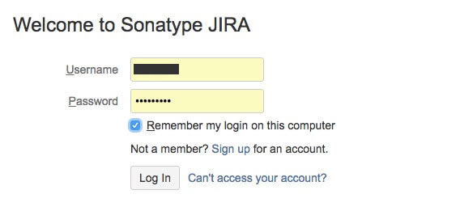
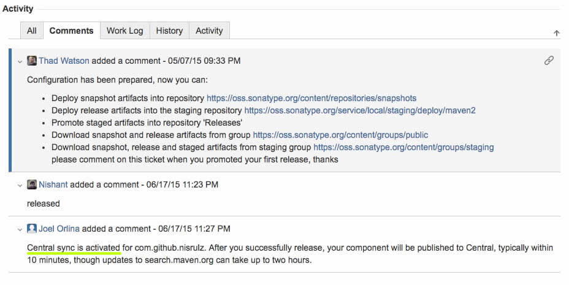
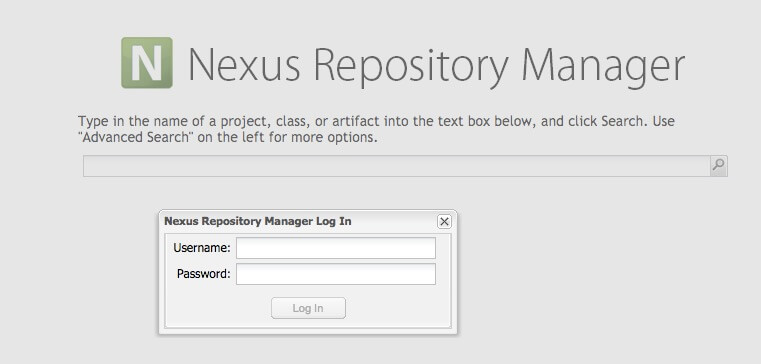

If you come from the java world, you would already be knowing about MavenCentral in a big way. MavenCentral is the central repository which hosts all the maven artifacts and one can reference them from anywhere in the world. Android artifacts can also be hosted on MavenCentral in a similar manner. Here I am going to document the process to publish an android library to MavenCentral, as I followed it.

This post is second in parts of a series. If you didnot read the others in series , go have a look

1. [Guide to publishing your Android Library via Jcenter/Bintray](/blog/publish-your-android-library-via-jcenter/)
2. [Guide to publishing your Android Library via MavenCentral](#)
3. [Guide to publishing your Android Library via JitPack](/blog/publish-your-android-library-via-jitpack/)

The first step need you to create and build your Android "Awesome" Library and can be read in the [first post of this series here](/publish-your-android-library-via-jcenter/). If you have not done so , then please go ahead and read it up.

Assuming you already have your Android "Awesome" Library built , I will jump directly to steps involved in publishing your library to MavenCentral

##### Publishing your Android "Awesome" Library

Setup [GPG](http://blog.ghostinthemachines.com/2015/03/01/how-to-use-gpg-command-line/) and generate yourself a key.

- Now list your gpg keys

  ```bash
  $ gpg --list-keys
  ```

  > There the first line will be like pub XXXXX/YYYYYYYY <date>. Remember that ‘YYYYYYYY’ part, it’s you key ID.

- Next, publish your keys

  ```bash
  $ gpg --keyserver hkp://keyserver.ubuntu.com --send-keys YYYYYYYY
  $ gpg --keyserver hkp://pgp.mit.edu --send-keys YYYYYYYY
  ```

- To ensure your keys were published

  ```bash
  $ gpg --keyserver hkp://pgp.mit.edu --search-keys
  username@example.com # Use your email
  ```

Setup Sonatype account

- Create a JIRA account on [Sonatype](https://issues.sonatype.org/secure/Signup!default.jspa)
  

and Login


- Once you are logged in, [create a new issue](https://issues.sonatype.org/secure/CreateIssue.jspa?issuetype=21&pid=10134)
  

- Fill out the form as below

  - Project : Community Support - Open source
  - Issue Type : New Project
  - Group Id : com.github.github_username
  - Project URL : https://github.com/github_username/project_name
  - SCM url : https://github.com/github_username/project_name.git
  - Username : sonatype_username
  - Already Synced to Central : No

  

  

- Next hit **Create**. After that, it can take up to 2 business days to process your issue. Then you will receive a confirmation that your configuration has been prepared and you can publish your library.

  > **IMPORTANT** : Do not deploy until after you have received an e-mail notice indicating that the ticket is Resolved.

  

- Update `gradle.properties` on your local machine at location `~/.gradle/gradle.properties` and include

  ```
   NEXUS_USERNAME=sonatype_username
   NEXUS_PASSWORD=sonatype_password
   signing.keyId=gpg_key_id
   signing.password=gpg_password
   signing.secretKeyRingFile=/Users/username/.gnupg/secring.gpg
   org.gradle.daemon=true
  ```

> IMPORTANT: Steps for setting up your sonatype account up till here are required only once. The steps after these are required whenever publishing your android library, even if its a new one. Just remember to configure it well in your gradle.properties

##### Add the plugin by Chris Banes to your library's `build.gradle`.

> NOTE: Below is a [fork](https://github.com/nisrulz/gradle-mvn-push) of the [original script](https://github.com/chrisbanes/gradle-mvn-push) written by Chris Banes.

```gradle
apply from: 'https://raw.github.com/nisrulz/gradle-mvn-push/master/gradle-mvn-push.gradle'
```

and define the required variables in the `gradle.properties`.

```
# Properties used by gradle maven-push plugin
VERSION_NAME=1.0.0
VERSION_CODE=1
POM_NAME=<Library_Name>
POM_ARTIFACT_ID=<library_name_smallcaps>

POM_DESCRIPTION=<library_description>
POM_URL=https://github.com/<username>/<repo_name>
POM_SCM_URL=https://github.com/<username>/<repo_name>
POM_SCM_CONNECTION=scm:git@github.com:<username>/<repo_name>.git
POM_SCM_DEV_CONNECTION=scm:git@github.com:<username>/<repo_name>.git
```

- Run in terminal to publish your artifacts

  ```bash
  ./gradlew build clean uploadArchive
  ```

- Login into [Nexus Repository Console](https://oss.sonatype.org/#stagingRepositories) and search for your package name.

  

Next


1. Close the staged artifact.[wait]

1. Release the closed artifact (keep drop artifact selected).[wait]

1. Wait for some hours before everything gets synced with MavenCentral.

##### Using your Android "Awesome" Library in other projects

Your code is available through MavenCentral if you have received the mail with confirmation

You can use the lib now as follows

```gradle
dependencies {
    implementation '<group_name>:<artifact_name>:1.0'
  }
```

i.e for the sample lib in this repo , `awesomelib`

```gradle
dependencies {
      implementation 'com.github.nisrulz:awesomelib:1.0'
  }
```

- Let the world know of your **AwesomeLib**

  > - Add a readme that explains how to integrate and use your Awesome library
  > - Add a license block as in this repo
  > - Also include a badge of MavenCentral in your readme
  > - Promote your lib on social media so that others can know about it.
  > - Always add a working sample app in your project that demonstrates your library in use.
  > - Add screenshots if possible in your readme.

The code for the AwesomeLibrary and this guide itself is open sourced and available on [github](https://github.com/nisrulz/UploadToMavenCentral)

Star it or just fork it to use it.
