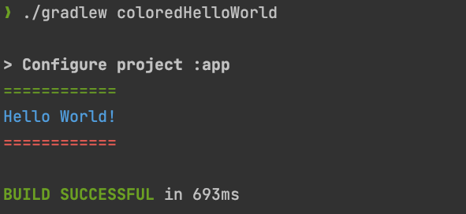

Have you ever wanted to emphasize some console log output with colors? Well, I thought I never would have needed to, but while tinkering with some side project, I found a trick to colorize my console log output. The magic trick is using [ANSI Escape Codes](https://en.wikipedia.org/wiki/ANSI_escape_code). My use-case was to highlight some part of my Groovy task's output as a yellow colored warning and some errors as red, while working with my Android project. The code is quite simple, so lets dive into its implementation right away!

<!--more-->

First, create a `colored_console.gradle` file at the root of your project directory and populate it with content shown below. You can copy past it as it is:

```groovy
// Colored Console logs in Groovy
def printlnWithColor(color, str) {
    // Map of ANSI Escape color codes
    final colorsMap = [black  : 30, red: 31, green: 32, yellow: 33,
                       blue   : 34, magenta: 35, cyan: 36, white: 37,
                       default: 39]
    // Create the escape sequence so string is color formatted
    final style = "${(char) 27}[${colorsMap[color]}" + "m"
    // Apply the escape sequence to the string by prepending it
    final styledStr = style + str
    // finally use println to print this escaped string
    println(styledStr)
}

// Using ext.method_name so it is exported and available
// to be used outside the file it is declared in
ext.printlnBlack = { str -> printlnWithColor("black", str) }

ext.printlnRed = { str -> printlnWithColor("red", str) }

ext.printlnGreen = { str -> printlnWithColor("green", str) }

ext.printlnYellow = { str -> printlnWithColor("yellow", str) }

ext.printlnBlue = { str -> printlnWithColor("blue", str) }

ext.printlnCyan = { str -> printlnWithColor("magenta", str) }

ext.printlnWhite = { str -> printlnWithColor("white", str) }

ext.printlnDefault = { str -> printlnWithColor("default", str) }

```

Next, include this file inside the `build.gradle` file where you want to want to use the functions that facilitate colored console output. i.e app module's build.gradle file.

Include the below line of code at the top of build.gradle file where plugins are defined.

```groovy
apply from: "$rootProject.projectDir/colored_console.gradle"
```

The setup part is now done and you can start using the defined functions to enable colored console output.

In order to test this out, lets create a task named `coloredHelloWorld`, as shown below:

```groovy
task coloredHelloWorld {
    printlnGreen("============")
    printlnBlue("Hello World!")
    printlnRed("============")
}
```

Now we should execute this task by running the below command in a terminal window at the root of the project:

```sh
./gradlew coloredHelloWorld
```

and its output:



Pretty neat 🌈 Now go use it in your projects and add a splash of color to your console logs 🙃

You can find all code in a functional Android project [here](https://github.com/nisrulz/android-examples/tree/develop/ColoredConsoleLogs).


