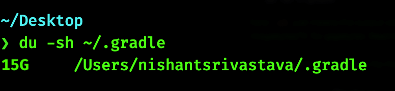
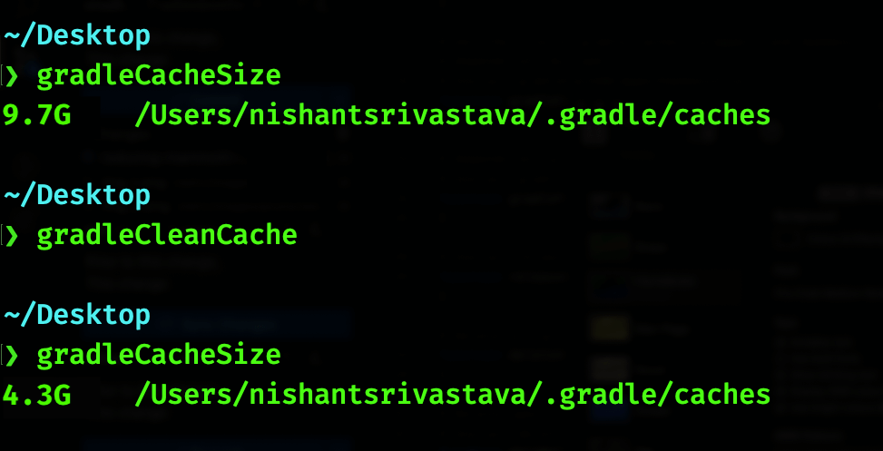

Once in a while I notice space occupied in my dev machine to be considerable. Since I am an Android Engineer, I mostly work with [Gradle build tool](https://gradle.org/).

Gradle maintains a cache of all dependencies it downloads as well as other artifacts such as downloaded wrappers at the path `~/.gradle`. Now you'll be surprized to know how much space this `.gradle` directory occupies. Lets try to find out.

<!--more-->

I'll use a tool called [`du`](https://ss64.com/bash/du.html). This is usually present on all unix systems (I am using macOS).

To check the space occupied by `.gradle` directory, you need to run the below command in a terminal window:

```sh
du -sh ~/.gradle
```

here `-sh` just means the output will be total value in a human readable format with a size letter such as **M** for megabytes/**G** for gigabytes. Read the [docs](https://ss64.com/bash/du.html) for more details.

When I ran this command in my machine this was the result:



Because I use this often, I have created an alias for this:

```sh
# Drop this aliases in your ~/.bashrc or ~/.zshrc file

# Find the size of your .gradle directory
# Usage: gradleDirSize
alias gradleDirSize='du -sh ~/.gradle'
```


Now that is a lot of space occupied by just 1 directory that is just a directory for storing caches and other artifacts, 15 Gb!

I need to free up some space, but I cannot delete the whole directory because gradle build system uses the artifacts and caches inside this directory. Thanks to [Octavia Togami, Gradle Engineer](https://octyl.net/) who reached out over email and pointed out this:

> " The `~/.gradle` folder is not only home to caches, it also contains `~/.gradle/gradle.properties` which sometimes hold data that is not stored elsewhere (API keys) as well as `~/.gradle/init.d/` which can contain init scripts that run for all projects. These are not cached values, they are added by users."

However, there is still some hope to free up some space (again pointed in the right direction by Octavia Togami). The subdirectory `caches` at the path `~/.gradle/caches` is a good candidate for freeing up space, while not messing up anything else. There are more subdirectories which I will mention towards the end of this post. For now lets focus on `~/.gradle/caches` directory.

First let's set up an alias to get the size of `~/.gradle/caches` directory like I did earlier for `~/.gradle` directory:

```sh
# Drop this aliases in your ~/.bashrc or ~/.zshrc file

# Find the size of your ~/.gradle/caches directory
# Usage: gradleCacheSize
alias gradleCacheSize='du -sh ~/.gradle/caches'
```

I will use this later in the post.

Now, inside `~/.gradle/caches` directory, ideally everything is useful. Its a directory which all dependencies that my projects are using and thus are maintained as a quick accessible cache. So deleting them all doesn't make much sense. I came up with a command that will only delete files that are were accessed more than 30 days ago. That way the most used cache files are kept intact and unused/rarely used files are deleted. Lets take a look at it now.

```sh
# Clean files inside ~/.gradle/caches directory that were accessed more than 30 days ago
find ~/.gradle/caches -type f -atime +30 -delete
```

here

- `~/.gradle/caches` = Path where [`find`](https://ss64.com/bash/find.html) will be executed.

- `-type f` = Only look for files.

- `-atime +30` = File was last accessed more than 30 days ago (tweak this as per your requirement).

  > WARNING: Not all filesystems keep access times so this could delete files that are just old, rather than ones that aren't being used. My use-case is limited to macOS and its default filesystem for now where this is not an issue.

- `-delete` = Delete files found by `find` based on set criteria.

Additionally, I could also delete all empty directories inside `.gradle`. The below command does just that:

```sh
# Delete empty directories inside ~/.gradle/caches directory
find ~/.gradle/caches -mindepth 1 -type d -empty -delete
```

here

- `-mindepth 1` = Means process all files except the command line arguments i.e except `~/.gradle` directory itself, all sub directories are used to find.

- `-type d` = Only look for directories.

- `-empty` = File is empty and is either a regular file or a directory.

Next combine these 2 commands into 1 alias as shown below. Copy and paste the below alias in your `~/.bashrc` or `~/.zshrc` file:

```sh
# Clean your ~/.gradle/caches directory of files
# that were accessed more than 30 days ago and remove empty directories
# Usage: gradleCleanCache
alias gradleCleanCache='find ~/.gradle/caches -type f -atime +30 -delete && \
find ~/.gradle/caches -mindepth 1 -type d -empty -delete'
```

Looks so much better! I executed this alias command to free up my disk space and checked for the occupied space again



Nice! I was able to free up 5.4 Gb of disk space. As pointed out by Octavia Togami, there are some more directories that are safe to run the above commands against:

- `~/.gradle/wrapper` to clean up old wrappers.
- `~/.gradle/daemon` to clean up old log files.

To do so, simply replace `~/.gradle/caches` with `~/.gradle/wrapper` in the above alias, like so:

```sh
# Clean your ~/.gradle/wrapper directory of files
# that were accessed more than 30 days ago and remove empty directories
# Usage: gradleCleanWrapper
alias gradleCleanWrapper='find ~/.gradle/wrapper -type f -atime +30 -delete && \
find ~/.gradle/wrapper -mindepth 1 -type d -empty -delete'
```

Similarly for `~/.gradle/daemon`:

```sh
# Clean your ~/.gradle/daemon directory of files
# that were accessed more than 30 days ago and remove empty directories
# Usage: gradleCleanDaemon
alias gradleCleanDaemon='find ~/.gradle/daemon -type f -atime +30 -delete && \
find ~/.gradle/daemon -mindepth 1 -type d -empty -delete'
```

As an improvement I created a bash functions to get me total size occupied by all 3 directories mentioned above: **caches**, **wrapper** and **daemon**:

```sh
# Get the size of gradle caches, wrappers and daemons in human readable format
# Depends on: du, awk
# Use as: gradleCacheWrapperDaemonsSize
function gradleCacheWrapperDaemonsSize(){
    DIR_TO_CHECK=("caches"  "wrapper"  "daemon")
    for dir in ${DIR_TO_CHECK[*]}; do
        printf "  👉 ~/.gradle/$dir: $(du -sh ~/.gradle/$dir | awk '{ print $1 }')\n"
    done
}
```

and another one to clean files inside those 3 directories that were accessed 30 days ago or were empty:

```sh
# Clean up the gradle caches, wrappers and daemons directory of files
# that were accessed more than 30 days ago and remove empty directories
# Depends on: gradleCacheWrapperDaemonsSize
# Use as: gradleFreeUpSpace
function gradleFreeUpSpace(){
    echo " [BEFORE Cleanup] Gradle caches size:"
    gradleCacheWrapperDaemonsSize
    echo "=========================================================="
    echo " Cleaning up gradle directories ..."
    echo " "
    echo " Working in:"
    DIR_TO_CHECK=("caches"  "wrapper"  "daemon")
    for dir in ${DIR_TO_CHECK[*]}; do
        echo " 👉 ~/.gradle/$dir"
        # Delete all files accessed 30 days ago
        find ~/.gradle/$dir -type f -atime +30 -delete
        # Delete empty directories
        find ~/.gradle/$dir -mindepth 1 -type d -empty -delete
    done
    echo "=========================================================="
    echo " [AFTER Cleanup] Gradle caches size:"
    gradleCacheWrapperDaemonsSize
    echo "=========================================================="
    echo " Done ✅"
}
```

These bash functions have more logs and are exactly the same as what I use on my machine :)

Thats it! Enjoy your free space 🎉

### Credits

<center><a href="https://www.flaticon.com/free-icons/elephant" title="elephant icons">Elephant icons created by Freepik - Flaticon</a></center>
