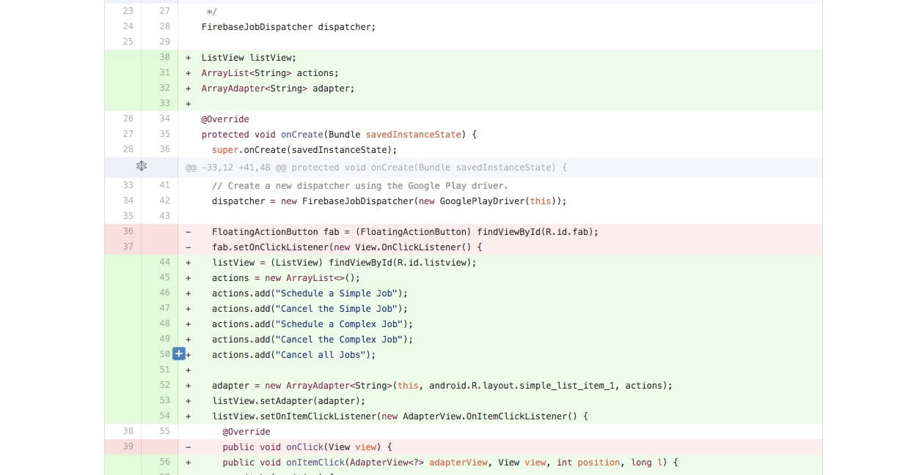

Most of us are engineers and at the end of the day humans. So basically we all are bound to make mistakes. As an Engineer we make such mistakes in code quite often and even if we do not admit it , they do exist. How many times have you published your code to a public VCS such as Github/Bitbucket with the credentials and then pulled down the repository only to reset the whole history and re-publish the new repository with the credentials cleaned out.

<!--more-->

Pretty common, eh ? From what I have experienced it turns out, thats what most of the devs do. However if I told you that you can clean the credentials out and still keep the git history ! Sounds awesome right ? Thats coz it is !

So how does one do it ? I will be demonstrating a very simple example of a scenario I recently came across and how I solved it.
It can however be applied to various other use cases. You can extend it to remove complete files even 🙄

### The Problem

We all have the license block in our code when pushing code to Github (If you don’t have one , then make sure you do have one from now onwards). It looks like below

```java
/*
 * Copyright (C) 2016 Nishant Srivastava
 *
 * Licensed under the Apache License, Version 2.0 (the "License");
 * you may not use this file except in compliance with the License.
 * You may obtain a copy of the License at
 *
 *    http://www.apache.org/licenses/LICENSE-2.0
 *
 * Unless required by applicable law or agreed to in writing, software
 * distributed under the License is distributed on an "AS IS" BASIS,
 * WITHOUT WARRANTIES OR CONDITIONS OF ANY KIND, either express or implied.
 * See the License for the specific language governing permissions and
 * limitations under the License.
 */
```

I use a single machine to code for my full time job and my own open source work (..almost like everyone) and I have preset my Android Studio to include the license block everywhere, but here is the catch, it is setup to add the license block of the company I work for (..thats coz its my full time job). It looks like this

```java
/*
 * Copyright (c) 2015 - 2016 CompanyName, Inc.
 *
 * DO NOT ALTER OR REMOVE COPYRIGHT NOTICES OR THIS FILE HEADER.
 * All Rights Reserved
 * Unauthorized copying of this file, via any medium is strictly prohibited
 */
```

I tend to add my own license when working with my own open source work after work hours and I have never got it messed up , up until recently. I recently pushed one of the .java class of one my android libraries to Github 😱 😱 😱 😱

Now thats a bummer 😩 to see your git history messed up as it was something that was not intended and I did not want to reset my repository. (..which would mean that I would lose all stars and issue).

### The Solution 🤓

One tool : [BFG Repo-Cleaner](https://rtyley.github.io/bfg-repo-cleaner/), from the tool’s homepage itself

> Removes large or troublesome blobs like git-filter-branch does, but faster.

Yeah, thats all you need to cleanup your repo. What this tool does is that it searches for text inside your git history and replaces it with another version and creates a new commit and removes the old commits. But the order and history is still maintained. Pretty neat , eh ? I know :)

So here is how we clean our git history of unwanted data.

1. Download the latest release of [bfg tool](https://github.com/rtyley/bfg-repo-cleaner/releases)

1. Once its downloaded, navigate to the folder you have downloaded it and create a text file named replace.txt (as a matter of fact you can name it whatever you want. I like to name it as replace.txt)

1. Edit the content of the replace.txt file created as below

   ```
   Copyright (c) 2015 - 2016 CompanyName, Inc.==>Copyright (C) 2016 Nishant Srivastava
   ```

   where the syntax followed is `text to replace==>text to replace with`.

   Notice that there are no spaces right before and after the operator `==>`

   > More ways of defining how to replace text in this [stackoverflow ans.](http://stackoverflow.com/questions/4110652/how-to-substitute-text-from-files-in-git-history/15730571#15730571)

1. Now go ahead clone a mirror of your project repo.
   ```bash
   git clone — mirror https://github.com/username/your-project.git
   ```
1. Once mirrored, now you need to run the command as below to clean your git history
   ```bash
   java -jar bfg-<latest_version>.jar  --replace-text replace.txt -fi *.java  your-project.git/
   ```
1. Next clean the reference logs and optimize the project again
   ```bash
   cd your-project.git/ git reflog expire --expire=now --all && git gc --prune=now --aggressive
   ```
1. Next when done, push your changes to Github
   ```bash
   git push
   ```

DONE. That is all there is.

Ok, not really. Here is what you might encounter after you do a git push. Depending on your project size, you can get a lot of output.

Here is what a successful overwrite of a branch would look like:

```
+ 1289ad8…bee1ea4 master -> master (forced update)
```

Unfortunately, you might also see something like this:

```
! [remote rejected] refs/pull/53/head -> refs/pull/53/head (deny updating a hidden ref)
```

> As mentioned in this [issue](https://github.com/rtyley/bfg-repo-cleaner/issues/36#issuecomment-37877829),
>
> The refs beginning ‘refs/pull' are synthetic read-only refs created by GitHub - you can't update (and therefore 'clean') them, because they reflect branches that may well actually come from other repositories - ones that submitted pull-requests to you.
> So, while you’ve pushed all your real refs, the pull requests don’t get updated
> In simple words Github also saves branches after you merged, closed and deleted them. You have no way to modify those branches that are owned by Github. The only way you can really remove them is by deleting the repository. And keep in mind that you also lose all stars, issues and so on when deleting a project. Which will be a bummer, you don’t want to do that, do you ?

So how do you solve this , well you need to [mirror your repo without the Github Pull Request](http://christoph.ruegg.name/blog/git-howto-mirror-a-github-repository-without-pull-refs.html) in Step 4.

> In short, simply replace the catch-all refspec above with two more specific specs to just include all heads and tags, but not the pulls, and all the remote pull refs will no longer make it into your bare mirror

Goto `your-project.git` folder and run `git config -e` . Next replace

```
fetch = +refs/*:refs/*
```

with

```
fetch = +refs/heads/*:refs/heads/*
fetch = +refs/tags/*:refs/tags/*
fetch = +refs/change/*:refs/change/*
```

This should solve your issue.
Also be careful because everyone who cloned or forked your project still has access to the original data. So thats that 🤔

If you want to find more about bfg , go ahead and [read their awesome doc](https://rtyley.github.io/bfg-repo-cleaner/#usage)

If you have suggestions or maybe would like me to add something to the content here, please let me know.
