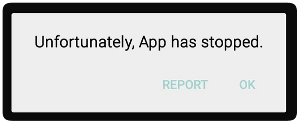
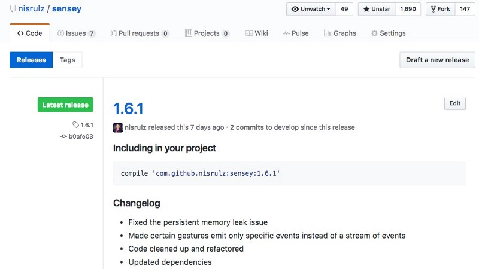

<!--more-->

It all starts when some android developer tries to figure out a solution to a problem he/she is having while building their **"Awesome Android App"**. During the process, most developers would encounter a couple of issues and in tandem, to those, they would come up with possible solutions.

Now here is a thing, if you are like me, who believes that if the problem was big enough for me to spend some time on it and there wasn’t an existing solution out there, I would abstract the whole solution in a modular manner, which eventually turns out to be an android library. Just so that whenever in future I encounter this problem again, I can reuse this solution easily.

So far, so good. So you have built the library and probably started using it completely privately or if you think someone else could make use of the same solution you release the code as an android library i.e.you open source the code. I believe (..or rather that is what it looks like..) at this point everyone thinks they are done.

**WRONG!** This very point is where most people usually miss out that this android library code is going to be used by other developers that do not sit next to you and that to them this is just some android library they wish to use to solve a similar problem. The better your approach of designing the API the better the chances of making sure that the library will be used as it is intended to be and whoever is using it isn’t confused. It should be clear from the very start what needs to be done to start using the library.

##### _Why does this happen?_

The devs that write these android libraries are usually the ones who don’t care about the API design when building one. At least the majority of them don’t. Not because they are indifferent but I think most of them are just beginners and there is no set rules that they can look up to be better at designing the API. I was in the same boat sometime back, so I can understand the frustration of not having a lot of information in this field.

So I have had my experiences and I happen to release some of the code as android libraries ([which you can check out here](https://github.com/nisrulz/android-tips-tricks#extra--android-libraries-built-by-me)). I have come up with a quick list of points which each and every developer who designs an API in the form of Android Library should keep in mind (some of them may apply to designing API in general too).

> Point to note here, my list isn’t exhaustive and I may not be covering everything. It covers things I have encountered and wished I knew it when I started and thus I will keep on updating this post as and when I learn with more experience in the future.

Before we dive into anything let’s first answer the most basic questions that everyone would have regarding building Android SDK/Library. So here goes

### Why would you create an android SDK/Library?


Sure it is...well, you do not have to create an SDK/library in all cases. It makes more sense to decide on building one based on the understanding of what value you bring to the table. Ask yourself the below

**_Is there some existing solution that would solve the problem?_**
If your answer is Yes, then possible try and use that existing solution.
Say that does not solve your specific problem, even in that scenario it is better to start by forking the code, modifying it to solve the problem and then using it versus starting from scratch.

> **Bonus Points** to you if you go ahead and submit a Pull Request to get the fix you made pushed into the existing library code so that the community can benefit from it.

If your answer is No, then go ahead and build the android sdk/library. Share it with the world later on so that others can make use of it in their projects.

### What are the packaging options for your artifacts?

Even before you start building your library you need to decide on how do you want to deliver your artifacts to developers.
Let me start here by describing some terms which we might use in the post here. To begin with let me describe what is an artifact first,

> In general software terms, an **"artifact"** is something produced by the software development process, whether it be software related documentation or an executable file.
> In Maven terminology, the artifact is the resulting output of the maven build, generally a `jar` , `war` , `aar` or other executable files.

Let’s look at the options you have

- **Library Project**: Code that you have to checkout and link into your project. It is the most flexible one as you can modify the code once you have it in your code, but also introduces issues such as being in sync with upstream changes.
- **JAR**: **J**ava **AR**chive is a package file format typically used to aggregate many Java class files and associated metadata into one file for distribution.
- **AAR**: **A**ndroid **AR**chive is similar to JAR with added functionality. Unlike JAR files, AAR files can contain Android resources and a manifest file, which allows you to bundle in shared resources like layouts and drawable in addition to Java classes and methods.

### We have the artifact, Now what? Where does one host these artifacts?


Not really...
Turns out you have a couple of options here too, each having its own pros and cons. Let’s take a look at each

##### Local AAR

If you happen to be very specific about not wanting to put your android library artifact into any repository, you can generate your local aar file and use that directly. Read [this stackoverflow answer](http://stackoverflow.com/a/28816265/2745762) to understand how to do that.

In a gist is you need to put the `aar` file in the `libs` directory (create it if needed), then, add the following code in your `build.gradle` :

```groovy
dependencies {
   compile(name:'nameOfYourAARFileWithoutExtension', ext:'aar')
 }
repositories{
      flatDir{
              dirs 'libs'
       }
 }
```

..what comes with this is that now whenever you want to share your android library you are passing around your `aar` file(…which is not the best way to share your android library).

> **Avoid doing this as much as you can**, since it is prone to a lot of problems the biggest one being manageability and maintainability of the code base.
> Another issue with this approach is you cannot make sure that the users of this artifact are in sync with the latest code.
> Not to mention the whole process is lengthy and prone to human error, just to integrate the library in an android project.

##### Local/Remote Maven Repositories

_What if you wanted to use the android library privately?_
The solution for that is to deploy your own instance of artifactory (read about how to do that [here](http://jeroenmols.com/blog/2015/08/06/artifactory/)) or using Github or Bitbucket repository as your own maven repository (read about how to do that [here](http://crushingcode.nisrulz.com/own-a-maven-repository-like-a-bosspart-1/)).

> Again **this is specific to you using your android library privately. If you want to share this with others its not the approach you wanna stick to.**

First issue that this approach has is that your artifact is in an private repository, to give access to this library you have to give access to the private repository which could be a security issue.
Second issue is that to use your android library one would need to include an extra line in their root `build.gradle` file

```groovy
allprojects {
	repositories {
		...
		maven { url 'http://url.to_your_hosted_artifactory_instance.maven_repository' }
	}
}
```

..which to be fair is an extra step and we are all here to make the process simpler. It is easier on the creator part to push the android library out quickly but adds an extra step for the users to use the library code.

##### Maven Central, Jcenter or JitPack

Now the easiest way to push it out immediately is via **JitPack**. So you would want to do that. JitPack takes your code from a public git repository, checks out the latest release code, builds it to generate the artifacts and later publishes to their self hosted maven repository.
However the issue at hand is same as the one for local/remote maven repositories that users of your android library would need to include an extra line in their root `build.gradle` file

```groovy
allprojects {
	repositories {
		...
		maven { url 'https://www.jitpack.io' }
	}
}
```

You can read about how to publish your android library to JitPack [here](/blog/publish-your-android-library-via-jitpack/).

The other option you have is of Maven Central or Jcenter.

Personally **_I would suggest you to stick to Jcenter_** as it well documented and better managed. It is also the default repository that is looked up for dependencies in Android projects (…unless someone changed it).

If you publish to Jcenter, bintray the company behind it gives you the option to sync with Maven Central from within their publishing platform. Once published its as simple as adding the below line to your build.gradle file to use the library in any android project

```groovy
dependencies {
  compile 'com.github.nisrulz:awesomelib:1.0'
}
```

You can read about how to publish your android library to Jcenter [here](http://crushingcode.co/publish-your-android-library-via-jcenter/).

With all those basic questions out of the way, let us look at things one should take care of while building an Android SDK/Library

### Avoid multiple arguments

Every android library has to be usually initialized with some arguments and to do that you would usually be passing a set of arguments to either a constructor or have an init function to setup your library. Whenever doing that consider the below

**_Passing more than 2–3 arguments to your init() function is bound to cause more headaches than provide ease of use._**

Just because its hard to remember the exact mapping of these arguments and the order in which they are declared in the library code.It also is prone to more mistakes as anyone can make a mistake of passing `int` value in a `String` field or vice versa.

```java
// DONOT DO THIS
void init(String apikey, int refresh, long interval, String type);

// DO this
void init(ApiSecret apisecret);
```

where ApiSecret is an Entity Class, declared as below

```java
public class ApiSecret{
    String apikey;
    int refresh;
    long interval;
    String type;
    // constructor
    /* you can define proper checks(such as type safety) and
     * conditions to validate data before it gets set
     */

    // setter and getters
}
```

Or you can also use `Builder Pattern` as an alternative approach to the above.

You can read more about Builder Pattern [here](https://sourcemaking.com/design_patterns/builder). [JOSE LUIS ORDIALES](https://jlordiales.me/about/) talks in depth about how to implement it in your code, take a look [here](https://jlordiales.me/2012/12/13/the-builder-pattern-in-practice/).

### Ease of use

When building your android library, keep in mind the usability of the library and the methods you expose. It should be

- **Intuitive**

  For everything thats happening in the android library code , there should be some feedback either in the logs or in the view. Depends on what kind of an android library is being built. If it does something that cannot be comprehended easily, the android library basically “does not work” in the language of devs. It should do what the user of android library expects it to do without having to look up the documentation.

- **Consistent**

  The code for the android library should be well thought and should not change drastically between versions. Follow [semantic versioning](http://semver.org/).

- **Easy to use, Hard to misuse**

  It should be easily understandable in terms of implementation and its usage in the first sight itself. The exposed public methods should have enough validation checks to make sure people cannot misuse its functionality other than what it was coded and intended for.Provide sane defaults and handle scenarios when dependencies are not present.

In short…


### Minimize Permissions

In the current times, when everyone just wants to jump the road and ask as many permissions, you should pause and think about do you really need that extra permission. Take care of these points especially

- Minimize your permissions as much as you can.
- Use Intents to let dedicated apps do the work for you and return the processed result.
- Enable and disable your features based off if you have the permission for it. Do not let your code crash just because you do not have the said permission. If at all , you must educate the user well before requesting the permission and that why its required. If possible have a fallback functionality if the permission isn’t approved.

This is how you check if you have a said permission granted or not:

```java
public boolean hasPermission(Context context, String permission) {
  int result = context.checkCallingOrSelfPermission(permission);
  return result == PackageManager.PERMISSION_GRANTED;
}
```

Some of the devs would say that they really need that specific permission, what to do in that case. Well, your library code should be generic for all types of apps that need the specific functionality. If you can provide hooks such as functions to let users of your android library pass the data you need the dangerous permission for. In that way, you do not force the devs to require a permission they do not want to. In absence of the permission provide a fallback implementation. Simple.

```java
/* Requiring GET_ACCOUNTS permission (as a requisite to use the
 * library) is avoided here by providing a function which lets the
 * devs to get it on their own and feed it to a function in the
 * library.
 */
MyAwesomeLibrary.getEmail("username@emailprovider.com");
```

### Minimize Requisites

We have all been there. We have a specific functionality that requires that the device has a certain feature. The usual way you would approach this is by defining the below in your manifest file

```xml
<uses-feature android:name="android.hardware.bluetooth" />
```

..the problem with this is that when this is defined in the android library code, this would get merged into the app manifest file during the manifest-merger phase of `build` and thus hide the app in Play Store for devices that do not have the bluetooth unit (this is something the Play Store does as filtering). So basically an app that was earlier visible to a larger audience would now be visible to a smaller audience, just cause you added that to your library code.

Well, that’s not we want, do we? Nope. So how do we solve this.
_Well what you need to do is not include that `uses-feature` in your manifest file for the android library but rather check for the feature during runtime in your code as below_

```java
String feature = PackageManager.FEATURE_BLUETOOTH;
public boolean isFeatureAvailable(Context context, String feature) {
 return context.getPackageManager().hasSystemFeature(feature);
}
```

.. this way there is no entry in the manifest and once it merges into the app, it won’t let the app get filtered in the Play Store.

As an added feature though if the feature is not available you can just disable the functionality in your library code and have some fallback functionality in place. It is a Win- Win for both the android dev who built the library and the dev who integrates the lib in their app.

### Support different versions


<center>_How many are out there exactly?_</center>

If you have a feature that’s available in a certain version of android, you should do the check for that in code and disable the feature if the version is lower than supported.
As a rule of thumb support the full spectrum of versions via defining in `minSdkVersion` and `targetSdkVersion`. What you should do internally to your library code is check for the android version at runtime and enable/disable the feature or use a fallback.

```java
// Method to check if the Android Version on device is greater than or equal to Marshmallow.
public boolean isMarshmallow(){
    return Build.VERSION.SDK_INT>= Build.VERSION_CODES.M;
}
```

### Do not log in production


<center>_Just DO NOT._</center>

Almost every time I am asked to test an app or an android library project the first thing that I have seen is that they log everything up in the open, in their release code.
As a rule of thumb, never log in production. You should use [build-variants](https://developer.android.com/studio/build/build-variants.html) with [timber](https://github.com/JakeWharton/timber) to help you in the process to separate logging info in production vs debug builds. A simple solution can be to provide a `debuggable` flag that the devs can flip to enable/disable logging from your android library

```java
// In code
boolean debuggable = false;
MyAwesomeLibrary.init(apisecret,debuggable);
// In build.gradle
debuggable = true
```

### Do not crash silently and fail fast



I have seen this a lot of times now. Some of the devs would not log their errors and exception in logcat! Which basically adds a headache to the users of the android library when they are trying to debug the code. In tandem to the last tip about not logging in production, you must understand that exceptions and errors need to be logged irrespective of being in debug or production. If you do not want to log in production, at least provide a functionality of enabling logs via passing some flag when you initialize your library. i.e

```java
void init(ApiSecret apisecret,boolean debuggable){
      ...
      try{
        ...
      }catch(Exception ex){
        if(debuggable){
          // This is printed only when debuggable is true
          ex.printStackTrace();
        }
      }
      ....
}
```

It is important that your android library fails immediately and shows an exception to the user of your android library instead of being hung up on doing something. Avoid writing code which would block the Main Thread.

### Degrade gracefully in an event of error

What I mean by this is that when say your android library code fails, try to have a check so that the code would not crash the app instead only the functionality provided by your library code is disabled.

### Catch specific exceptions

Continuing with the last tip, you might notice that in my last code snippet I am using a `try-catch` statement. Catch statement specifically catches all `Exception` as its a base class. There is no specific distinction between one exception vs the other one. So what one must do is define specific types of `Exception` as per the requirement at hand. i.e `NUllPointerException`, `SocketTimeoutException`, `IOException`, etc.

### Handle poor network conditions


<center>_…this gets on my nerves, seriously!_</center>

If the android library you wrote deals with making network calls, a very simple thing that usually goes unnoticed is that you should always consider a case of what happens if the network is slow or non-responsive.

What I have observed is that library code developers assume that the network calls being made will always go through. A good example will be if your android library fetches some config file from the server to initialize itself. Now when developing the library the devs assume that the config file will always get downloaded. What they forget is that on a flaky network, the library code will not be able to download the config file and hence would crash the whole codebase. If simple checks and a strategy to handle such situations are built right into the android library code, it saves quite a number of people the headaches they would have otherwise.

Whenever possible batch your network calls and avoid multiple calls. This also [saves a lot of battery](https://developer.android.com/training/monitoring-device-state/index.html), [read here](https://developer.android.com/training/efficient-downloads/efficient-network-access.html)
Reduce the amount of data you transfer over the network by moving away from JSON and XML to [Flatbuffers](https://google.github.io/flatbuffers/).

[Read more about managing network here](https://developer.android.com/topic/performance/power/network/index.html)

### Reluctance to include large libraries as dependencies

This one goes without much explanation. As most of fellow Android Devs would be knowing, there is a method count limit of 65K methods for android app code. Now say if you have a transitive dependency on a large library, you would introduce two undesirable effects to the android app your library is being included

1. You will considerably increase the method count of the android app, even though your own library codebase has a low method count footprint since you would transitively download the larger library and thus it will contribute to the method count too.
1. If the method count hits the 65K limit, just because of your library code that transitively downloaded the larger library, the app developer will be forced to get into the lands of multi-dexing. Trust me on this, no one wants to get into the multi-dexing world.
   In such a scenario, your library has introduced a bigger problem than solving the initial problem. So most probably your library will be replaced by some other library that does not add to the method count or basically that takes care everything in a better way.

### Do not require dependencies unless you very much have to

Now this rule is something that I think everyone knows, right? Do not bloat your android libraries with dependencies you do not need. But the point to note here is that even if you need dependencies you do not have to make the users of the library download it transitively. i.e the dependency does not not need to be bundled with your android library.

_Well, then the question arises as to how do we use it if it is not bundled with our library?_

Well the simple answer is you ask your users to provide that dependency to you during compile time. What this means is that not every user might need the functionality which requires the dependency. And for those users, if you cannot find the dependency as provided to you, you just disable the functionality in your code. But for those who need it, they will provide you the dependency, by including it in their build.gradle .
How to achieve this ? Check in classpath

```java
private boolean hasOKHttpOnClasspath() {
   try {
       Class.forName("com.squareup.okhttp3.OkHttpClient");
       return true;
   } catch (ClassNotFoundException ex) {
       ex.printStackTrace();
   }
   return false;
}
```

Next, you can use `provided`(Gradle v2.12 and below) or `compileOnly`(Gradle v2.12+)([Read here for complete information](https://blog.gradle.org/introducing-compile-only-dependencies)), so as to be able to get hold of the classes defined by the dependency during compile time.

```groovy
dependencies {
   // for gradle version 2.12 and below
   provided 'com.squareup.okhttp3:okhttp:3.6.0'
   // or for gradle version 2.12+
   compileOnly 'com.squareup.okhttp3:okhttp:3.6.0'
}
```

> A word of caution here, you can only use this functionality of requiring a dependency if its a complete java dependency. i.e if its an android library you want to include at compile time, you can not reference its transitive libs as well as resources which need to be present before compilation. A pure java dependency, on the other hand, has only java classes and they are the only ones that would be added to classpath during the compilation process.

### Try not to hog the startup


<center>_no kidding…_</center>

What I mean by this is that, as soon as the app starts up try not to initialize your android library greedily. What that would tend to do is that it will increase the startup time for the App itself, even though the app does simply nothing at startup except off course initialize your android library.

The solution to such a problem is to do all work of initializing off the main thread i.e in a new thread, async. Better if you use `Executors.newSingleThreadExecutor()` and keep the number of thread to just one.

Another solution would be to initialize components of your android library **on demand** i.e _Load them up/initialize them only when they are needed._

### Remove functionality and features gracefully

Do not remove your public functions between versions as that would lead the builds of many users of your android library break and they would be clueless as to why did that even happen.

Solution: Deprecate the functions by marking them @Deprecated and then define a roadmap of their removal in future versions.

### Make your code Testable

Making sure you have tests in your code isn’t actually a rule to follow. You should be doing this everywhere and for every project app or library without saying.

Test your library code by making use of Mocks, avoiding final classes, not having static methods, etc.

Writing code with interfaces around your public API also makes your android library capable of swapping implementations easily and in turn makes the code more testable.i.e you can provide mock implementations easily when testing.

### Document Everything!


Being the creator of the android library you would know about your code, but the people who are going to use it won’t know about it unless you expect them to figure out by reading your source code (you should never need that).

Document your library well including every detail about how to use it and detailing every feature you have implemented.

1. Create a Readme.md file and place it at the root of your repository.
1. Have javadoc comments in your code, covering all public functions.
   They should cover and explain
   - Purpose of the public method
   - The arguments passed
   - Return type
1. Bundle a sample app which demonstrates a working example of how the library and its features are used.
1. Make sure you keep a detailed change log for your changes. A good place to do that would be to add the information right in your release section for the specific version tag.



<center>_Screenshot of Github Releases section for Sensey android library_</center>

…and [here is the link to releases section](https://github.com/nisrulz/sensey/releases) for [Sensey](https://github.com/nisrulz/sensey)

### Provide a most minimalistic Sample App

This goes without saying. Always provide the most minimalistic Sample app with your library code, as that is the first thing other devs will checkout to understand a working example of using your android library.

The simpler it is the easier it is to understand. Making the sample app look fancy and code complex would only undermine the actual goal of the sample app, that is to provide a working example of using your android library.

### Consider putting up a License

Most of the time developers forget about the Licensing piece. This is one factor that decides the adoption of your android library.

Say you decided to license your android library in a restrictive manner i.e Using **GPL** license, would mean that whoever uses your library and makes modification will have to contribute back to your codebase in order to keep using the android library. Putting such restrictions hampers the adoption of android libraries and developers tend to avoid such codebase.
The solution to this is that you stick to more open licenses such as **MIT** or **Apache 2**.

Read about licensing at this [simple site](https://choosealicense.com/) and about need of [copyright in your code here](http://jeroenmols.com/blog/2016/08/03/copyright/)

### Last but not the least, get feedback


Yeah, you heard that right! Your android library was built to cater to your needs initially. Once you put it out for others to use, you will come to know a lot of issues in it. Hear out your fellow devs and gather feedback. Act on it considering and weighing on the functionality to introduce or fix while maintaining the goals of the android library intact.

### Summary

In short, you need to take care of the below points while building

- Avoid multiple arguments
- Ease of use
- Minimize permissions
- Minimize requisites
- Support different versions
- Do not log in production
- Do not crash silently and fail fast
- Degrade gracefully in an event of error
- Catch specific exceptions
- Handle poor network conditions
- Reluctance to include large libraries as dependencies
- Do not require dependencies unless you very much have to
- Try not to hog the startup
- Remove features and functionalities gracefully
- Make your code testable
- Document everything
- Provide a most minimalistic sample app
- Consider putting up a license
- Get feedback, lots of them

As a rule of thumb follow the rule of SPOIL-ing your Library

- Simple — Briefly and Clearly expressed
- Purposeful — Having or showing resolve
- OpenSource — Universal Access, Free license
- Idiomatic — Natural to the native environment
- Logical — Clear, Sound Reasoning

I read this sometime back in a presentation by some author I cannot recall. I took note of it as it makes a lot of sense and provides a clear picture in a very concise manner. If you know who the author is, please comment it and I will add his link and give due credit.

### Ending Thoughts

I hope this post helps fellow android devs in building better android libraries. Android Community benefits extensively from using android libraries published daily by fellow android devs and if everyone starts to take care of their API design process keeping in mind the end user (other android developers) we would all be a step closer to an even better ecosystem as a whole.

These guidelines are compiled on my experience of developing android libraries. I would love to know your views on the pointers mentioned above. Please leave a comment, and let me know!

If you have suggestions or maybe would like me to add something to the content here, please let me know.
