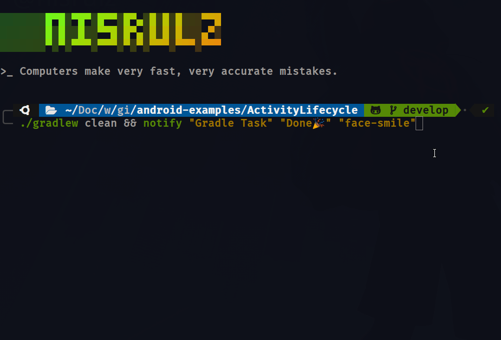

<!--more-->

Executing tasks and processes is pretty common in the Terminal. Having them run and then pipe the output into another one, transforming the output, triggering a sub-process/task, etc. are some of the usual ways of working with them.

That implies that they will most probably won't finish immediately. Now that is an not much of an issue, but more of an annoyance because you sometimes have to wait for the task to finish to start another one. Ofcourse you can open new terminal windows to execute multiple tasks, however the feedback loop is still missing.

I wanted to personally fix this issue for myself. So I set out to find a solution for this.

One of things that I find very useful is the Notifications in macOS and Ubuntu. Wouldn't it be nice if there was a notification that could be triggered when a task is finished?

So, I decided to find a unified of way of doing the same across multiple platforms i.e macOS and Ubuntu.

### Ubuntu

I work with Ubuntu Budgie on my personal laptop, so that was my starting point. Taking a dig inside Google results, surfaced a package that could solve my problem at hand: `notify-send`

Here is what the [man page](http://manpages.ubuntu.com/manpages/xenial/man1/notify-send.1.html) for it state:

> `notify-send` - a program to send desktop notifications

Wow😀 Bingo! This is exactly what I want.

Now, if you read the man pages, you will notice that the are some options yo can pass to this utility on the cmdline. However we are interested in something very simple. Something on the lines of a title, description and maybe an icon.

After reading through the possible options, I figured I can do this via:

```bash
notify-send "Title" "Message" -i face-smile
```

The `-i face-smile` allows to specify an icon for the notification. This is how it shows up if you execute the above line in your terminal. You can find the valid names for icons that can be used[here](https://specifications.freedesktop.org/icon-naming-spec/latest/ar01s04.html).


To test if it works when a task finishes, execute the below:

```bash
for i in {1..9999999}; do ; done && notify-send "Title" "Message" -i face-smile
```

Here we are running a for loop to simulate work being done. When the for loop finishes you will see the same notification show up! Sweet🍬

So Ubuntu is sorted for showing a notification when a task finishes. Next up is figuring it out for macOS.

### macOS

Turns out on macOS this was relatively simpler to achieve. macOS has a utility called `display notification`.

From their [man pages](https://developer.apple.com/library/archive/documentation/LanguagesUtilities/Conceptual/MacAutomationScriptingGuide/DisplayNotifications.html):

> display notification command to show notifications, such as status updates as files are processed.

and you use it as below:

```bash
display notification "Message" with title "Title"
```

However you cannot just execute it directly in a terminal. This utility needs to be triggered via `osascript`. So you need to trigger this from terminal as below:

```bash
osascript -e 'display notification "Message" with title "Title"'
```

This is how it shows up if you execute the above line in your terminal.


To test if it works when a task finishes, we will do the same for-loop test. Execute the below in a terminal:

```bash
for i in {1..9999999}; do ; done && osascript -e 'display notification "Message" with title "Title"'
```

Thats perfect!

Now the only thing bothering me is that I need to call these commands based on the platforms and that their syntax differs for each. I can fix that by making a simple bash function called `notify`:

```bash
# Drop this in your ~/.zshrc or ~/.bashrc file
# Trigger a notification
# Use as:
#   notify "Title" "Message" "face-smile"
function notify() {
    local TITLE="$1"
    local MSG="$2"
    local ICON="$3"
    if [[ "$OSTYPE" == "darwin"* ]]; then # if it is macOS
        osascript -e "display notification \"$MSG\" with title \"$TITLE\""
    else
        notify-send $TITLE $MSG -i $ICON
    fi
}
```

Here, if the function is being executed on macOS it will execute the `display notification` utility by setting the right params in order, otherwise it will execute the `notify-send` utility.

> NOTE: A bash function can be called just like an alias
> Also note that I escaped the `"` in `\"$MSG\"` for the `display notification` utility so as to be able to pass in a variable.

Here is a functional version of this, where I call `notify` after `./gradlew clean` task finishes:



Nice! Set this up as you would like to and be more productive.

Subscribe to my RSS feed to keep track of more such terminal foo nuggets 🍪
