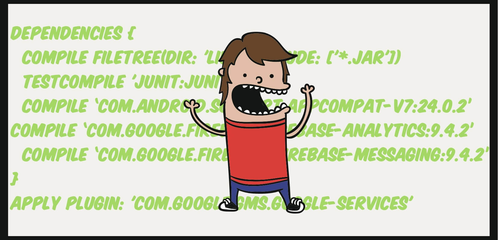

<!--more-->

Agree or not agree, but on an average consensus pretty much every android dev goes through the loop of **Update Dependencies.Code.Repeat.** for each of his/her android project. Its frustrating, a waste of time and super annoying when you would want to have the same version across all projects.

One of such situations that I recently got into was trying to keep all my apps under **[Android-Examples](https://github.com/nisrulz/android-examples)** repository on github updated. As you can see it the repository has multiple small and simple examples of completely functional android apps. Keeping all of them updated was becoming a hard task whenever a new version of android-gradle-plugin, support library or google play services would be released.

Initially I would go on to update each app in the repository and then commiting it back. As you can see it wasn't the most efficient way to do it. So sometime back I decided that I am going to put an end to this process and make all version configurations common to all apps and thus escape the **Update Dependencies.Code.Repeat.** loop of hell.

So now that I had decided to not update each app individually, I decided to look at my options. The obvious one here was looking at Gradle that supported variables.

Now we all might have done this for `support-library` , where we define a variable inside our module's `build.gradle` and then reference it as below

```gradle
def  supportLibVer = "24.2.0"
..
dependencies {
  compile "com.android.support:appcompat-v7:$supportLibVer"
}

```

So what I have done here is basically

- Defined a variable named `supportLibVer` with the value `24.2.0` using `def` keyword.
- Next referenced it by using it in the `compile` statement as `$supportLibVer`

  > Note that the surrounding quote is a double quote `"` and not a single quote.

Now this approach is basically using a [Local Variable ](https://docs.gradle.org/current/userguide/writing_build_scripts.html#sec:local_variables), which means that this variable works in the scope of the `build.gradle` file it is defined in.

We want to **_externalize_** the variable from outside the `build.gradle` file of the module, so as to provide values to all modules of the project.
Gradle's [Extra properties](https://docs.gradle.org/current/userguide/writing_build_scripts.html#sec:extra_properties) comes to the rescue for this.

The way we use them is by moving our varibales to an `ext` block inside the project's root `build.gradle` file and referencing it as below

Project's root `build.gradle` file

```gradle
ext {
    supportLibVer = "24.2.0"
}
```

Now reference it in all/required modules as below

```gradle
..
dependencies {
  compile "com.android.support:appcompat-v7:$rootProject.ext.supportLibVer"
}
```

> Notice that referencing variable is changed now to `$rootProject.ext.supportLibVer`

..hmm looks like we are going somewhere with this. So till now we have been able to externalize the variables so as to facilitate common values to the multiple modules inside a particluar project.

But my requirement was a step ahead than this. I wanted to provide common values to all projects inside my repository and not just to one particular project. So I needed to provide an external `gradle` file (that I place at the root of the folder which contains all my projects) with all `ext` variables defined in it , something like this [[dependencies.gradle](https://github.com/nisrulz/android-examples/blob/master/dependencies.gradle)]

```gradle
ext {
   androidPluginVer = "2.1.3"
   compileSdkVer = 24
   buildToolsVer = "24.0.2"

   minSdkVer = 9
   targetSdkVer = 24

   supportLibVer = "24.2.0"
   googlePlayServicesVer = "9.4.0"
}
```

But how do I make them available to each **sub-module** inside each of my projects?

I had to dig the gradle docs and buried deep inside is a section that talks about it, called [Subproject Configuration](https://docs.gradle.org/current/userguide/multi_project_builds.html#sec:subproject_configuration).

So after some practical experimentation i figured out how I can use it to facilitate the `ext` variables to **sub-modules** of each project.
This is what I did next in each Project's root `build.gradle`, I added a `subprojects` configuration section just below `allprojects` configuration section and added a `apply from:` statement to apply my external gradle file to each sub-module.

```gradle
// Top-level build file where you can add configuration options common to all sub-projects/modules.
buildscript {
    ...
}

allprojects {
    ..
}

// This is added to apply the gradle file to each module under the project
subprojects {
    apply from: '../../dependencies.gradle'
}
..

```

What this did was that it made my external variables, defined in `dependencies.gradle` files available in the scope of each module in each of my projects now and I could now reference them simply as

```gradle
..
dependencies {
  compile "com.android.support:appcompat-v7:$supportLibVer"
}
```

Good. Now this makes life so much easy and now I can provide common values to all the dependencies.

**But wait**, if you would try to provide a variable and facilitate the version for `android-gradle-plugin`, you would see that this wont work!

Well thats a bummer, as I needed to make that as a common variable too.

So after much experimentation, I figured out it was because when we define the `subprojects` configuration , it doesnot apply to the root project's `build.gradle`. Hmm, this is news as we had almost solved the problem.

So the way I solved this is by applying the `dependencies.gradle` to the `buildscript` section directly inside the root `build.gradle` for each Project. So now each project's root `build.gradle` script became as below

```gradle
// Top-level build file where you can add configuration options common to all sub-projects/modules.
buildscript {
    // This is added to apply the gradle file to facilitate providing variable values to root build.gradle of the project
    apply from: '../dependencies.gradle'
    ..
    dependencies {
        classpath "com.android.tools.build:gradle:$androidPluginVer"
        ..
    }
}


allprojects {
    ..
}

// This is added to apply the gradle file to each module under the project
subprojects {
    apply from: '../../dependencies.gradle'
}
..
```

[Here is a functional root `build.gradle` script from one of the project of my repository itself](https://github.com/nisrulz/android-examples/blob/master/ActivityLifecycle/build.gradle) and [Here is a functional module `build.gradle` script from the same project of my repository itself](https://github.com/nisrulz/android-examples/blob/master/ActivityLifecycle/app/build.gradle). You can see I extended the idea to start externalizing the variable for `buildToolsVersion` and `compileSdkVersion` too :D

Great! Now we only need to change the values inside the `dependencies.gradle` file and hey presto! when ever I would be loading up any of the projects , they will reference the values from this file and would automagically be working of the most udpated version.

You can checkout the [Android-Examples](https://github.com/nisrulz/android-examples) repository to see a fully functional model of this approach.

Phew, thats all for this time. Hoping it will solve any similar problems, as this approach can be definitely be extended.

> Got featured in [AndroidWeekly Issue 221](http://androidweekly.net/issues/issue-221), thank you for the love

If you have suggestions or maybe would like me to add something to the content here, please let me know.
