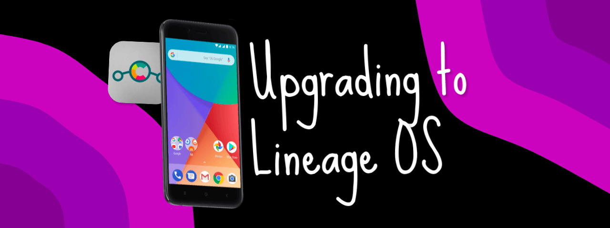
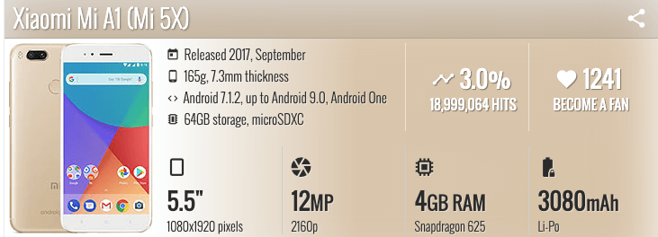
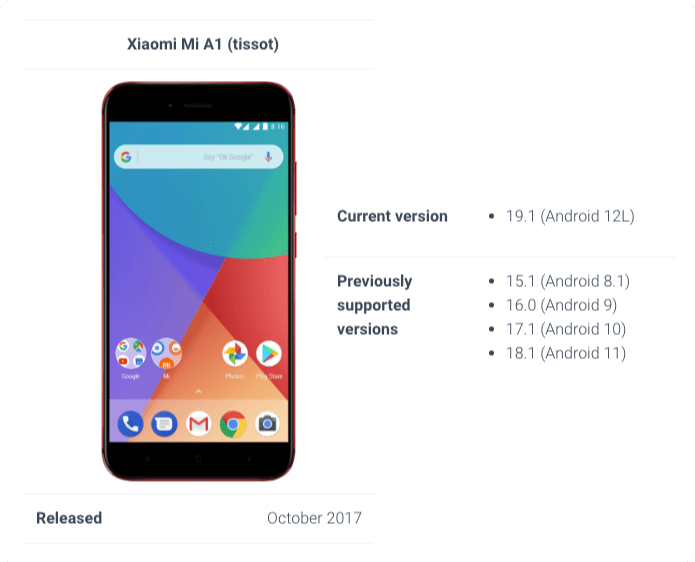
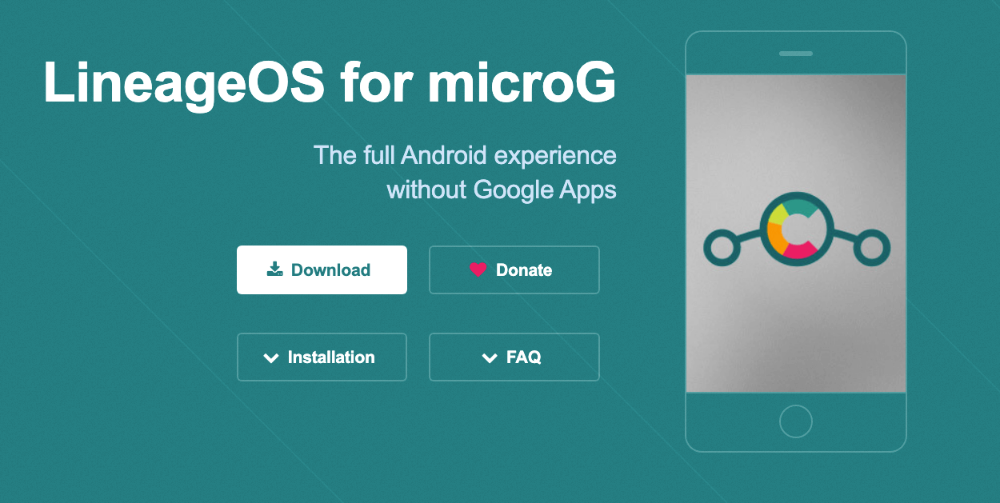

Every few years I upgrade my personal device to the next Android phone in the market. Since I do not want to just throw the last device out, I usually keep them around. They are also useful for development purposes.[Back in 2017 one of the devices](https://en.wikipedia.org/wiki/Android_One#2017) to launch with Android One program was [Xiaomi Mi A1](<https://www.gsmarena.com/xiaomi_mi_a1_(mi_5x)-8776.php>), which was built with joint efforts from Google and Xiaomi.

<!--more-->



I remember being so hyped up and immediately placed the order to get hold of it asap. The phone was bloat free (not usual for a Xiaomi phone) and worked super nice for its time. It came with guaranteed OS upgrades for 2 years straight (until 2019). This was not normal for the price range this device was launched in. Clearly this device was already ahead of its game.

Fast forward to 2022 (almost 6 years since launch), this device is still super efficient in many fronts when it comes to hardware. Software though is where it is lacking. The OS upgrades are discontinued from Google/Xiaomi side. Luckily the best part of Android ecosystem is that it is open source ([AOSP](https://source.android.com/)). This means tinkerers can modify latest version of AOSP to make it work on old hardware, even though official support is discontinued.

One of the well supported effort comes from the community named [Lineage](https://lineageos.org/about/). They basically modify AOSP, add some nice modifications, add driver support for the device and make a release of that modified Android OS under the name of "Lineage OS". This is essentially Android only, just rebranded to ["Lineage OS](https://lineageos.org/)" with all the niceties added by the community.

> One of the best features include OTA(Over The Air) updates. As in once flashed, the device can receive security patches just like normal devices do, as part of "Software Update" option under Settings 🎉

I keep my [Xiaomi MiA1 updated](https://wiki.lineageos.org/devices/tissot/) up to date as soon as a new release of Lineage OS based on latest AOSP is released. Currently my device is running Lineage OS 19.1 which is basically Android 12L.



> Note: As of writing this post Android 13 is yet to be released and is in Beta phase. Android 12L is the last stable release of AOSP.

In order to flash my device with Lineage OS, I always follow through the same steps. This post is about documenting those steps so my future self remembers it.


Note: There is a comprehensive guide published by Lineage OS itself [here](https://wiki.lineageos.org/devices/tissot/install). However I don't need all that extra info and honestly don't spend time reading it either. This post is my version of how I flash my device.




WARNING: Flashing a device is unpredictable process and there is always a chance of bricking your device completely. When following instructions to flash a device always note that YOU are responsible for anything that goes wrong in the process. The process that worked on my device doesn't guarantee that it would work on yours too. Although if it is the same device down to hardware combination used to build it for a specific region (same brand of device can have region specific hardware combinations based on how the parts are sourced. i.e EU region, US region, India region, etc.), the chances of success can thus be roughly around 80%. This is my perception though, it is not quantitatively derived. Take this claim however you may.


## Steps

{}

### [Download Lineage OS image for Xiaomi Mi A1](https://download.lineage.microg.org/tissot/)

My device codename is `tissot`, so that is the one I need to find in Lineage OS directory. The name of the file would look like `lineage-19.1-20220626-microG-tissot.zip`.

> Note: The version of Lineage OS that I prefer is the one which doesn't come with Google Services. I download the one that has [microG](https://microg.org/) [pre-setup](https://lineage.microg.org/).



### [Download a recovery image](https://dl.twrp.me/tissot/).

I prefer [TWRP](https://twrp.me/about/). Download the one for `tissot` again. The name of file would look like `twrp-3.6.2_9-0-tissot.img`.

### Connect your device over USB.

### Enable Developer Settings

On your device, go into **Settings** -> **About** and find the **Build Number** and tap on it 7 times to enable developer settings.

### Enable USB Debugging

Press back and go into **Developer Options** and enable **USB debugging**.

### Fire up a terminal on your dev machine. (I am using macOS for this post)

### Check if device is connected

Check if the device is connected via `adb` and is debuggable by running the command

```sh
adb devices
```

You should see a device with an id as the result if everything is functional:

```sh
List of devices attached
56580e47	device
```

### Reboot into Bootloader Mode

Now reboot the device into bootloader, using the command:

```sh
adb reboot bootloader
```

Your device would restart and end up on a screen that has an Android figure. This just means you are in the bootloader mode.

To verify the device is responsive in this mode, run the below command:

```sh
fastboot devices
```

You should see the same device id, if everything is functional:

```sh
56580e47	fastboot
```

### Unlock Bootloader

Now before you start flashing anything, you need to unlock the bootloader. Use the below command:

```sh
fastboot oem unlock
```

### Reboot device

Reboot the device, by executing the command:

```sh
fastboot reboot
```

Output should look like:

```sh
Rebooting                                          OKAY [  0.001s]
Finished. Total time: 0.001s
```

### Enable USB Debugging

Since the device resets completely, you will need to re-enable USB debugging to continue. Repeat **Steps 4 and 5** mentioned earlier to do so.

### Reboot into Bootloader Mode

Now that the bootloader is unlocked, you need to get into the bootloader mode again. Re-run the **Step 8** to get back into the bootloader mode.

### Flash TWRP Recovery Image

Now you need to flash a temp. recovery into memory to get access to ADB Sideload feature. To do so, run the below command with TWRP recovery image file (`twrp-3.6.2_9-0-tissot.img`) as shown below:

```sh
fastboot flash boot twrp-3.6.2_9-0-tissot.img
```

### Reboot into Recovery Mode

Once the last process finishes successfully, you need to boot into the recovery. Run the below command:

```sh
fastboot reboot recovery
```

### Enable ADB Sideload

At this point, TWRP would load up and you now need to sideload the Lineage OS `.zip` file. On the device, select **Advanced** -> **ADB Sideload**, then swipe to begin sideload.

### Sideload Lineage OS

On the dev machine, sideload the Lineage OS package using: `adb sideload filename.zip`. Run the command like below:

```sh
adb sideload lineage-19.1-20220626-microG-tissot.zip
```

### Reboot Device

Once you have installed everything successfully, click the back arrow in the top left of the screen, then **Reboot system now**.

### Final step

Your device will take some time to load and start completely. The first boot is usually a bit of time taking process as everything is being setup. Simply setup your device as you would when you buy a new phone.


  If you encounter error, please refer to their [FAQ page](https://wiki.lineageos.org/faq) to help debug some common issues.


{}

Thats all there is!

Lineage OS is super awesome and their work single handedly keeps old hardware functional, thus reducing e-waste. Give it a try to [revive your old device, if supported by Lineage OS](https://wiki.lineageos.org/devices/). The steps mentioned in this post remain the same for the most parts, only the recovery and OS image should be specifically downloaded for the device you want to flash.

Lineage OS shows the power of open source. Big corps such as Google and Xiaomi (and many other OEMs) won't support the device after certain years for their own profit. Lineage OS makes it possible by leveraging open source and technical know how within the community. The community is driven by enthusiasts and passionate developers alike. Hopefully this project would continue in its mission for years to come.
