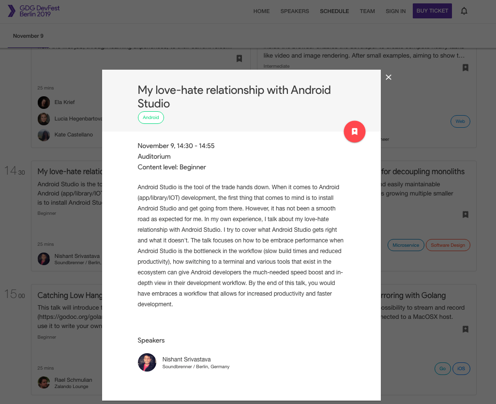

 Devfest Berlin, Berlin, Germany

<!--more-->

## Abstract

Android Studio is the tool of the trade hands down. When it comes to Android (app/library/IoT) development, the first thing that comes to mind is to install Android Studio and get going from there. However, it has not been a smooth road for me. In my own experience, I talk about my love-hate relationship with Android Studio. I try to cover what Android Studio gets right and what it doesn't. The talk focuses on how to embrace performance when Android Studio is the bottleneck in the workflow (slow build times and reduced productivity), how switching to a terminal and various supporting tools that exist in the ecosystem can give Android developers the much-needed speed boost and in-depth view in their development workflow. By the end of this talk, you would be aware of a workflow that allows for increased productivity and faster development.

## Presentation

<iframe src="https://docs.google.com/presentation/d/e/2PACX-1vSJlEsFOiX39iKcpM19oWWUZ4A1jLlffkw5b4ngpKlFAoy54OW5kWkYD59vimRnzsqoH8u6pETWW1DR/embed?start=false&loop=false&delayms=3000" frameborder="0" width="100%" height="480" allowfullscreen="true" mozallowfullscreen="true" webkitallowfullscreen="true"></iframe>

## Event

<a href="https://2019.devfest-berlin.de/schedule/2019-11-09?sessionId=1016" target="_blank">
  
  
Click here to access the event website

</a>
