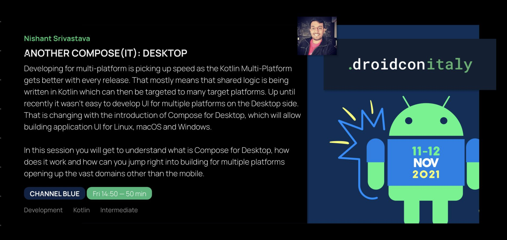

 Droidcon Italy, Italy, Online

<!--more-->

## Abstract

Developing for multi-platform is picking up speed as the Kotlin Multi-Platform gets better with every release. That mostly means that shared logic is being written in Kotlin which can then be targeted to many target platforms. Up until recently it wasn't easy to develop UI for multiple platforms on the Desktop side. That is changing with the introduction of Compose for Desktop, which will allow building application UI for Linux, macOS and Windows.

In this session you will get to understand what is Compose for Desktop, how does it work and how can you jump right into building for multiple platforms opening up the vast domains other than the mobile.

## Presentation

<iframe src="https://docs.google.com/presentation/d/e/2PACX-1vQMIhEhMgB-vQ5i4siIqhMf4TK9Q1bCGkImuaI9KCgc9eDC0ajIWPM2BMJPelm8U7IP3BPTN2xThWyE/embed?start=false&loop=false&delayms=3000" frameborder="0" width="100%" height="480" allowfullscreen="true" mozallowfullscreen="true" webkitallowfullscreen="true"></iframe>

## Video

<iframe width="100%" height="480" src="https://www.youtube.com/embed/aON21ScnYgk?si=s_ulzy4vHiH9tDl2" frameborder="0" allow="accelerometer; autoplay; encrypted-media; gyroscope; picture-in-picture" allowfullscreen></iframe>

## Event

<a href="https://it.droidcon.com/2021/agenda/" target="_blank">
    
    
Click here to access the event website

</a>
